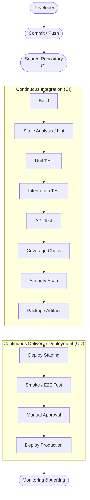
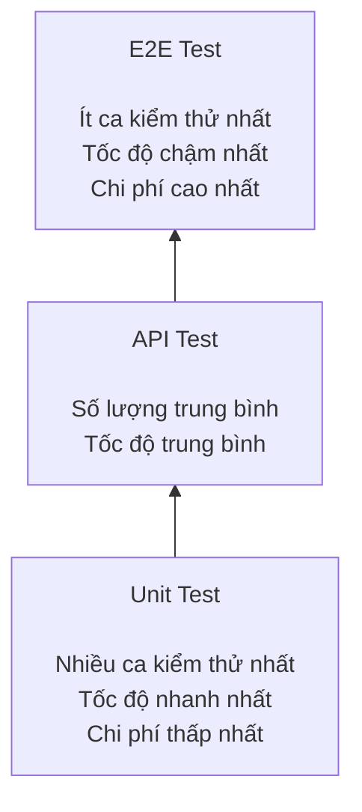
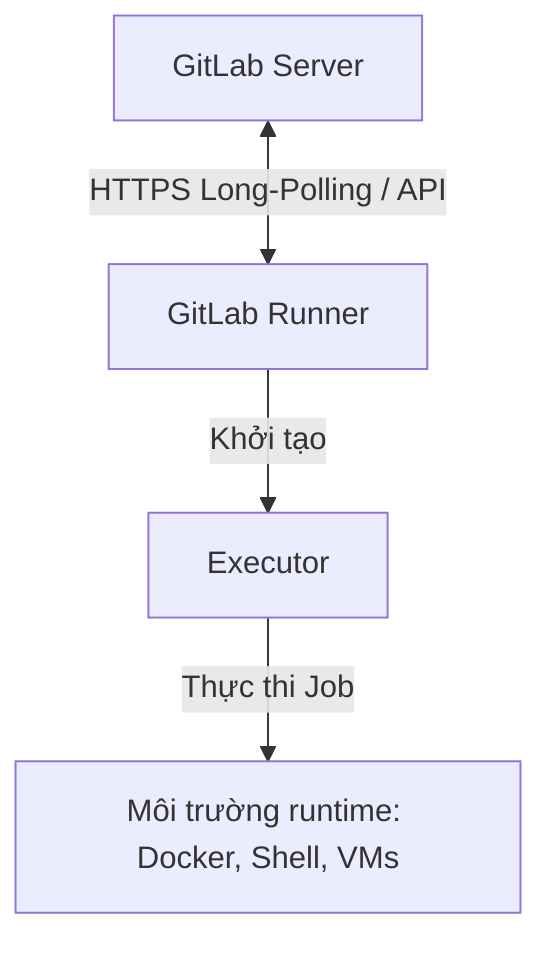

# Báo cáo về chủ đề CI/CD & Test-Harness Engineering

**Nhóm 06 - Môn Kiểm thử phần mềm**

## Thành viên nhóm

| MSSV | Họ và tên |
|---|---|
| 23127031 | Nguyễn Ngọc Minh Châu |
| 23127033 | Bùi Dương Duy Cường |
| 23127391 | Nguyễn Anh Khoa |
| 23127459 | Huỳnh Vương Thụy Quân |
| 21127498 | Trần Quang Đạo |

## Video demo

- 🎥 **GitHub Actions:** https://youtu.be/hMHrNRQyqYo
- 🎥 **GitLab CI/CD:** https://youtu.be/pn46VvWUwNQ

## Mục lục

1. [Tổng quan về CI/CD](#1-tổng-quan-về-cicd)
2. [Cấu trúc một CI/CD Pipeline](#2-cấu-trúc-một-cicd-pipeline)
3. [Test-Harness Engineering](#3-test-harness-engineering)
4. [Các loại kiểm thử trong CI/CD (Test Pyramid)](#4-các-loại-kiểm-thử-trong-cicd-test-pyramid)
5. [Chiến lược tích hợp Test-Harness vào Pipeline](#5-chiến-lược-tích-hợp-test-harness-vào-pipeline)
6. [Khảo sát công cụ hỗ trợ](#6-khảo-sát-công-cụ-hỗ-trợ)
7. [Các vấn đề thực tế thường gặp](#7-các-vấn-đề-thực-tế-thường-gặp)
8. [Xu hướng tương lai](#8-xu-hướng-tương-lai)
9. [Best Practices](#9-best-practices)
10. [Kết luận](#10-kết-luận)
11. [Hướng dẫn công cụ](#11-hướng-dẫn-công-cụ)
12. [Tài liệu tham khảo](#12-tài-liệu-tham-khảo)

---

## 1. Tổng quan về CI/CD

### 1.1 Vấn đề trước khi có CI/CD

Trước khi CI/CD phổ biến, các nhóm phát triển thường gặp khó khăn khi tích hợp hệ thống do lập trình viên làm việc độc lập trong thời gian dài, tích hợp code muộn, chỉ gộp sau nhiều tuần/tháng. 

Hệ quả:

- Việc kiểm thử thủ công mất nhiều thời gian, dễ bỏ sót các trường hợp cần kiểm tra, khó thực hiện lặp lại một cách nhất quán và khó phát hiện các lỗi phát sinh sau khi hệ thống được chỉnh sửa.
- Khi tích hợp muộn, xung đột code và lỗi giao tiếp giữa các module rất khó sửa, chi phí sửa chữa cao.
- Việc nhận phản hồi diễn ra chậm, thời gian phát hành sản phẩm kéo dài và sản phẩm vẫn có thể còn nhiều lỗi khi đến tay người dùng.

### 1.2 Khái niệm

| Khái niệm | Định nghĩa | Đặc điểm |
|---|---|---|
| **CI - Continuous Integration** (Tích hợp liên tục) | Lập trình viên thường xuyên tích hợp mã nguồn vào nhánh chung (nhiều lần mỗi ngày); sau mỗi lần tích hợp, hệ thống tự động biên dịch và kiểm thử mã nguồn. | Không tự động triển khai; mục tiêu là phát hiện sớm các xung đột và lỗi biên dịch. |
| **CD - Continuous Delivery** (Chuyển giao liên tục) | Nối tiếp CI: Mã nguồn luôn ở trạng thái sẵn sàng để triển khai lên bất kỳ môi trường nào. | Tự động triển khai lên môi trường tiền sản xuất, nhưng khi triển khai lên môi trường sản xuất vẫn cần được phê duyệt thủ công.|
| **CD - Continuous Deployment** (Triển khai liên tục) | Mọi thay đổi sau khi vượt qua toàn bộ quy trình kiểm thử tự động sẽ được tự động triển khai lên môi trường sản xuất. | Không cần phê duyệt thủ công; đòi hỏi bộ kiểm thử tự động có độ tin cậy rất cao. |

So sánh nhanh:

| Khía cạnh | CI | Continuous Delivery | Continuous Deployment |
|---|---|---|---|
| Deploy production | Không | Cần phê duyệt thủ công | Tự động |
| Tần suất release | Vài lần/ngày | Hàng ngày/tuần | Hàng giờ/ngày |
| Rủi ro | Thấp | Trung bình | Cao (đòi hỏi kiểm thử rất chặt) |
| Phù hợp | Mọi dự án | Dự án ổn định | các dự án khởi nghiệp (startup), các sản phẩm phần mềm cung cấp dưới dạng dịch vụ (SaaS) và ứng dụng web.|

### 1.3 Ưu điểm và nhược điểm

**Ưu điểm:**
- Phát hiện lỗi biên dịch hay lỗi môi trường từ sớm, tránh lỗi không đáng có.
- Đảm bảo tính năng mới không phá vỡ tính năng cũ nhờ kiểm thử tự động (phát hiện lỗi phát sinh sau khi thay đổi mã nguồn).
- Lập trình viên có thể tập trung vào việc phát triển mã nguồn thay vì phải biên dịch và triển khai thủ công; kết quả phản hồi được nhận chỉ sau vài phút thay vì phải chờ đến ngày hôm sau.
- Nâng cao chất lượng mã nguồn thông qua các quy định của quy trình phát triển (giới hạn số lượng thay đổi trong mỗi yêu cầu hợp nhất (PR), yêu cầu pipeline hoàn thành thành công trước khi hợp nhất mã nguồn).
- Cho phép phát hành phần mềm nhanh chóng, nhiều lần trong ngày mà vẫn bảo đảm chất lượng.

**Nhược điểm:**
- Nhiều yêu cầu hợp nhất mã nguồn (PR) được tạo cùng lúc có thể làm tăng thời gian chờ hợp nhất, phát sinh xung đột mã nguồn và phải thực hiện lại toàn bộ quy trình kiểm thử, từ đó làm chậm tiến độ phát triển.
- Phụ thuộc vào dịch vụ CI/CD của bên thứ ba; khi dịch vụ gặp sự cố hoặc ngừng hoạt động, toàn bộ quy trình phát triển phần mềm có thể bị ảnh hưởng.
- Cần đầu tư ban đầu về hạ tầng và năng lực vận hành; nếu đội ngũ chưa có đủ chuyên môn, các sự cố trong quy trình tự động (pipeline) có thể gây gián đoạn nhiều hơn những lợi ích mà CI/CD mang lại.

### 1.4 Khi nào nên/không nên áp dụng

- **Nên áp dụng càng sớm càng tốt**, kể cả đối với các dự án cá nhân, vì nhiều nền tảng cung cấp gói miễn phí đáp ứng đủ nhu cầu của các dự án nhỏ.
- **Nên cân nhắc chỉ áp dụng ở mức cơ bản hoặc tạm thời chưa áp dụng** khi tổ chức chưa có nhân sự đủ năng lực vận hành CI/CD, lập trình viên chưa thành thạo các công cụ hoặc nhóm chưa thể bảo đảm quy trình tự động hoạt động ổn định. Trong những trường hợp này, việc xử lý sự cố có thể tốn nhiều thời gian hơn những lợi ích mà CI/CD mang lại.
- **Nên triển khai thử nghiệm trên từng nhóm nhỏ** (theo ngôn ngữ lập trình hoặc nền tảng phát triển) trước khi áp dụng cho toàn bộ dự án hoặc tổ chức.

### 1.5 Yếu tố lựa chọn nền tảng CI/CD

Khi chọn công cụ CI/CD, cần cân nhắc:

1. **Cloud-based vs Self-hosted** - Cloud-based không cần tự quản lý và bảo trì hạ tầng; Self-hosted cho phép kiểm soát tốt hơn về bảo mật và tài nguyên.
2. **Tính dễ dùng** - giao diện thân thiện, tài liệu đầy đủ và giúp rút ngắn thời gian hòa nhập của thành viên mới.
3. **Khả năng tích hợp** - có thể tích hợp với ngôn ngữ lập trình, hệ thống quản lý mã nguồn (VCS), hệ thống theo dõi công việc và nền tảng điện toán đám mây đang sử dụng.
4. **Khả năng cấu hình** - hỗ trợ cấu hình điều kiện kích hoạt, xử lý khi quy trình thất bại, quản lý biến môi trường và thông tin bí mật, thông qua script, tệp YAML hoặc giao diện người dùng.
5. **Chi phí** Phù hợp với ngân sách, bao gồm thời lượng thực hiện build, số lượng người dùng và dung lượng lưu trữ các tệp đầu ra (artifact).
6. **Mức độ quen thuộc của đội ngũ** - công cụ được sử dụng phổ biến, dễ tìm tài liệu và nhận được sự hỗ trợ từ cộng đồng.
7. **Khả năng mở rộng/hiệu năng** - đáp ứng tốt khối lượng công việc lớn, đồng thời hỗ trợ tùy biến thông qua hệ sinh thái plugin.

---

## 2. Cấu trúc một CI/CD Pipeline

### 2.1 Sơ đồ tổng quát



- Ví dụ thực tế: 

Lập trình viên đẩy mã nguồn lên GitHub, sau đó GitHub Actions tự động biên dịch ứng dụng, thực hiện kiểm thử đơn vị và kiểm thử tích hợp. Nếu tất cả các bước đều thành công, hệ thống sẽ tự động triển khai lên môi trường tiền sản xuất. Sau khi một thành viên xem xét và phê duyệt, ứng dụng sẽ được triển khai lên môi trường sản xuất.

### 2.2 Các giai đoạn và vai trò

| Giai đoạn | Mục đích | Loại lỗi phát hiện | Ví dụ công cụ |
|---|---|---|---|
| **Kích hoạt quy trình** (Trigger) | Khởi động quy trình tự động khi có sự kiện như push, pull request, schedule (cron), manual hoặc tạo thẻ phiên bản (release tag). | - | GitHub Actions `on:`, GitLab `rules:` |
| **Cài đặt thư viện** | Cài đặt các thư viện cần thiết, cố định phiên bản và bảo đảm môi trường phát triển nhất quán. | Thiếu thư viện, không tương thích phiên bản. | npm/yarn, pip, Maven/Gradle, go mod |
| **Phân tích tĩnh/Kiểm tra quy tắc mã nguồn/Định dạng mã nguồn** (Static Analysis/Lint/Format) | Kiểm tra chất lượng mã nguồn và phát hiện các lỗi tiềm ẩn mà không cần chạy chương trình. | Vi phạm quy tắc viết mã, biến hoặc thư viện không được sử dụng, các lỗ hổng bảo mật cơ bản. | ESLint, Prettier, Pylint/Ruff, golangci-lint, Checkstyle/PMD, SonarQube |
| **Biên dịch và đóng gói** (Build) | Biên dịch và đóng gói mã nguồn thành sản phẩm hoặc tệp đầu ra có thể triển khai. | Lỗi biên dịch, xung đột giữa các thư viện. | Maven/Gradle, go build, webpack/esbuild, Docker build |
| **Kiểm thử đơn vị** (Unit Test) | Kiểm thử riêng từng hàm hoặc phương thức, tách biệt với các thành phần phụ thuộc. | Lỗi logic, các trường hợp biên, ngoại lệ chưa được xử lý. | Jest, Vitest, pytest, JUnit, Go testing, NUnit/xUnit |
| **Kiểm thử tích hợp** (Integration Test) | Kiểm tra sự tương tác giữa các mô-đun, dịch vụ hoặc cơ sở dữ liệu. | Không tương thích giao diện, lỗi truy vấn cơ sở dữ liệu, điều kiện tranh chấp. | Testcontainers, WireMock, Spring Test |
| **Kiểm thử API** | Kiểm tra toàn bộ quá trình xử lý của API từ yêu cầu đến phản hồi. | Sai mã trạng thái, sai cấu trúc dữ liệu phản hồi, lỗi nghiệp vụ. | Postman/Newman, REST Assured, Supertest |
| **Báo cáo độ bao phủ kiểm thử** (Coverage Report) | Đo tỷ lệ mã nguồn đã được kiểm thử và xác định các phần mã chưa được kiểm thử. | Mã nguồn chưa được kiểm thử, đoạn mã có độ phức tạp cao nhưng độ bao phủ thấp. | JaCoCo, Istanbul/nyc, coverage.py, Codecov |
| **Quét bảo mật** (Security Scan) | Kiểm tra các lỗ hổng bảo mật trong thư viện, mã nguồn và ảnh vùng chứa (container image). | Lỗ hổng bảo mật (CVE), thông tin bí mật được ghi trực tiếp trong mã nguồn, ảnh vùng chứa lỗi thời. | Snyk, OWASP Dependency-Check, Trivy, Semgrep, Dependabot |
| **Đóng gói sản phẩm đầu ra** (Package Artifact) | Đóng gói sản phẩm đầu ra thành tệp thực thi hoặc container image, sau đó lưu vào kho lưu trữ với phiên bản tương ứng. | Thiếu sản phẩm đầu ra hoặc gán sai phiên bản. | Docker Registry, JFrog Artifactory, GitHub Packages |
| **Triển khai lên môi trường tiền sản xuất** (Deploy Staging) | Triển khai ứng dụng lên môi trường có cấu hình tương tự môi trường sản xuất để tiếp tục kiểm thử. | Lỗi cấu hình triển khai, thiếu thư viện hoặc thành phần của môi trường. | Kubernetes/Helm, Docker Compose, Terraform |
| **Kiểm thử nhanh/Kiểm thử đầu cuối** (Smoke Test/E2E Test) | Kiểm tra nhanh hệ thống sau khi triển khai hoặc kiểm thử toàn bộ luồng sử dụng của người dùng. | Lỗi triển khai, lỗi giao diện, lỗi tích hợp giữa giao diện và hệ thống phía máy chủ. | Playwright, Cypress, Selenium |
| **Phê duyệt và triển khai lên môi trường sản xuất** (Manual Approval/Production Deploy) | Thành viên có trách nhiệm xem xét và phê duyệt trước khi triển khai lên môi trường sản xuất (đối với Continuous Delivery) hoặc triển khai tự động (đối với Continuous Deployment). | Rủi ro về nghiệp vụ, các thay đổi có thể làm ảnh hưởng đến chức năng hiện có. | Blue-green, Canary deployment |
| **Giám sát và cảnh báo** (Monitoring & Alerting) | Theo dõi tình trạng hoạt động của hệ thống sau khi triển khai và gửi cảnh báo khi có bất thường. | Các lỗi phát sinh trên môi trường sản xuất. | Prometheus/Grafana, healthcheck endpoint |

**Nguyên tắc phát hiện lỗi sớm**: Các bước thực hiện nhanh và ít tốn tài nguyên như kiểm tra quy tắc mã nguồn và kiểm thử đơn vị nên được thực hiện trước. Nếu phát hiện lỗi, quy trình sẽ dừng ngay để tránh lãng phí thời gian và tài nguyên cho các bước tốn kém hơn như kiểm thử đầu cuối hoặc quét bảo mật chuyên sâu.

---

## 3. Kỹ thuật xây dựng môi trường kiểm thử tự động (Test-Harness Engineering)

### 3.1 Định nghĩa

**Test Harness** là tập hợp các công cụ, thư viện, dữ liệu kiểm thử và cấu hình được xây dựng để **tự động hóa việc thực thi test, thu thập kết quả và báo cáo** một cách nhất quán, lặp lại được. Có thể hình dung Test Harness giống *giàn giáo* khi xây nhà: hỗ trợ việc kiểm thử diễn ra, nhưng bản thân nó không phải là sản phẩm chính.

Về mặt kỹ thuật, Test Harness gồm hai phần lõi:
- **Test execution engine**: bộ máy thực thi test.
- **Test script repository**: kho lưu trữ test case/script.

Nó cung cấp bản sao của tài nguyên/cấu hình chưa có sẵn (driver, stub) để có thể kiểm thử ngay cả khi một phần hệ thống chưa hoàn thiện - vì vậy phục vụ tốt cho cả **automation testing** lẫn **integration testing**.

### 3.2 Phân biệt các khái niệm dễ nhầm lẫn

| Thuật ngữ | Định nghĩa | Phạm vi | Ví dụ |
|---|---|---|---|
| **Bộ kiểm thử (Test Suite)** | Tập hợp các ca kiểm thử dùng để xác minh một chức năng hoặc một phần của hệ thống. | Nội dung kiểm thử | Bộ kiểm thử cho chức năng thanh toán |
| **Khung kiểm thử (Test Framework)** | Thư viện hoặc nền tảng hỗ trợ xây dựng và thực hiện các ca kiểm thử, cung cấp các chức năng như kiểm tra kết quả (assert), mô phỏng (mock) và chạy kiểm thử (test runner). | Công cụ (thư viện) | Jest, JUnit, pytest, Cypress |
| **Hạ tầng kiểm thử (Test Harness)** | Toàn bộ môi trường phục vụ việc thực hiện kiểm thử, bao gồm khung kiểm thử, dữ liệu kiểm thử, thành phần mô phỏng, môi trường thực thi và công cụ ghi nhận kết quả. | Hệ thống | Docker Compose + Jest + Fixtures + WireMock |
| **Đường ống CI/CD (CI/CD Pipeline)** | Quy trình tự động thực hiện các bước như build, kiểm thử và triển khai, được kích hoạt bởi các sự kiện từ hệ thống quản lý mã nguồn. | Quy trình điều phối | Quy trình GitHub Actions chạy lint → test → deploy |

Trong thực tế, CI/CD Pipeline là lớp điều phối cao nhất: nó sử dụng Test Harness để thực thi Test Suite, còn Test Framework là công cụ được sử dụng bên trong Test Harness.

### 3.3 Các thành phần cốt lõi

| Thành phần | Vai trò |
|---|---|
| **Test Runner** | Thực thi các tập lệnh kiểm thử, tổng hợp kết quả đạt/không đạt và tạo báo cáo kiểm thử. (Ví dụ: Jest, pytest, JUnit, Go testing) |
| **Test Script** | Mã nguồn chứa các ca kiểm thử, thường được xây dựng theo mô hình chuẩn bị - thực hiện - kiểm tra (Arrange - Act - Assert). |
| **Test Data** | Dữ liệu đầu vào và kết quả mong đợi, có thể được khai báo trực tiếp trong mã nguồn, lưu trong tệp fixture (JSON, YAML), hoặc được tạo bằng factory method hay builder pattern. |
| **Fixture** | Chuẩn bị môi trường trước khi kiểm thử và dọn dẹp sau khi kiểm thử, chẳng hạn như kết nối cơ sở dữ liệu, tạo dữ liệu mẫu hoặc xóa dữ liệu tạm. |
| **Mock** | Thành phần mô phỏng đối tượng hoặc dịch vụ, cho phép kiểm soát giá trị trả về và theo dõi các lần được gọi, đồng thời có thể kiểm tra xem đối tượng đã được gọi đúng cách hay chưa. |
| **Stub** | Thành phần mô phỏng tương tự mock, nhưng chỉ trả về các giá trị được định nghĩa trước và không theo dõi các lần được gọi. |
| **Driver** | Thành phần điều khiển hệ thống cần kiểm thử (System Under Test – SUT), giúp trừu tượng hóa các thao tác, chẳng hạn như điều khiển trình duyệt. |
| **Assertion** | Kiểm tra và so sánh kết quả thực tế với kết quả mong đợi. |
| **Test Environment** | Bao gồm cơ sở dữ liệu, các dịch vụ mô phỏng, container, biến môi trường và thông tin bí mật (secret) phục vụ quá trình kiểm thử. |
| **Reporter** | Xuất kết quả kiểm thử dưới các định dạng như console, JUnit XML, HTML hoặc JSON để con người và hệ thống CI/CD có thể sử dụng. |
| **Log/Artifact** | Lưu trữ nhật ký, ảnh chụp màn hình, video, bản ghi thực thi (trace) hoặc bản sao cơ sở dữ liệu (database dump) khi kiểm thử thất bại để hỗ trợ gỡ lỗi. |

### 3.4 Quy trình xây dựng Test Harness

1. Cài đặt và cấu hình Test Harness, bao gồm công cụ kiểm thử tự động, dữ liệu kiểm thử và môi trường kiểm thử.
2. Viết các tập lệnh kiểm thử (test script) cho từng chức năng hoặc từng tình huống, bắt đầu từ dữ liệu hợp lệ, dữ liệu biên và dữ liệu nhạy cảm.
3. Kích hoạt thực hiện toàn bộ bộ kiểm thử bằng một lệnh hoặc một thao tác tự động, đồng thời thu thập kết quả thực thi.
4. So sánh kết quả thực tế với kết quả mong đợi, ghi nhận các sai lệch hoặc lỗi phát hiện được.
5. Tạo báo cáo kiểm thử, chia sẻ với các bên liên quan và cập nhật các tập lệnh kiểm thử khi phần mềm hoặc yêu cầu kiểm thử thay đổi.

### 3.5 Ưu điểm và nhược điểm

**Ưu điểm:** 
- Nâng cao năng suất của người kiểm thử và lập trình viên.
- Hỗ trợ thực hiện kiểm thử tự động lặp lại, giảm sự phụ thuộc vào thao tác thủ công.
- Hỗ trợ gỡ lỗi thông qua nhật ký, ảnh chụp màn hình và các thông tin ghi nhận khác.
- Phát hiện lỗi sớm trong vòng đời phát triển phần mềm.
- Đo lường mức độ bao phủ của các ca kiểm thử đối với mã nguồn.
- Bao phủ được các chức năng và tình huống kiểm thử phức tạp, khó thực hiện hoặc khó tái hiện bằng phương pháp thủ công.

**Nhược điểm:** 
- Không hỗ trợ chức năng ghi và phát lại như một số công cụ kiểm thử giao diện người dùng chuyên dụng.
- Đòi hỏi kiến thức và kỹ năng kỹ thuật để thiết kế, xây dựng và bảo trì. 
- Tốn thời gian và chi phí đầu tư ban đầu, đặc biệt đối với các hệ thống có quy mô lớn hoặc kiến trúc phức tạp.

### 3.6 Vai trò của Test Harness trong CI/CD

Nếu không có Test Harness đủ tin cậy, quy trình CI/CD sẽ khó bảo đảm chất lượng của các bước kiểm thử tự động. Test Harness mang lại các lợi ích sau:

- **Tính nhất quán (Consistency)**: Mỗi lần kiểm thử đều được thực hiện trong cùng một môi trường và cùng một quy trình, giúp kết quả có thể tái lập (reproducible) và giảm các ca kiểm thử không ổn định (flaky test).
- **Tốc độ và khả năng mở rộng (Speed & Scalability)**: Cho phép thực hiện hàng nghìn ca kiểm thử tự động mà không cần thao tác thủ công.
- **Tính độc lập (Isolation)**: Sử dụng mock để mô phỏng các dịch vụ bên ngoài, giúp quá trình kiểm thử không phụ thuộc vào các hệ thống không ổn định.
- **Độ tin cậy và khả năng gỡ lỗi (Reliability & Debugging)**: Cung cấp nhật ký thực thi, ảnh chụp màn hình, dấu vết thực thi để hỗ trợ phân tích nguyên nhân khi kiểm thử thất bại.
- Bảo đảm các ca kiểm thử được thực hiện **nhất quán trên máy phát triển (local) và máy chạy CI (CI agent)**, tạo nền tảng để pipeline có thể phát hiện và ngăn chặn các thay đổi có lỗi trước khi triển khai lên môi trường sản xuất (production).

---

## 4. Các loại kiểm thử trong CI/CD (Test Pyramid)



| Loại test | Mục tiêu | Vị trí pipeline | Tốc độ | Công cụ tiêu biểu |
|---|---|---|---|---|
| **Unit Test** | Kiểm thử một hàm hoặc phương thức riêng lẻ, mô phỏng (mock) toàn bộ các thành phần phụ thuộc. | Sớm nhất, ngay sau bước build.| Rất nhanh (khoảng 10–100 ms mỗi ca kiểm thử). | Jest, Vitest, pytest, JUnit, Go testing |
| **Integration Test** | Kiểm tra sự tương tác giữa các mô-đun, cơ sở dữ liệu và dịch vụ. | Sau unit test | Trung bình (khoảng 100 ms–1s mỗi ca kiểm thử).| Testcontainers, WireMock, Spring Test |
| **API Test** | Kiểm tra toàn bộ quá trình xử lý của API từ yêu cầu đến phản hồi. | Sau integration test | Trung bình (khoảng 100–500 ms cho mỗi yêu cầu). | Postman/Newman, REST Assured, Supertest |
| **E2E Test** | Kiểm tra toàn bộ luồng thao tác của người dùng thông qua giao diện thực tế. | Trên môi trường staging, trước khi phát hành hoặc trong quy trình chạy định kỳ vào ban đêm. | Chậm (khoảng 1–5 giây mỗi ca kiểm thử). | Playwright, Cypress, Selenium, Appium |
| **Smoke Test** | Kiểm tra nhanh sau khi triển khai để xác nhận ứng dụng vẫn hoạt động. | Ngay sau deploy | Rất nhanh (khoảng 10–30 giây cho toàn bộ bài kiểm thử). | HTTP healthcheck, curl |
| **Regression Test** | Đảm bảo các thay đổi mới không làm hỏng các chức năng đã hoạt động trước đó. | Sau Unit Test, Integration Test và API Test. | Phụ thuộc vào các bộ kiểm thử được sử dụng lại. | Thực hiện bằng bộ kiểm thử hiện có, chạy định kỳ |
| **Performance/Load Test** | Đánh giá thời gian phản hồi và khả năng xử lý khi hệ thống chịu tải lớn. | Trong quy trình chạy định kỳ hoặc trước khi phát hành.| Chậm (khoảng 5–30 phút). | k6, JMeter, Gatling, Locust |
| **Security Test** | Phát hiện các lỗ hổng bảo mật như SQL Injection (SQLi), Cross-site Scripting (XSS) và các thư viện có lỗ hổng (CVE). | Quét thư viện từ sớm; quét mã nguồn ở mỗi PR. | Nhanh hoặc chậm tùy theo mức độ quét. | Snyk, OWASP DC, Trivy, Semgrep |

---

## 5. Chiến lược tích hợp Test-Harness vào Pipeline

### 5.1 Áp dụng Test Pyramid trong pipeline

- **PR pipeline** (feedback nhanh, <10 phút): lint + unit test + integration test cơ bản.
- **Nightly pipeline** (toàn diện, 30–60 phút): toàn bộ test + E2E test + performance test + quét bảo mật chuyên sâu.
- **Release pipeline** (nghiêm ngặt): hực hiện toàn bộ các loại kiểm thử, quét bảo mật toàn diện và yêu cầu phê duyệt thủ công trước khi triển khai lên môi trường sản xuất.

### 5.2 Chạy kiểm thử song song (Parallelization)

Khi số lượng ca kiểm thử tăng, chạy tuần tự làm nghẽn pipeline. Giải pháp là chia các tệp kiểm thử chạy song song trên nhiều worker/thread (VD: `--maxWorkers` của Jest) hoặc phân phối sang nhiều máy (**sharding**, VD `npx playwright test --shard=1/3`). Nhờ đó, thời gian thực hiện toàn bộ bộ kiểm thử được rút ngắn đáng kể.

### 5.3 Xử lý Flaky Test

Flaky test là là các ca kiểm thử có kết quả không ổn định, lúc thành công, lúc thất bại mặc dù mã nguồn không thay đổi. Nguyên nhân thường gặp gồm: 
- Vấn đề về thời gian thực thi (timing) hoặc điều kiện tranh chấp (race condition). 
- Dữ liệu ngẫu nhiên. 
- Phụ thuộc vào các dịch vụ bên ngoài không ổn định. 
- Các ca kiểm thử phụ thuộc vào thứ tự thực hiện. 

Chiến lược xử lý:

1. **Tự động chạy lại (Auto-retry)**: Thực hiện lại tối đa 2–3 lần trước khi xác định ca kiểm thử thất bại.
2. **Cách ly (Quarantine)**: Gắn nhãn @flaky hoặc @quarantine để tách các ca kiểm thử này khỏi quy trình chặn pipeline chính, giúp nhóm kiểm thử (QA) xử lý riêng.
3. **Sử dụng explicit wait** thay cho thời gian chờ cố định (fixed timeout), **dùng dữ liệu cố định** thay vì dữ liệu ngẫu nhiên, **mock các dịch vụ bên ngoài** và bảo đảm mỗi ca kiểm thử hoạt động độc lập bằng cách **chuẩn bị và dọn dẹp dữ liệu trước, sau mỗi lần kiểm thử**.

### 5.4 Shift-Left & Shift-Right Testing

- **Shift-Left**: Đưa hoạt động kiểm thử sang các giai đoạn sớm nhất của quá trình phát triển, chẳng hạn thực hiện lint và phân tích tĩnh ngay trên máy của lập trình viên thông qua Git Hooks (ví dụ: husky kết hợp lint-staged) trước khi push mã nguồn.
- **Shift-Right**: Thực hiện kiểm thử sau khi hệ thống đã được triển khai lên môi trường sản xuất bằng các kỹ thuật như:
  - Canary Deployment: Triển khai phiên bản mới cho một tỷ lệ nhỏ người dùng trước, theo dõi hoạt động rồi mới mở rộng phạm vi triển khai.
  - Synthetic Monitoring: Thực hiện các kịch bản kiểm thử tự động theo định kỳ trên môi trường sản xuất để giám sát khả năng hoạt động của hệ thống.

---

## 6. Khảo sát công cụ hỗ trợ

### 6.1 Playwright

**Chức năng**: Playwright là framework automation testing mã nguồn mở do Microsoft phát triển (2020), dùng để thực hiện **kiểm thử end-to-end (E2E)** cho ứng dụng web hiện đại — mô phỏng hành vi người dùng thật trên nhiều trình duyệt. Các tính năng cốt lõi:
- Cross-browser testing: chạy cùng bộ test trên Chromium, Firefox, WebKit mà không cần viết code riêng cho từng trình duyệt.
- Auto-waiting: Tự động chờ các điều kiện cần thiết (phần tử, hiệu ứng chuyển động hoặc yêu cầu mạng) trước khi thực hiện thao tác, giúp tăng tính ổn định của các ca kiểm thử.
- Mock và chặn yêu cầu mạng: Hỗ trợ mô phỏng hoặc chặn các yêu cầu mạng thông qua `page.route`, giúp kiểm thử trong nhiều tình huống khác nhau mà không phụ thuộc vào dịch vụ bên ngoài.
- Debug & Trace Viewer: ghi lại toàn bộ quá trình chạy test kèm screenshot, DOM snapshot, network log.
- Parallel testing & sharding: Hỗ trợ chạy nhiều ca kiểm thử đồng thời và phân chia bộ kiểm thử để thực hiện trên nhiều tiến trình hoặc nhiều máy, đồng thời tích hợp với các nền tảng CI/CD như GitHub Actions, GitLab CI/CD, Jenkins, CircleCI và Azure Pipelines thông qua Docker image chính thức.
- Ngoài kiểm thử giao diện người dùng, công cụ còn hỗ trợ API Testing, cho phép kết hợp kiểm thử giao diện và API trong cùng một dự án.

**Giá**: Playwright được phát hành theo giấy phép Apache License 2.0, hoàn toàn miễn phí và mã nguồn mở. Công cụ không có phiên bản thương mại; chi phí phát sinh chủ yếu đến từ hạ tầng sử dụng để thực hiện kiểm thử, chẳng hạn như máy chủ hoặc CI runner.

**Điểm mạnh**:
- Cung cấp cơ chế auto-waiting tích hợp sẵn, giúp giảm nhu cầu cấu hình thời gian chờ thủ công và nâng cao độ ổn định của kiểm thử.
- Hỗ trợ nhiều trình duyệt và nhiều ngôn ngữ lập trình, tạo thuận lợi khi phát triển các dự án đa nền tảng.
- Tích hợp sẵn các công cụ hỗ trợ gỡ lỗi như Trace Viewer, chụp ảnh màn hình, ghi hình mà không cần cài đặt thêm plugin.
- Được Microsoft duy trì và phát triển liên tục, có tài liệu chính thức đầy đủ và cộng đồng sử dụng rộng rãi.
- Hỗ trợ chạy kiểm thử song song (parallel testing) và phân chia bộ kiểm thử (sharding) nhằm rút ngắn thời gian thực hiện kiểm thử trong môi trường CI/CD.

**Điểm yếu**:
- Hệ sinh thái plugin và tài nguyên của bên thứ ba vẫn chưa đa dạng.
- Có thể tiêu tốn nhiều tài nguyên hệ thống khi chạy đồng thời nhiều phiên trình duyệt trong môi trường CI/CD.
- Người mới sử dụng cần thời gian làm quen với JavaScript/TypeScript hoặc mô hình lập trình bất đồng bộ (async/await).
- Không hỗ trợ kiểm thử ứng dụng di động gốc (native mobile application); chỉ hỗ trợ mô phỏng thiết bị và trình duyệt di động.

**Hỗ trợ ngôn ngữ lập trình**: Playwright hỗ trợ JavaScript, TypeScript, Python, Java và C#/.NET.

**Hỗ trợ AI**: Playwright cung cấp Codegen để ghi lại thao tác của người dùng và tự động sinh mã kiểm thử. Hiện tại, tài liệu chính thức không đề cập đến các tính năng AI như self-healing test hay tự động sửa lỗi ca kiểm thử. Nếu cần các khả năng này, Playwright có thể được kết hợp với các công cụ của bên thứ ba như Healenium, Applitools Eyes, Testim hoặc Mabl.

### 6.2 GitLab CI/CD

**Chức năng**: GitLab CI/CD là công cụ tự động hóa quy trình biên dịch, kiểm thử và triển khai được tích hợp sẵn trong nền tảng GitLab. Quy trình làm việc được định nghĩa bằng tệp .gitlab-ci.yml, bao gồm nhiều giai đoạn và tác vụ do runner thực thi. Các tính năng chính gồm::
- Pipeline-as-code: Quy trình CI/CD được khai báo bằng tệp .gitlab-ci.yml, hỗ trợ chạy nhiều tác vụ song song thông qua parallel và parallel:matrix.
- GitLab Runner: Hỗ trợ sử dụng runner do GitLab cung cấp hoặc tự triển khai trên các hệ điều hành Linux, Windows và macOS.
- Tích hợp với hệ sinh thái GitLab: Kết nối trực tiếp với Merge Request, hệ thống quản lý vấn đề (Issue), rà soát mã nguồn (Code Review) và Container Registry trên cùng một nền tảng.
- Quản lý biến CI/CD: Hỗ trợ biến tùy chỉnh, biến hệ thống, biến được bảo vệ hoặc mã hóa, cùng các biểu thức phục vụ việc cấu hình pipeline.
- CI/CD Components: Cho phép tái sử dụng các thành phần pipeline thông qua include:component và thư viện CI/CD Catalog.
- Hỗ trợ Container, Kubernetes và DevSecOps: Tích hợp Auto DevOps, triển khai trên Kubernetes và cung cấp các tính năng quét bảo mật như SAST và DAST.

**Giá**: GitLab áp dụng mô hình freemium. GitLab Community Edition (CE) là phiên bản mã nguồn mở, miễn phí khi tự triển khai (self-managed). Trên GitLab.com, gói Free được sử dụng miễn phí với giới hạn về số phút CI/CD và một số tính năng nâng cao. Gói Premium có giá 29 USD/người dùng/tháng (thanh toán theo năm), bổ sung các tính năng nâng cao về CI/CD, quản lý dự án và hỗ trợ kỹ thuật. Gói Ultimate hướng đến doanh nghiệp, cung cấp đầy đủ các tính năng về DevSecOps, bảo mật và tuân thủ; mức giá được GitLab báo theo nhu cầu của khách hàng (Contact Sales). Đối với phiên bản tự triển khai, ngoài chi phí giấy phép (nếu có), tổ chức còn cần đầu tư hạ tầng và chi phí vận hành máy chủ.

**Điểm mạnh**:
- Được tích hợp trực tiếp trong GitLab, không cần cài đặt riêng máy chủ CI.
- Cung cấp đầy đủ các chức năng phục vụ quy trình DevOps trên cùng một nền tảng, bao gồm quản lý mã nguồn, quản lý công việc, rà soát mã nguồn, quản lý Container Registry và quét bảo mật.
- Hỗ trợ chạy song song nhiều tác vụ và mở rộng runner nhằm rút ngắn thời gian thực hiện pipeline.
- Cung cấp cơ chế phân quyền, kiểm soát truy cập và nhật ký hoạt động, phù hợp với các dự án yêu cầu bảo mật và khả năng truy vết.
- Có tài liệu chính thức đầy đủ và cộng đồng sử dụng rộng rãi, đặc biệt phù hợp với các nhóm phát triển đã sử dụng GitLab.

**Điểm yếu**:
- Phiên bản tự triển khai yêu cầu nhiều tài nguyên hệ thống và cần chi phí để vận hành, bảo trì.
- Một số tính năng nâng cao chỉ có trong các gói Premium hoặc Ultimate.
- Hệ sinh thái plugin và công cụ tích hợp của bên thứ ba chưa phong phú bằng Jenkins.
- Khi mã nguồn được lưu trữ trên GitHub hoặc Bitbucket, việc tích hợp GitLab CI/CD có thể cần thêm bước đồng bộ kho mã nguồn.

**Hỗ trợ ngôn ngữ lập trình**: GitLab CI/CD không giới hạn ngôn ngữ lập trình. Pipeline chỉ thực thi các lệnh hoặc tập lệnh trong môi trường runner hoặc container, do đó có thể sử dụng với nhiều ngôn ngữ như JavaScript, TypeScript, Python, Java, Go, .NET, PHP và Ruby.

**Hỗ trợ AI**: GitLab cung cấp trợ lý AI GitLab Duo, hỗ trợ gợi ý mã nguồn, giải thích và tóm tắt Merge Request, hỗ trợ rà soát mã nguồn và phân tích lỗ hổng bảo mật. Các tính năng này chủ yếu có trong các gói trả phí. Bản thân GitLab CI/CD không cung cấp cơ chế kiểm thử tự phục hồi (self-healing test), nhưng có thể tích hợp với các công cụ AI của bên thứ ba trong pipeline khi cần.

### 6.3 Postman

**Chức năng**: Postman là nền tảng hỗ trợ toàn bộ vòng đời phát triển API, bao gồm thiết kế, kiểm thử, giả lập, tài liệu hóa và giám sát API. Trong quy trình CI/CD, Postman chủ yếu được sử dụng để thực hiện kiểm thử API. Các tính năng chính gồm:
- Hỗ trợ gửi và kiểm thử nhiều loại yêu cầu như HTTP (GET, POST, PUT, PATCH, DELETE), GraphQL, gRPC, WebSocket và SOAP.
- Cho phép viết tập lệnh kiểm thử bằng JavaScript để kiểm tra mã trạng thái, nội dung phản hồi và tiêu đề HTTP.
- Hỗ trợ quản lý Collection và Environment để tổ chức các yêu cầu API và cấu hình cho nhiều môi trường khác nhau.
- Cung cấp Mock Server để mô phỏng API khi hệ thống backend chưa hoàn thiện.
- Hỗ trợ tự động hóa kiểm thử và tích hợp với GitHub Actions, GitLab CI/CD, Jenkins thông qua Postman CLI hoặc Newman.
- Hỗ trợ tài liệu hóa API và cộng tác theo thời gian thực thông qua Workspace.

**Giá**: Postman áp dụng mô hình freemium. Gói Free được cung cấp miễn phí (0 USD/tháng), đáp ứng nhu cầu phát triển và kiểm thử API cơ bản cho cá nhân. Gói Solo có giá 9 USD/tháng (thanh toán theo năm), bổ sung các tính năng AI và tự động hóa dành cho lập trình viên cá nhân. Gói Team có giá 19 USD/người dùng/tháng (thanh toán theo năm), hỗ trợ cộng tác nhóm, phân quyền cơ bản và quản lý không gian làm việc dùng chung. Gói Enterprise có giá 49 USD/người dùng/tháng (thanh toán theo năm), bổ sung các tính năng quản trị, bảo mật, API Catalog, nhật ký kiểm toán và quản trị tổ chức ở quy mô doanh nghiệp. Ngoài ra, một số dịch vụ như AI Credits, Monitoring hoặc Flows được tính phí theo mức sử dụng trên các gói trả phí.

**Điểm mạnh**:
- Giao diện trực quan, thuận tiện cho việc tạo và gửi các yêu cầu API, phù hợp với các tác vụ kiểm thử cơ bản.
- Hỗ trợ tự động hóa kiểm thử API và tích hợp với các quy trình CI/CD thông qua Postman CLI hoặc Newman.
- Có cộng đồng sử dụng lớn, tài liệu hướng dẫn phong phú.
- Hỗ trợ chia sẻ Collection và cộng tác theo thời gian thực trong Workspace.
- Hỗ trợ nhập và xuất nhiều định dạng như OpenAPI, Swagger, cURL, Insomnia và SoapUI.

**Điểm yếu**:
- Chi phí sử dụng có thể cao đối với các nhóm hoặc doanh nghiệp cần đầy đủ tính năng.
- Khi sử dụng các tính năng nâng cao như Flows, Vault hoặc API Governance, giao diện có nhiều thành phần và tùy chọn, khiến người mới cần thời gian để làm quen.
- Một số trường hợp khi sử dụng Postman Web cần cài đặt Desktop Agent để truy cập tài nguyên cục bộ hoặc vượt qua giới hạn CORS của trình duyệt.
- Công cụ tập trung vào kiểm thử API; đối với kiểm thử giao diện người dùng thường cần kết hợp với các công cụ chuyên biệt.

**Hỗ trợ ngôn ngữ lập trình**: Postman không phụ thuộc vào ngôn ngữ lập trình của hệ thống. Công cụ có thể kiểm thử các API sử dụng REST, GraphQL, gRPC, WebSocket hoặc SOAP. Các tập lệnh kiểm thử được viết bằng JavaScript. Postman hỗ trợ sinh mã mẫu cho nhiều ngôn ngữ lập trình khác nhau.

**Hỗ trợ AI**: Postman tích hợp Postman AI và Agent Mode, hỗ trợ sinh tập lệnh kiểm thử, gợi ý cấu hình yêu cầu và hỗ trợ làm việc với mô hình AI hoặc máy chủ MCP. Ngoài ra, Postman Flows cung cấp AI Agent để xây dựng các quy trình xử lý có sử dụng AI. Công cụ hiện chưa hỗ trợ cơ chế self-healing test ở mức chuyên biệt và có thể kết hợp với các giải pháp AI khác khi cần.

### 6.4 CircleCI

**Chức năng**: CircleCI giải quyết bài toán tự động hóa hoàn toàn quy trình tích hợp liên tục (CI) và chuyển giao liên tục (CD) trên nền tảng đám mây, giúp loại bỏ các thao tác thủ công dễ sai sót của lập trình viên. Các tính năng cốt lõi bao gồm:
- Tự động hóa luồng tích hợp: Hỗ trợ tự động chạy build, kiểm thử mã nguồn, đóng gói sản phẩm đầu ra (artifact) ngay khi phát hiện thay đổi trên repository.
- Cơ chế Caching mạnh mẽ: Hỗ trợ lưu trữ lại bộ nhớ đệm cho các file phụ thuộc (như thư mục node_modules), giúp giảm thiểu tối đa thời gian cài đặt ở các lần build tiếp theo.
- Chạy song song (Parallelism) và Sharding: Cho phép chia tách các tập tin kiểm thử để chạy đồng thời trên nhiều container biệt lập, tối ưu hóa tốc độ phản hồi feedback.
- Hệ sinh thái CircleCI Orbs: Các gói cấu hình mã nguồn mở được đóng gói sẵn giúp người dùng tái sử dụng nhanh chóng (ví dụ: dùng Node orb để thiết lập môi trường chạy Node.js chỉ với một dòng lệnh).

**Giá**: CircleCI áp dụng mô hình đăng ký kết hợp tính phí theo mức sử dụng. Gói Free được cung cấp miễn phí với giới hạn về build minutes, số người dùng hoạt động và số credit mỗi tháng. Gói Performance có giá từ 15 USD/tháng, bao gồm 30.000 credit mỗi tháng; nếu sử dụng vượt mức này, người dùng sẽ trả thêm theo số credit tiêu thụ. Gói Scale hướng đến doanh nghiệp, cung cấp khả năng tùy chỉnh tài nguyên, quản trị và hỗ trợ ở quy mô lớn; mức giá được báo theo nhu cầu của khách hàng (Get in touch). CircleCI sử dụng credit làm đơn vị tính chi phí, trong đó số credit tiêu thụ phụ thuộc vào loại tài nguyên (CPU, RAM, Docker, máy ảo...) và thời gian thực thi của pipeline.

**Điểm mạnh**:
- Tốc độ thực thi tối ưu: Nhờ kiến trúc tối ưu hóa nâng cao cho lưu trữ cache và khả năng thực thi song song hiệu năng cao, CircleCI thường cho thời gian hoàn thành pipeline rất ngắn.
- Khả năng debug trực quan: Cung cấp tính năng "Rerun job với quyền SSH", cho phép lập trình viên truy cập trực tiếp vào container đang chạy lỗi để gỡ lỗi trong môi trường thực tế.
- So sánh ngắn gọn: Khác với GitHub Actions vốn được tích hợp mặc định sâu vào hệ sinh thái GitHub, CircleCI là nền tảng độc lập chuyên biệt cao, mang lại khả năng quản lý tài nguyên và tùy biến các pipelines phức tạp tốt hơn đối với các dự án quy mô doanh nghiệp lớn.

**Điểm yếu**:
- Chi phí tài nguyên tăng nhanh: Mô hình tính phí dựa trên mức độ tiêu thụ tài nguyên thực tế (số phút build, dung lượng RAM/CPU cấp phát). Đối với các dự án lớn có tần suất commit dày đặc, chi phí có thể vượt kiểm soát nếu không tối ưu hóa file config.
- Độ dốc đường cong học tập: Hệ thống phân tách cấu hình thành nhiều khái niệm như Workflows, Jobs, Steps, và Executors, khiến người mới bắt đầu dễ bị bối rối so với cấu hình dạng tuyến tính đơn giản của một số công cụ khác.

**Hỗ trợ ngôn ngữ lập trình**: Không giới hạn ngôn ngữ/nền tảng, miễn đóng gói được thành Docker image hoặc chạy trên hệ điều hành phổ biến. Rất phù hợp với cấu trúc mã nguồn full-stack của nhóm — có sẵn Orb tối ưu cho Node.js/React (`application/frontend-*`) và ExpressJS (`application/backend`), giúp đồng bộ phiên bản thư viện giữa local và máy chủ build.

**Hỗ trợ AI**: Hệ thống tích hợp tính năng CircleCI Insights sử dụng dữ liệu thống kê lịch sử chạy pipeline để phân tích xu hướng, tự động phát hiện các flaky test (test không ổn định) hoặc cảnh báo tình trạng nghẽn cổ chai. Đối với việc kiểm tra an toàn hay đánh giá mã nguồn bằng AI, CircleCI cho phép tích hợp linh hoạt các plugin/actions của bên thứ ba như DeepCode AI hoặc SonarQube thông qua các bước quét tĩnh trong pipeline.

### 6.5 SonarQube

**Chức năng**: SonarQube đóng vai trò là chốt chặn kiểm soát chất lượng mã nguồn toàn diện, thực hiện phân tích mã tĩnh (Static Application Security Testing - SAST). Các tính năng cốt lõi gồm:
- Phát hiện Bug và Code Smell: Nhận diện các lỗi logic tiềm ẩn, mã dư thừa không sử dụng hoặc các đoạn code viết tồi làm giảm khả năng bảo trì của hệ thống.
- Quét lỗ hổng bảo mật chuyên sâu: Phát hiện các rủi ro an toàn thông tin dựa trên các tiêu chuẩn quốc tế như OWASP Top 10 và CWE (như XSS, SQL Injection, Hardcoded Secrets).
- hiết lập Chốt chặn chất lượng (Quality Gates): Ràng buộc các tiêu chí bắt buộc để mã nguồn được phép merge hoặc deploy (ví dụ: độ phủ test case > 80%, không có bug nghiêm trọng).
- Dashboard theo dõi xu hướng: Trực quan hóa tiến độ cải thiện chất lượng mã nguồn và thống kê nợ kỹ thuật theo thời gian của dự án.

**Giá**: SonarQube cung cấp Community Build miễn phí dành cho các nhu cầu phân tích mã nguồn cơ bản. Đối với các tính năng nâng cao, gói Team có giá từ 34 USD/tháng, hỗ trợ hơn 30 ngôn ngữ lập trình, phân tích Pull Request, phát hiện lỗi, lỗ hổng bảo mật và AI-driven code fixes. Gói Enterprise hướng đến các tổ chức lớn, bổ sung các tính năng về quản trị, bảo mật và khả năng mở rộng; mức giá được báo theo nhu cầu của khách hàng (Contact Sales).

**Điểm mạnh**:
- Thúc đẩy chiến lược Shift-Left Security: Giúp phát hiện các điểm yếu về mặt logic và bảo mật từ rất sớm trong chu kỳ phát triển phần mềm (SDLC), giúp giảm thiểu tối đa chi phí khắc phục lỗi so với việc phát hiện ở giai đoạn kiểm thử thủ công hay trên production.
- Bộ quy tắc phong phú và chuẩn hóa: Tích hợp sẵn hàng nghìn quy tắc phân tích được cập nhật liên tục theo các tiêu chuẩn bảo mật phần mềm hiện đại.
- Quản lý nợ kỹ thuật tối ưu: Dashboard trực quan giúp nhà quản lý theo dõi sát sao sức khỏe của dự án phần mềm theo dài hạn.

**Điểm yếu**:
- Gánh nặng về hạ tầng và bảo trì: Việc tự vận hành và cấu hình hệ thống máy chủ SonarQube (Self-hosted) tương đối phức tạp, đòi hỏi tài nguyên phần cứng lớn (khuyến nghị tối thiểu 2GB RAM cho Java Heap).
- Ràng buộc chi phí phiên bản: Phiên bản miễn phí (Community) bị giới hạn nhiều tính năng nâng cao (ví dụ: không hỗ trợ phân tích riêng biệt theo từng nhánh - Branch Analysis hoặc kiểm tra Pull Request). Các phiên bản thương mại có mức giá bản quyền rất cao đối với các nhóm nhỏ.

**Hỗ trợ ngôn ngữ lập trình**: Hỗ trợ chính thức hơn 30 ngôn ngữ phổ biến (JavaScript, TypeScript, Python, Java, C#, C++, Go...). Phù hợp và cần thiết cho dự án nhóm — quét được cả giao diện React (`application/frontend-*`) lẫn kiến trúc định tuyến/xử lý dữ liệu ExpressJS ở backend (`application/backend`).

**Hỗ trợ AI**: SonarQube đã tích hợp các tính năng AI-Assisted mã nguồn nâng cao. Khi phát hiện lỗi hoặc lỗ hổng bảo mật phức tạp, hệ thống sử dụng các mô hình ngôn ngữ lớn (LLMs) để đưa ra lời giải thích chi tiết về nguyên nhân gây lỗi, đồng thời tự động đề xuất đoạn mã sửa lỗi tối ưu trực tiếp trên giao diện, giúp lập trình viên rút ngắn thời gian sửa mã nguồn.

### 6.6 GitHub Actions

**Chức năng**: GitHub Actions là nền tảng tích hợp sẵn CI/CD giúp tự động hóa toàn bộ quy trình phát triển phần mềm (Software Workflow) ngay trên GitHub. Trong Test-Harness Engineering, nó đóng vai trò là một hệ thống kích hoạt (Trigger System) và điều phối (Orchestrator), tự động chuẩn bị môi trường độc lập để chạy các bộ công cụ kiểm thử tự động, quét lỗi mã nguồn và triển khai ứng dụng mà không cần sự can thiệp thủ công của con người. Tính năng cốt lõi:
- **CI/CD:** Tự động hóa các quy trình xây dựng (Build), kiểm thử (Test) mã nguồn liên tục khi có sự kiện thay đổi code, và triển khai (Deploy) sản phẩm lên các môi trường lưu trữ/Cloud.
- **Tự động hóa quy trình:** Hệ thống cho phép tự động hóa bất kỳ sự kiện nào trên GitHub (ví dụ: Tự động gắn tag khi tạo Issue mới, tự động đóng các Pull Request bị bỏ quên).
- **Quét mã và bảo mật:** Tích hợp tính năng tự động quét mã nguồn để phát hiện sớm các lỗ hổng bảo mật hoặc lỗi logic trước khi code được gộp vào nhánh chính.
- **Hệ thống Workflow Templates phong phú:** Cung cấp sẵn các cấu hình mẫu (Templates) tối ưu cho từng loại ngôn ngữ và framework, giúp khởi tạo quy trình làm việc (Workflow) ban đầu nhanh chóng mà không cần viết từ đầu.
- **Quản lý trang (Pages/Artifacts Management):** Hỗ trợ tự động hóa việc đóng gói sản phẩm, lưu trữ báo cáo kiểm thử (Artifacts) và triển khai các trang web tĩnh qua GitHub Pages.

**Giá**:
- **Kho chứa công khai (Public Repositories):** Hoàn toàn miễn phí, có thể chạy bao nhiêu phút tùy thích, không giới hạn tính năng và thời gian chạy pipeline cho tất cả các dự án mã nguồn mở hoặc bài tập để chế độ Public.
- **Kho chứa riêng tư (Private Repositories):** Tính phí dựa trên số phút chạy (Compute Minutes) và dung lượng lưu trữ kết quả (Storage) mỗi tháng:
  - **Gói Free (Cá nhân):** Miễn phí 2,000 phút chạy/tháng và 500MB lưu trữ.
  - **Gói GitHub Pro:** Tặng 3,000 phút chạy/tháng và 1GB lưu trữ.
  - **Gói GitHub Enterprise:** Lên đến 50,000 phút chạy/tháng và 50GB lưu trữ.
  - *Lưu ý về hệ số nhân hệ điều hành:* Máy ảo Linux tính 1 phút; Windows nhân hệ số 2; macOS nhân hệ số 10 (chạy 1 phút thực tế bị trừ 10 phút miễn phí).

**Điểm mạnh**:
- **Hệ sinh thái GitHub Marketplace khổng lồ:** Có hàng ngàn "Actions" được viết sẵn từ cộng đồng (ví dụ: action setup Node.js, Docker, AWS...). Chỉ cần gọi tên ra xài, giúp tiết kiệm thời gian viết script cấu hình tối đa.
- **Tích hợp sâu, không cần cài đặt:** Nằm ngay trong kho chứa code của GitHub, phân quyền bảo mật (Secrets) cực kỳ an toàn và mượt mà với Pull Request mà không cần cấu hình Webhook bên ngoài.
- **Hỗ trợ đa nền tảng (Multi-platform OS):** Cho phép chạy thử nghiệm code trên cả 3 hệ điều hành lớn (Linux, Windows, macOS) cùng lúc trong cùng một workflow dễ dàng thông qua tính năng `matrix`.

**Điểm yếu**:
- **Giới hạn phút chạy miễn phí trên Repo riêng tư:** Đối với các dự án đóng kín của doanh nghiệp lớn, số phút free bị cạn kiệt rất nhanh, dẫn đến phát sinh chi phí phát triển không mong muốn.
- **Khó khăn khi chạy thử nghiệm local (Debug offline):** GitHub Actions không hỗ trợ sẵn công cụ chạy thử workflow dưới máy cá nhân. Developer phải dùng công cụ bên thứ ba (như `act`) hoặc phải push code liên tục lên GitHub để test thử file YAML có chạy đúng hay không.
- **Cú pháp YAML dễ phình to:** Khi dự án lớn dần và phức tạp, file cấu hình workflow sẽ cực kỳ dài, gây khó khăn cho việc quản trị nếu không module hóa tốt.

**Hỗ trợ ngôn ngữ lập trình**: 
- **Danh sách hỗ trợ chính thức:** Hỗ trợ tất cả mọi ngôn ngữ và nền tảng thông qua hệ thống máy ảo có cài sẵn công cụ hoặc chạy bằng Docker container.
- **Mức độ phù hợp với dự án nhóm (Node.js/React):** Cực kỳ tối ưu. Cung cấp sẵn template chính thức mang tên `actions/setup-node`. Khi áp dụng vào dự án `eshop` (frontend/backend Node.js), workflow sẽ tự động cài đặt phiên bản Node.js mong muốn, cache lại thư mục `node_modules` giúp tăng tốc độ chạy lệnh `npm install` và thực thi các bài test cực kỳ nhanh chóng.

**Hỗ trợ AI**:
- **Công cụ tích hợp:** Tích hợp tính năng **Copilot in GitHub Actions** (thuộc hệ sinh thái GitHub Copilot).
- **Chức năng chính của AI:**
  - **Tự động phân loại và giải thích lỗi:** Khi pipeline bị Fail, AI sẽ phân tích log Terminal và đưa ra gợi ý giải thích lý do tại sao test fail, đồng thời đề xuất cách sửa code bằng ngôn ngữ tự nhiên ngay tại tab Actions.
  - **Auto-suggest file cấu hình:** Hỗ trợ viết và hoàn thiện các file YAML cấu hình workflow thông qua chat trực tiếp hoặc gợi ý mã (Smart suggestions).

### 6.7 Jest

**Chức năng**: Jest là một framework JavaScript Testing dùng để thực hiện các bài kiểm thử Đơn vị (Unit Test) và Kiểm thử Tích hợp (Integration Test). Trong Test-Harness Engineering, Jest cung cấp toàn bộ môi trường từ bộ công cụ chạy test (Test Runner), thư viện so sánh kết quả (Assertion Library) cho đến công cụ giả lập dữ liệu (Mocking Object) để cô lập mã nguồn cần kiểm tra. Tính năng cốt lõi:
- **Zero Configuration:** Tự động nhận diện và chạy các file test trong dự án JavaScript/TypeScript mà không cần cấu hình phức tạp.
- **Snapshot Testing:** Chụp lại cấu trúc giao diện (UI) hoặc dữ liệu tại một thời điểm để so sánh với các thay đổi trong tương lai, cực kỳ mạnh mẽ khi test component React.
- **Built-in Mocking:** Giả lập dễ dàng các hàm (Functions), module, hoặc API gọi từ bên ngoài để kiểm tra độc lập phần logic cốt lõi.

**Giá**: Hoàn toàn miễn phí, mã nguồn mở dưới giấy phép MIT License, dùng không giới hạn cho dự án cá nhân, thương mại hay giáo dục.

**Điểm mạnh**:
- **Tốc độ thực thi nhanh và song song:** Jest chạy các file bài test trong các tiến trình (worker processes) cô lập một cách song song, giúp tối ưu hóa hiệu năng tài nguyên máy tính.
- **Xem độ bao phủ mã nguồn (Code Coverage):** Tích hợp sẵn công cụ xuất báo cáo độ bao phủ mã nguồn (`--coverage`) mà không cần cài thêm thư viện bên ngoài như Istanbul.
- **Thông báo lỗi trực quan:** Trình bày log lỗi cực kỳ rõ ràng, chỉ ra chính xác dòng code bị lỗi và sự khác biệt (diff) giữa kết quả thực tế và mong đợi.

**Điểm yếu**:
- **Tiêu tốn bộ nhớ (Memory Intensive):** Do cơ chế cô lập môi trường và chạy song song, Jest có thể ngốn rất nhiều RAM của hệ thống khi chạy những bộ kiểm thử lớn (Large test suites).
- **Môi trường DOM giả lập (jsdom):** Jest sử dụng `jsdom` để giả lập trình duyệt trong môi trường Node.js. Điều này giúp chạy test nhanh nhưng một số tính năng đặc thù của trình duyệt thật (như layout, hiệu ứng hình ảnh, định vị tọa độ chuột) sẽ không thể kiểm tra chính xác 100%.

**Hỗ trợ ngôn ngữ lập trình**:
- **Danh sách hỗ trợ chính thức:** Hỗ trợ tối đa cho **JavaScript, TypeScript** và các framework đi kèm như **React, Vue, Angular, Node.js**.
- **Mức độ phù hợp với dự án nhóm (Node.js/React):** Hoàn toàn tuyệt đối (100% Matching). Vì dự án `eshop` sử dụng React ở frontend và Node.js ở backend, Jest chính là công cụ tiêu chuẩn hàng đầu để viết Unit Test cho logic giỏ hàng, áp dụng coupon ở `Checkout.jsx` hay các API xử lý đơn hàng ở backend.

**Hỗ trợ AI**: 
- **Công cụ bên thứ ba:** Sử dụng kết hợp với **GitHub Copilot, CodiumAI hoặc Tabnine**.
- **Chức năng chính của AI:** Tự động đọc và phân tích hàm logic có sẵn (ví dụ hàm tính giá tiền sau khi giảm giá của `eshop`) rồi tự sinh ra toàn bộ file bài test Jest tương ứng (Auto-generate test cases), bao gồm cả trường hợp kiểm thử biên (Boundary test) và dữ liệu lỗi.

### 6.8 ArgoCD

**Chức năng**: ArgoCD là một công cụ Triển khai liên tục (CD) khai báo theo triết lý **GitOps** dành riêng cho nền tảng Kubernetes (K8s). Nó giải quyết bài toán đồng bộ hóa trạng thái hệ thống: Giữ cho ứng dụng đang chạy thực tế trên cụm Kubernetes luôn khớp chính xác 100% với các file cấu hình được lưu trữ trong Git Repository. Tính năng cốt lõi:
- **Automated Sync:** Tự động phát hiện sự thay đổi cấu hình hạ tầng trong Git và tiến hành cập nhật (Deploy) lên Kubernetes Cluster mà không cần gõ lệnh thủ công.
- **Self-Healing (Tự chữa lành):** Nếu có ai đó vào sửa đổi trực tiếp ứng dụng trên hệ thống chạy thật (lệch cấu hình Git), ArgoCD sẽ tự động phát hiện tình trạng "Out of Sync" và ghi đè lại đúng cấu hình chuẩn trong Git.
- **Dashboard trực quan:** Cung cấp giao diện web trực quan hiển thị sơ đồ cây các thành phần của ứng dụng trên Kubernetes (Pods, Services, Deployments).

**Giá**:
- **Bản Open Source:** Hoàn toàn **Miễn phí**, mã nguồn mở do tổ chức CNCF (Cloud Native Computing Foundation) quản lý.
- **Bản Managed Service (Thương mại):** Nếu doanh nghiệp không muốn tự vận hành hạ tầng ArgoCD, họ có thể sử dụng các nền tảng quản lý như **Akuity Platform** với mức giá khởi điểm khoảng từ $495/tháng (bao gồm tích hợp sẵn AI và các dashboard nâng cao).

**Điểm mạnh**:
- **Bảo mật tối đa (Pull-based CD):** Không giống như Jenkins hay GitLab CI cần nắm giữ Key/Token của server để nhảy vào deploy (Push-based), ArgoCD được cài bên trong Kubernetes và chủ động "kéo" code về (Pull-based). Kẻ địch chiếm được Git Repo cũng không lấy được thông tin đăng nhập của Kubernetes Cluster.
- **Quản lý phiên bản hạ tầng rõ ràng:** Mọi thay đổi về kiến trúc hệ thống đều được lưu lại lịch sử qua các lượt Commit Git, giúp dễ dàng Rollback (quay xe) về phiên bản cũ chỉ bằng một cú click.
- **Hỗ trợ nhiều công cụ định nghĩa K8s:** Tương thích tốt với Kustomize, Helm, Ksonnet, và các file YAML Kubernetes thuần túy.

**Điểm yếu**:
- **Giới hạn nền tảng:** Chỉ chạy được và triển khai ứng dụng lên hệ sinh thái **Kubernetes**, hoàn toàn không phù hợp cho các dự án triển khai lên VPS truyền thống hoặc mô hình Serverless đơn giản.
- **Độ phức tạp cấu hình cao:** Đòi hỏi đội ngũ kỹ sư phải có kiến thức nền tảng rất vững chắc về Docker, Kubernetes, GitOps và quản trị mạng.

**Hỗ trợ ngôn ngữ lập trình**:
- **Danh sách hỗ trợ chính thức:** **Không phụ thuộc ngôn ngữ lập trình (Language-agnostic)**. Vì ArgoCD làm việc ở tầng hạ tầng container (Kubernetes), nó chỉ quan tâm đến các file cấu hình YAML (`deployment.yaml`, `service.yaml`, `Chart.yaml`) chứ không quan tâm mã nguồn bên trong viết bằng gì.
- **Mức độ phù hợp với dự án nhóm (Node.js/React):** Phù hợp ở khâu Đóng gói. Nếu dự án `eshop` của nhóm ní được đóng gói thành các Docker Image (`eshop-frontend:latest` và `eshop-backend:latest`), ArgoCD sẽ đảm nhận việc quản lý và tự động cập nhật các image này lên cụm máy ảo test hoặc production cực kỳ mượt mà.

**Hỗ trợ AI**:
- **Công cụ tích hợp:** Các nền tảng thương mại của ArgoCD như **Akuity Platform** có tích hợp sẵn các gói AI Tokens (khoảng 25 triệu tokens/tháng).
- **Chức năng chính của AI:** AI sẽ tự động đọc các file manifest YAML của Kubernetes để phân tích và phát hiện các điểm bất thường cấu hình (misconfigurations), cảnh báo rủi ro bảo mật hạ tầng hoặc tự động tóm tắt các thay đổi kiến trúc hệ thống khi đồng bộ.

### 6.9 k6

**Chức năng**: k6 (do Grafana Labs phát triển) là một công cụ kiểm thử hiệu năng (Performance & Load Testing) mã nguồn mở hiện đại. Nó giải quyết bài toán kiểm tra sức chịu đựng của hệ thống bằng cách giả lập hàng ngàn, hàng vạn người dùng ảo (Virtual Users - VUs) cùng lúc truy cập vào ứng dụng nhằm phát hiện các điểm nghẽn (bottlenecks), hiện tượng sập server hoặc chậm phản hồi. Tính năng cốt lõi:
- **Scripting in JavaScript:** Cho phép viết kịch bản giả lập hành vi user (nhập hàng, bấm thanh toán coupon trên `eshop`) bằng ngôn ngữ JavaScript quen thuộc.
- **Metrics First:** Thu thập chi tiết các thông số kỹ thuật như thời gian phản hồi (Response Time), tỷ lệ lỗi (Error Rate), băng thông nhận được (Data Received).
- **Thresholds (Định nghĩa hạn mức):** Thiết lập quy chuẩn cho bài test (ví dụ: Nếu thời gian phản hồi trung bình > 200ms thì bài test tự động bị đánh Fail để chặn không cho deploy code lỗi hiệu năng).

**Giá**:
- **k6 OSS (Open Source):** Hoàn toàn **Miễn phí** khi chạy script kiểm thử local dưới máy tính cá nhân hoặc tự dựng hạ tầng chạy (không giới hạn số người dùng ảo VUs nếu máy đủ mạnh).
- **Grafana Cloud k6 (Bản Cloud thương mại):** Dành cho nhu cầu chạy test quy mô lớn phân tán từ nhiều khu vực địa lý trên thế giới, tính phí dựa trên mô hình thời gian sử dụng người dùng ảo (Virtual User hours - VUh) với mức giá khoảng từ $0.15 cho mỗi VUh (hoặc các gói Pro từ $19/tháng kèm lượng sử dụng thực tế).

**Điểm mạnh**:
- **Tiết kiệm tài nguyên vượt trội:** Được viết bằng ngôn ngữ Go (Golang), k6 có hiệu năng cực cao, một máy đơn lẻ chạy k6 có thể tạo ra lượng người dùng ảo gấp nhiều lần so với các công cụ cũ chạy bằng Java như Apache JMeter.
- **Thân thiện với Automation & CI/CD:** Được thiết kế dưới dạng giao diện dòng lệnh (CLI), k6 cực kỳ dễ tích hợp vào các pipeline tự động của GitHub Actions hay GitLab CI/CD để tự động chạy kiểm thử tải mỗi khi cập nhật phiên bản mới.
- **Tích hợp hệ sinh thái Grafana:** Dễ dàng đẩy dữ liệu báo cáo theo thời gian thực lên Grafana Dashboard để vẽ các biểu đồ hiệu năng trực quan sinh động.

**Điểm yếu**:
- **Không dựng sẵn giao diện đồ họa (No GUI Script Builder):** Không giống như JMeter có giao diện kéo thả, k6 bắt buộc người viết test phải tự code kịch bản hoàn toàn bằng tay, gây khó khăn cho những kiểm thử viên (Tester) không mạnh về kỹ năng lập trình.
- **Không hỗ trợ chạy NodeJS gốc bên trong:** Mặc dù script viết bằng JavaScript, nhưng k6 chạy trên môi trường JavaScript nội bộ (bằng Go), do đó không thể import trực tiếp các thư viện NPM nặng của Node.js trừ khi được chuyển đổi qua Webpack.

**Hỗ trợ ngôn ngữ lập trình**:
- **Danh sách hỗ trợ chính thức:** Ngôn ngữ viết kịch bản (Scripting) là **JavaScript (ES6)**.
- **Mức độ phù hợp với dự án nhóm (Node.js/React):** Rất cao. Vì toàn bộ thành viên trong nhóm làm dự án `eshop` đều đã quen thuộc với JavaScript (do làm React/Node.js), việc học cú pháp và viết các script test tải bằng k6 cho tính năng Checkout sẽ diễn ra cực kỳ nhanh chóng mà không cần học một ngôn ngữ mới.

**Hỗ trợ AI**:
- **Công cụ bên thứ ba:** Sử dụng **Grafana AI Assistant** hoặc các plugin AI trên VS Code.
- **Chức năng chính của AI:** AI có khả năng đọc cấu trúc API endpoint của hệ thống backend và tự động viết ra script k6 hoàn chỉnh để test tải (ví dụ: tự sinh kịch bản giả lập 500 người dùng liên tục bắn API mua hàng áp coupon). Ngoài ra, AI còn hỗ trợ đọc và phân tích các biểu đồ metric hiệu năng bị lỗi để tìm ra nguyên nhân server bị thắt nút cổ chai.

### 6.10 Jenkins

**Chức năng**: Jenkins là một máy chủ tự động hóa (Automation Server) mã nguồn mở lâu đời và phổ biến nhất thế giới. Nó đóng vai trò là "trái tim" của hệ thống CI/CD truyền thống, giải quyết bài toán kết nối tất cả các công cụ đơn lẻ (Git, Docker, SonarQube, Jest, Kubernetes) lại thành một chuỗi quy trình tự động hóa khép kín (Pipeline) từ khâu nhận code cho đến khi phân phối sản phẩm. Tính năng cốt lõi:
- **Jenkins Pipeline (Groovy):** Định nghĩa toàn bộ quy trình CI/CD bằng mã lệnh (Pipeline as Code) qua file `Jenkinsfile` bằng ngôn ngữ Declarative hoặc Scripted Groovy.
- **Plugin Ecosystem:** Kho tàng plugin khổng lồ (hơn 1800+ plugins) giúp kết nối với hầu như tất cả mọi phần mềm, công nghệ xuất hiện trong ngành CNTT.
- **Distributed Builds:** Cơ chế phân phối công việc từ một Server chính (Controller) sang nhiều máy phụ trách chạy job độc lập (Agents/Nodes) để xử lý song song.

**Giá**:
- **Chính sách:** Hoàn toàn **Miễn phí** về mặt bản quyền phần mềm (Mã nguồn mở dưới giấy phép MIT License).
- **Chi phí thực tế (Ẩn):** Mặc dù phần mềm free, nhưng chi phí vận hành (Total Cost of Ownership) của Jenkins rất lớn: bao gồm chi phí thuê máy chủ (AWS, Azure) để duy trì server chạy 24/7 và chi phí kỹ sư DevOps bảo trì, cập nhật plugin liên tục (Ước tính các hệ thống lớn tiêu tốn từ vài trăm đến hàng ngàn USD/tháng cho phần hạ tầng này).

**Điểm mạnh**:
- **Khả năng tùy biến vô hạn:** Nhờ vào hệ thống plugin đồ sộ và ngôn ngữ Groovy mạnh mẽ, Jenkins có thể giải quyết được các quy trình CI/CD có độ dị biệt, phức tạp và lắt léo nhất mà các công cụ Cloud hiện đại như GitHub Actions hay GitLab CI phải bó tay.
- **Làm chủ hoàn toàn dữ liệu (Self-hosted):** Toàn bộ hệ thống nằm trên server riêng của doanh nghiệp, giúp đảm bảo các tiêu chí bảo mật nội bộ khắt khe của các ngân hàng, tập đoàn tài chính lớn.
- **Cộng đồng lâu đời:** Lượng tài liệu hướng dẫn, giải đáp lỗi trên StackOverflow cực kỳ nhiều, hầu như gặp lỗi gì cũng đều có cách xử lý có sẵn.

**Điểm yếu**:
- **Gánh nặng bảo trì ("Plugin Hell"):** Các plugin của Jenkins thường xuyên xung đột lẫn nhau khi cập nhật phiên bản mới, đòi hỏi kỹ sư phải tốn rất nhiều thời gian "sửa chữa" hệ thống (Maintenance Overhead).
- **Giao diện lỗi thời và khó cấu hình ban đầu:** Giao diện UI/UX truyền thống của Jenkins khá cũ kỹ, cấu hình phân quyền người dùng phức tạp và không được tích hợp sẵn môi trường chạy mượt mà như các nền tảng SaaS hiện nay.

**Hỗ trợ ngôn ngữ lập trình**: 
- **Danh sách hỗ trợ chính thức:** **Không phụ thuộc ngôn ngữ (Language-agnostic)**. Thông qua việc cài đặt các công cụ tương ứng trên máy Agent (hoặc sử dụng Docker Container Agent), Jenkins có thể build và test mọi ngôn ngữ từ Java, C#, C++, Python cho đến NodeJS, Go.
- **Mức độ phù hợp với dự án nhóm (Node.js/React):** Phù hợp nếu tự dựng hạ tầng. Nhóm cần cài đặt thêm NodeJS Plugin trên Jenkins hoặc cấu hình cho Jenkins Pipeline chạy trực tiếp các câu lệnh `npm install` inside một Docker image chứa Node.js để thực thi test dự án `eshop`.

**Hỗ trợ AI**:
- **Công cụ tích hợp & Plugin bên thứ ba:** Sử dụng các plugin kết nối AI thời gian gần đây như **Jenkins OpenAI Plugin** hoặc tích hợp các webhook gọi API đến ChatGPT/Claude.
- **Chức năng chính của AI:** AI hỗ trợ các kỹ sư DevOps đọc hiểu và chuyển đổi các file cấu hình Jenkins cũ viết bằng Scripted Groovy sang định dạng Declarative trực quan hơn. Đồng thời, AI có thể tự động quét log console đầu ra của Jenkins (vốn rất dài và rối) để chỉ thẳng ra dòng code nào khiến bản build bị thất bại.

---

## 7. Các vấn đề thực tế thường gặp

| Vấn đề | Nguyên nhân chính | Hướng khắc phục |
|---|---|---|
| **Flaky test** |Điều kiện tranh chấp (race condition), dữ liệu ngẫu nhiên, phụ thuộc vào dịch vụ bên ngoài, các ca kiểm thử phụ thuộc thứ tự thực hiện. | Sử dụng explicit wait, dữ liệu kiểm thử cố định, mock các dịch vụ bên ngoài, retry có giới hạn và bảo đảm các ca kiểm thử độc lập. |
| **Pipeline chạy chậm** | Quá nhiều ca kiểm thử, thực hiện tuần tự, quá trình build hoặc tạo artifact mất nhiều thời gian. | Chạy song song, lưu bộ nhớ đệm cho thư viện và kết quả build, tách pipeline của PR (nhanh) và nightly pipeline (đầy đủ). |
| **Môi trường kiểm thử khác môi trường sản xuất** | Khác hệ điều hành, phiên bản thư viện, cơ sở dữ liệu hoặc cấu hình. | Sử dụng container (Docker), quản lý và cấu hình hạ tầng bằng mã nguồn (Infrastructure as Code) và kiểm thử trên staging trước khi triển khai lên production. |
| **Dữ liệu kiểm thử không ổn định** | Tạo dữ liệu thủ công, không dọn dẹp dữ liệu hoặc nhiều ca kiểm thử cùng dùng chung cơ sở dữ liệu. | Sử dụng Factory Method, Builder Pattern, transaction rollback và cơ sở dữ liệu hoặc môi trường kiểm thử độc lập. |
| **Thông tin bí mật hoặc cấu hình bị lộ hoặc sai** | Ghi trực tiếp khóa bí mật trong mã nguồn hoặc đưa tệp .env vào kho mã nguồn. | Sử dụng biến môi trường, trình quản lý thông tin bí mật, tệp `.env.test` riêng và quét trước khi commit. |
| **Báo cáo khó đọc** | Thông báo kiểm tra không rõ ràng, không lưu log hoặc screenshot khi kiểm thử thất bại. | Viết thông báo kiểm tra rõ ràng, chụp ảnh màn hình khi lỗi, sử dụng log có cấu trúc và báo cáo HTML. |
| **Độ bao phủ kiểm thử cao nhưng chất lượng thấp** | Kiểm thử không xác minh đúng hành vi, sử dụng mock quá nhiều hoặc thiếu các trường hợp biên. | Đo cả branch coverage, viết kiểm thử theo hành vi và áp dụng mutation testing. |
| **Dịch vụ của bên thứ ba làm kiểm thử thất bại** | Gọi trực tiếp các dịch vụ thật như thanh toán hoặc gửi email. | Mock trong Unit Test và Integration Test, sử dụng môi trường thử nghiệm (sandbox, staging) cho E2E Test, kết hợp circuit breaker, retry và timeout.|

---

## 8. Xu hướng tương lai

- **Môi trường kiểm thử tạm thời (Ephemeral Environments)**: mỗi Pull Request tự động khởi tạo môi trường biệt lập riêng (Kubernetes Namespace/Docker Compose), tự xoá khi PR đóng - tránh xung đột dữ liệu test giữa các lập trình viên.
- **Kiểm thử sử dụng trí tuệ nhân tạo (AI-Driven Testing)**: Ứng dụng AI để tự động cập nhật các ca kiểm thử khi giao diện thay đổi (self-healing test) và tự động sinh các ca kiểm thử dựa trên việc phân tích mã nguồn hoặc lịch sử lỗi.
- **GitOps & Infrastructure as Code (IaC) cho hạ tầng kiểm thử**: toàn bộ cấu hình test harness (cơ sở dữ liệu mô phỏng, mạng, biến môi trường) được định nghĩa bằng Terraform/Ansible/Docker Compose giúp có thể tái tạo môi trường kiểm thử ở bất kỳ đâu.

---

## 9. Best Practices

1. **Phản hồi nhanh (Fast Feedback)** - Pipeline của PR nên hoàn thành trong vòng dưới 10 phút bằng cách chạy song song lint và Unit Test, đồng thời sử dụng cache cho các thư viện.
2. **Phát hiện lỗi sớm (Fail early)** - lint/static analysis trước, unit test trước integration, smoke test ngay sau deploy.
3. **Độc lập giữa các ca kiểm thử (Test Isolation)** - Mỗi ca kiểm thử tự chuẩn bị và dọn dẹp dữ liệu, không chia sẻ trạng thái và mock các dịch vụ bên ngoài.
4. **Khả năng lặp lại (Repeatability)** - Sử dụng dữ liệu kiểm thử cố định, mô phỏng thời gian khi cần và hạn chế Flaky Test.
5. **Môi trường dưới dạng mã (Environment as Code)** - Quản lý môi trường kiểm thử bằng Docker Compose hoặc Terraform, hạn chế thiết lập thủ công.
6. **Cổng kiểm soát chất lượng (Quality Gate)** - Chỉ cho phép merge khi các ca kiểm thử đều thành công, độ bao phủ kiểm thử đạt ngưỡng yêu cầu và lint không phát hiện lỗi.
7. **Chạy song song (Parallelization)** - Thực hiện đồng thời nhiều job hoặc ca kiểm thử để rút ngắn thời gian của pipeline.
8. **Sử dụng bộ nhớ đệm hợp lý (Cache)** - Lưu bộ nhớ đệm cho thư viện và kết quả build, nhưng không lưu bộ nhớ đệm cho dữ liệu kiểm thử.
9. **Không thực hiện mọi loại kiểm thử ở mọi thời điểm** - PR pipeline chỉ chạy các kiểm thử nhanh (Unit Test, lint), nightly pipeline chạy đầy đủ các kiểm thử, còn release pipeline thực hiện kiểm thử toàn diện và yêu cầu phê duyệt trước khi triển khai.
10. **Báo cáo dễ đọc** - Đặt tên ca kiểm thử rõ ràng, viết thông báo assertion chi tiết, lưu screenshot hoặc video khi kiểm thử thất bại và liên kết với mã nguồn, commit hoặc PR tương ứng.

---

## 10. Kết luận

CI/CD và Test-Harness Engineering **không thay thế vai trò người kiểm thử (tester)**, mà giúp tester:

- Tự động hóa các công việc lặp lại, để tester tập trung vào các hoạt động có giá trị cao hơn như kiểm thử khám phá (exploratory testing), đánh giá bảo mật (security audit) và đánh giá khả năng sử dụng (usability testing).
- Phát hiện lỗi ngay từ giai đoạn PR, giúp giảm đáng kể chi phí sửa lỗi so với khi phát hiện ở giai đoạn QA hoặc trên môi trường production.
- Cho phép phát hành phần mềm nhanh hơn nhưng vẫn bảo đảm chất lượng nhờ pipeline kiểm thử tự động.

**Test Harness là nền tảng** giúp CI/CD pipeline đáng tin cậy. Nếu không có một Test Harness được thiết kế tốt, pipeline chỉ đơn thuần tự động hóa việc thực hiện các bộ kiểm thử có chất lượng thấp. Mục tiêu cuối cùng là xây dựng một quy trình kiểm thử tự động nhất quán, đáng tin cậy và dễ tái sử dụng, góp phần nâng cao chất lượng phần mềm, rút ngắn thời gian phát hành và giảm rủi ro khi triển khai.

---

## 11. Hướng dẫn công cụ

### 11.1 GitHub Actions

> 🎥 **Video demo:** https://youtu.be/hMHrNRQyqYo

#### Kịch bản test

Áp dụng thực nghiệm trên backend EShop (`application_demo_1/backend`), với 2 kịch bản test tương ứng 2 chức năng đã đặc tả trong `README.md` (System Requirements Specification). Test đã được mở rộng để bao phủ **toàn bộ các chức năng mà 2 luồng nghiệp vụ đi qua** (đăng ký, đăng nhập, giỏ hàng, checkout, admin cập nhật trạng thái, hủy đơn, xem chi tiết đơn) — chia rõ **Unit test** (hàm nghiệp vụ thuần, không đụng DB) và **Integration test** (gọi API thật qua Supertest + SQLite).

**Chức năng 1 — Hủy đơn hàng theo trạng thái (FR-10: Order State Machine)**
**Đặc tả đúng:** Khi đơn hàng đã ở trạng thái `shipping` (đang giao), User không được phép tự hủy đơn nữa — chỉ các trạng thái `pending`/`confirmed` mới được phép hủy. `delivered` và `canceled` là trạng thái kết thúc, không được chuyển tiếp sang bất kỳ trạng thái nào khác.

**2 bug phát hiện trong code:**
- `PUT /api/orders/:id/cancel` chỉ chặn hủy khi trạng thái là `delivered` hoặc `canceled`, quên mất trường hợp `shipping`.
- `PUT /api/admin/orders/:id/status` cho phép chuyển `canceled → delivered`, vi phạm nguyên tắc "trạng thái kết thúc không được chuyển tiếp".

**Các endpoint xuất hiện trong luồng (test đầy đủ, không chỉ endpoint có bug):** `POST /api/register` → `POST /api/login` (user + admin) → `POST /api/checkout` → `PUT /api/admin/orders/:id/status` (nhiều lần, cả case hợp lệ lẫn không hợp lệ) → `PUT /api/orders/:id/cancel` (cả case pending hủy được lẫn shipping không hủy được).

**Unit test** (`tests/unit/business-logic.test.js`): gọi trực tiếp 2 hàm thuần `canCancelOrder(status)` và `isValidOrderStatusTransition(from, to)` với đầy đủ tổ hợp trạng thái (`test.each`), không cần khởi động server hay DB.

**Integration test** (`tests/integration/order-status.test.js`, `order-cancel.test.js`): dựng luồng thật qua Supertest — checkout tạo đơn, admin chuyển trạng thái, user gọi hủy — kiểm tra đúng mã HTTP trả về ở từng bước.

**Chức năng 2 — Thanh toán, tự tính lại tổng tiền (FR-08: Checkout)**
**Đặc tả đúng:** "Backend phải tự tính lại tổng tiền; không chấp nhận giá trị `total_amount` do client gửi lên."

**Bug phát hiện trong code:** `POST /api/checkout` lấy thẳng `total_amount` từ `req.body` và lưu vào đơn hàng, không hề đối chiếu với giỏ hàng thực tế phía server.

**Các endpoint xuất hiện trong luồng:** `POST /api/register` → `POST /api/login` → `POST /api/cart` (thêm sản phẩm) → `GET /api/cart` (xác nhận giỏ hàng đúng) → `POST /api/checkout` (gửi `total_amount` giả) → `GET /api/orders/:id` (xác nhận DB lưu đúng tổng tiền thật).

**Unit test** (`tests/unit/business-logic.test.js`): gọi trực tiếp hàm thuần `calculateCartTotal(cartItems)` với nhiều bộ dữ liệu giỏ hàng (nhiều sản phẩm, giỏ rỗng), không cần DB.

**Integration test** (`tests/integration/cart.test.js`, `checkout.test.js`, `order-detail.test.js`): test toàn bộ luồng thật qua Supertest, bao gồm cả trường hợp chưa đăng nhập (401), giỏ hàng rỗng, đơn hàng không tồn tại (404).

**Danh sách file test cuối cùng:**

| File | Loại | Nội dung |
|---|---|---|
| `tests/unit/business-logic.test.js` | Unit | `calculateCartTotal`, `canCancelOrder`, `isValidOrderStatusTransition` |
| `tests/integration/auth.test.js` | Integration | Đăng ký, đăng nhập đúng/sai |
| `tests/integration/cart.test.js` | Integration | Giỏ hàng rỗng, thêm sản phẩm, chưa đăng nhập |
| `tests/integration/checkout.test.js` | Integration | Tính lại tổng tiền, chưa đăng nhập |
| `tests/integration/order-status.test.js` | Integration | Toàn bộ chuyển trạng thái hợp lệ/không hợp lệ |
| `tests/integration/order-cancel.test.js` | Integration | Hủy khi pending (thành công), hủy khi shipping (bị chặn) |
| `tests/integration/order-detail.test.js` | Integration | Xem đơn hàng đúng, đơn không tồn tại |

**Kết quả sau khi sửa code:** 7 test suite / 37 test — toàn bộ PASS.

#### Chức năng

GitHub Actions là nền tảng CI/CD tích hợp sẵn trong GitHub, dùng để **tự động hóa việc build, test và deploy** mỗi khi có sự kiện xảy ra trên repository (push, pull request, tạo tag...). Trong bài demo, GitHub Actions đảm nhiệm 2 vai trò:

- **CI (Continuous Integration):** tự động chạy bộ test Jest mỗi khi có push hoặc Pull Request, báo cáo kết quả pass/fail ngay trên giao diện PR.
- **Quality Gate:** kết hợp với Branch Protection Rule của GitHub, biến kết quả test thành điều kiện bắt buộc — PR không thể merge vào `main` nếu test chưa pass.
- **CD (Continuous Deployment) trigger:** sau khi merge thành công vào `main`, tự động gọi Render Deploy Hook để kích hoạt deploy bản mới lên production.

Công cụ hỗ trợ đi kèm trong demo: **Jest** (test framework/test runner — phát hiện file test, thực thi, so sánh kết quả/assertion, xuất báo cáo) kết hợp **Supertest** (thư viện gửi HTTP request giả lập tới Express app mà không cần mở cổng mạng thật, dùng để viết test tầng API/integration).

#### Nguyên lý hoạt động

GitHub Actions vận hành dựa trên file cấu hình YAML đặt trong `.github/workflows/`. Mỗi file định nghĩa 1 **workflow**, gồm 3 tầng: **Trigger (on) → Job → Step**.

```yaml
name: CI Demo 1 - Backend Tests

on:
  push:
    branches: [main, demo_1]
    paths:
      - "application_demo_1/**"
  pull_request:
    branches: [main]
    paths:
      - "application_demo_1/**"

jobs:
  test:
    name: Run Jest tests (backend)
    runs-on: ubuntu-latest
    defaults:
      run:
        working-directory: application_demo_1/backend
    steps:
      - uses: actions/checkout@v4
      - uses: actions/setup-node@v4
        with:
          node-version: "20"
          cache: "npm"
          cache-dependency-path: application_demo_1/backend/package-lock.json
      - run: npm ci
      - run: npm test

  deploy:
    name: Trigger Render deploy
    needs: test
    if: github.ref == 'refs/heads/main' && github.event_name == 'push'
    runs-on: ubuntu-latest
    steps:
      - run: curl -X POST "${{ secrets.RENDER_DEPLOY_HOOK }}"
```

Giải thích cơ chế từng phần:

- **`on:`** — GitHub liên tục lắng nghe sự kiện trên repo. Ở đây workflow chỉ kích hoạt khi có `push`/`pull_request` **và** thay đổi nằm trong đường dẫn `application_demo_1/**` (tránh chạy dư thừa khi sửa các folder demo khác).
- **`jobs.test.runs-on: ubuntu-latest`** — GitHub cấp phát 1 máy ảo Linux tạm thời (runner) để chạy job này, hoàn toàn cô lập, hủy sau khi job xong.
- **`defaults.run.working-directory`** — vì backend không nằm ở root repo, mọi lệnh `run:` trong job này sẽ tự `cd` vào `application_demo_1/backend` trước khi chạy.
- **`actions/checkout@v4`** — clone code repo vào máy ảo runner (nếu không có bước này, runner sẽ trống, không có gì để test).
- **`actions/setup-node@v4`** — cài đặt đúng Node.js 20 vào runner, đồng thời cache lại `node_modules` dựa trên checksum của `package-lock.json` để lần chạy sau nhanh hơn (không phải tải lại dependency từ đầu).
- **`npm ci`** — cài dependency đúng y hệt phiên bản ghi trong `package-lock.json` (khác `npm install` ở chỗ không tự ý cập nhật lockfile, đảm bảo môi trường CI luôn nhất quán).
- **`npm test`** — chạy `jest --runInBand`; **exit code** của lệnh này chính là thứ GitHub Actions dùng để quyết định job pass hay fail (exit code 0 = pass, khác 0 = fail). Đây là cơ chế cốt lõi giúp Actions "biết" test có pass hay không — không phải đọc hiểu nội dung test, mà chỉ dựa vào mã thoát của tiến trình.
- **`needs: test`** ở job `deploy` — tạo phụ thuộc: job `deploy` chỉ chạy nếu job `test` thành công trước đó. Đây chính là cơ chế "Quality Gate" ở tầng workflow.
- **`if: github.ref == 'refs/heads/main' && github.event_name == 'push'`** — đảm bảo việc gọi deploy hook **chỉ** xảy ra khi có push thật sự vào `main` (tức là sau khi PR đã được merge), không chạy khi mới chỉ là Pull Request đang mở.
- **`secrets.RENDER_DEPLOY_HOOK`** — GitHub inject giá trị bí mật đã lưu ở Settings → Secrets vào biến môi trường tại thời điểm chạy, không bao giờ lộ ra trong log hay trong code.

Kết hợp với **Branch Protection Rule** (cấu hình ở GitHub, không nằm trong file YAML) yêu cầu check `"Run Jest tests (backend)"` phải pass, GitHub sẽ tự khóa nút Merge trên PR cho tới khi job `test` trả về exit code 0.

**Cơ chế Jest + Supertest bên trong job test:**

**Bước 0 — Vì sao tách được Unit test và Integration test:**
Ban đầu, logic nghiệp vụ (kiểm tra trạng thái đơn hàng, tính tiền giỏ hàng) nằm lẫn trực tiếp trong route handler của Express (đọc/ghi DB và xử lý logic cùng một chỗ) — khiến muốn test logic thì bắt buộc phải đi qua HTTP + DB thật, không thể tách riêng. Để unit test được, phần logic thuần (không phụ thuộc DB/HTTP) được tách ra file riêng `businessLogic.js`:

```js
function calculateCartTotal(cartItems) {
  return cartItems.reduce((sum, item) => sum + item.price * item.quantity, 0);
}
```

Route handler trong `server.js` giờ chỉ còn gọi lại hàm này:

```js
const cartItems = userCarts[userId] || [];
const total_amount = calculateCartTotal(cartItems);
```

Nhờ vậy, **Unit test** gọi thẳng `calculateCartTotal([{price: 100000, quantity: 2}])` và `expect(...).toBe(200000)` — chạy trong vài mili-giây, không cần Supertest, không cần DB, không cần Express. Còn **Integration test** vẫn giữ nguyên việc gọi qua Supertest như bên dưới, để xác nhận toàn bộ chuỗi (HTTP → middleware xác thực → route → DB) hoạt động đúng với nhau, không chỉ riêng logic bên trong.

**Bước 1 — Jest phát hiện và thực thi test:**
Jest tự động quét các file khớp pattern `*.test.js` (mặc định), nạp từng file như 1 module Node.js riêng biệt (mỗi file test có 1 module registry/require-cache độc lập). Bên trong mỗi file, `describe()` nhóm các test lại, `test()`/`it()` định nghĩa từng ca kiểm thử cụ thể.

**Bước 2 — Supertest giả lập HTTP mà không cần mở cổng mạng thật:**

```js
const request = require("supertest");
const app = require("../server");

const res = await request(app)
  .put(`/api/orders/${orderId}/cancel`)
  .set("Authorization", `Bearer ${userToken}`);

expect(res.status).toBe(400);
```

Cơ chế: `require("../server")` trả về **object `app` của Express** — bản thân `app` chỉ là 1 hàm xử lý request (request handler), chưa hề mở cổng mạng nào. Để `app` export ra được (thay vì tự chạy `app.listen()` ngay khi require), `server.js` được chỉnh:

```js
if (require.main === module) {
  app.listen(PORT, () => {
    console.log(`Server is running on http://localhost:${PORT}`);
  });
}

module.exports = app;
```

`require.main === module` chỉ đúng khi file được chạy trực tiếp bằng `node server.js` — còn khi Jest `require()` file này để test, điều kiện sai, nên `app.listen()` **không** chạy, tránh việc mỗi lần test lại tự mở thêm 1 server thật trên port 3000 (gây xung đột/lãng phí).

Khi gọi `request(app).put(...)`, Supertest tự tạo **1 HTTP server tạm thời trên cổng ngẫu nhiên (ephemeral port)**, gắn `app` vào làm handler, gửi request thật qua network loopback tới server tạm đó, nhận response, rồi tắt server đi ngay sau khi xong — toàn bộ diễn ra trong nội bộ tiến trình Jest, không cần bạn tự chạy `node server.js` trước.

**Bước 3 — Assertion (`expect`):**
Jest cung cấp hàm toàn cục `expect()` cùng các *matcher* (`.toBe()`, `.toEqual()`...). Khi matcher không thỏa mãn, Jest ném ra 1 lỗi có cấu trúc (kèm giá trị *Expected* vs *Received*), Jest bắt lỗi này, đánh dấu test là **failed**, in ra report, nhưng vẫn tiếp tục chạy các test khác (không dừng cả tiến trình).

**Bước 4 — Vì sao chạy `--runInBand`:**
`database.js` (SQLite) tự `DROP TABLE` + tạo lại + seed dữ liệu mỗi khi được `require()`. Nếu để Jest chạy nhiều file test song song (mặc định), nhiều tiến trình worker có thể cùng lúc DROP/CREATE trên **cùng 1 file SQLite**, gây xung đột dữ liệu. Cờ `--runInBand` buộc Jest chạy tuần tự từng file test trong 1 tiến trình duy nhất, đảm bảo file test sau chỉ bắt đầu seed lại DB sau khi file trước đã chạy xong hoàn toàn.

Tóm tắt luồng phối hợp:
```
Developer push code
   → GitHub Actions trigger (on.push / on.pull_request)
   → Runner cài Node 20, npm ci
   → npm test (Jest nạp server.js làm app, Supertest gọi API giả lập, expect() so sánh kết quả)
   → Exit code quyết định job "test" pass/fail
   → Branch Protection dùng kết quả đó để khóa/mở nút Merge
   → Sau khi merge vào main, job "deploy" (needs: test) gọi Render Deploy Hook
   → Render build & deploy bản mới
```

### 11.2 GitLab CI/CD

> 🎥 **Video demo:** https://youtu.be/pn46VvWUwNQ

#### Kịch bản test

Thực nghiệm trên backend EShop (`application_demo_2/backend`), gồm 3 kịch bản kiểm thử tích hợp vào pipeline GitLab:

**Kịch bản 1 — Thực hiện kịch bản kiểm thử luồng hủy đơn hàng (Order Cancel)**: 
Kịch bản kiểm thử được thiết kế nhằm phát hiện và ngăn chặn lỗi nghiệp vụ: cho phép khách hàng hủy đơn hàng khi đơn hàng đang ở trạng thái vận chuyển (shipping).

**Các bước thực hiện kịch bản:**
1. **Viết tích hợp kiểm thử & Tạo Merge Request**: Viết các test case tích hợp (Jest + Supertest) và đẩy code lên nhánh bugfix, khởi tạo Merge Request để kích hoạt pipeline.
2. **Kích hoạt Pipeline tự động (Trạng thái Failed)**: Pipeline CI/CD chạy kiểm thử và phát hiện lỗi logic nghiệp vụ (vẫn cho phép hủy đơn ở trạng thái shipping). Nút Merge bị khóa.
3. **Khắc phục lỗi logic**: Lập trình viên cập nhật mã nguồn kiểm tra trạng thái đơn hàng trong `server.js` và push code mới lên.
4. **Xác thực lại và Gộp nhánh (Trạng thái Passed)**: Pipeline CI/CD chạy lại thành công, nút Merge được mở khóa và tiến hành gộp vào nhánh `main`.
5. **Tự động Deploy**: Sau khi gộp code vào `main`, pipeline kích hoạt job deploy gửi yêu cầu đến Render Deploy Hook để cập nhật môi trường chạy thực tế.

**Kịch bản 2 — Thực hiện kịch bản kiểm thử chức năng Quản lý hồ sơ cá nhân (FR-04)**:
Kịch bản kiểm thử được thiết kế nhằm xác thực các quy định nghiệp vụ và bảo mật liên quan đến việc cập nhật hồ sơ thông tin cá nhân của người dùng, bao gồm:
* Ràng buộc định dạng Số điện thoại hợp lệ (phải bắt đầu bằng số `0`, từ 10–11 chữ số).
* Ngăn chặn lỗ hổng bảo mật tự nâng cấp quyền hạn, đảm bảo người dùng thông thường không thể tự sửa trường `role` thành `admin` thông qua API cập nhật thông tin cá nhân.

**Các bước thực hiện kịch bản:**
1. **Thiết lập kịch bản kiểm thử**: Xây dựng tệp unit test `profile.test.js` và tệp kịch bản kiểm thử độc lập `test_profile_flow.js`. Khởi tạo Merge Request từ nhánh `bugfix/profile` sang nhánh `main`.
2. **Kích hoạt Pipeline tự động (Trạng thái Failed)**: Pipeline chạy kiểm thử tự động báo thất bại (Failed) do API cho phép lưu số điện thoại sai định dạng và cho phép người dùng tự nâng quyền. Nút Merge bị khóa.
3. **Khắc phục lỗi định dạng & Lỗ hổng bảo mật**: Sửa đổi logic trong `server.js` (thêm regex xác thực SĐT và loại bỏ logic sửa trường `role`).
4. **Xác thực lại và Gộp nhánh (Trạng thái Passed)**: Pipeline chạy lại thành công, nút Merge được mở khóa để tiến hành gộp vào nhánh chính.
5. **Tự động Deploy**: Hệ thống tự động triển khai phiên bản đã sửa lỗi an toàn lên máy chủ Render thông qua Deploy Hook.

**Kịch bản 3 — Thực hiện kịch bản kiểm thử chức năng Xác thực (Đăng ký/Đăng nhập)**:
Kịch bản kiểm thử được thiết kế nhằm xác thực các tính năng đăng ký tài khoản, đăng nhập hệ thống, cơ chế khóa tài khoản (Account Lockout) khi nhập sai mật khẩu nhiều lần, và quy trình cấp lại mật khẩu (Forgot/Reset Password).

**Các bước thực hiện kịch bản:**
1. **Thiết lập kịch bản kiểm thử**: Xây dựng tệp unit test `auth.test.js` trong thư mục `backend` sử dụng Jest và Supertest. Khởi tạo Merge Request từ nhánh `bugfix/auth` sang nhánh `main`.
2. **Kích hoạt Pipeline tự động (Trạng thái Passed)**: Pipeline CI/CD tự động kích hoạt để chạy toàn bộ các suite kiểm thử (`auth.test.js`, `profile.test.js`, `order.test.js`).
3. **Xác thực và Gộp nhánh (Trạng thái Passed)**: Khi pipeline hoàn thành thành công (Passed), tiến hành gộp code từ nhánh `bugfix/auth` vào nhánh chính `main`.
4. **Tự động Deploy**: Sau khi gộp vào `main`, pipeline kích hoạt job deploy tự động gọi Webhook để triển khai mã nguồn mới nhất lên máy chủ Render.

#### Chức năng

GitLab CI/CD là giải pháp built-in trong nền tảng GitLab, quản lý quy trình tự động hóa thông qua các khái niệm:

1.  **Pipeline**: Đơn vị thực thi cấp cao nhất của CI/CD. Một pipeline bao gồm tập hợp các stages và jobs định nghĩa cho dự án. Tiến trình chạy của pipeline tuân theo cấu trúc Đồ thị có hướng không chu trình (DAG - Directed Acyclic Graph), cho phép tối ưu hóa và chạy song song các job không phụ thuộc lẫn nhau.
2.  **Stage**: Phân chia pipeline thành các giai đoạn logic chạy tuần tự. Các stage mặc định bao gồm `.pre`, `build`, `test`, `deploy`, và `.post`. Các job thuộc cùng một stage được thực thi song song, các stage tiếp theo chỉ bắt đầu khi toàn bộ job ở stage trước đó đã hoàn thành thành công.
3.  **Job**: Đơn vị thực thi nhỏ nhất trong pipeline, xác định tác vụ cụ thể cần chạy (chạy lệnh shell, chạy test suite, build docker image,...). Mỗi job được cô lập trong môi trường runtime riêng biệt do GitLab Runner khởi tạo.

#### Nguyên lý hoạt động

**GitLab Runner** là một agent mã nguồn mở chịu trách nhiệm xử lý các job được yêu cầu bởi pipeline.



*   **Cơ chế giao tiếp**: Runner kết nối với GitLab Server thông qua HTTPS bằng cơ chế **Long-Polling**. Runner chủ động gửi request để nhận job từ hàng đợi. Thiết kế này giúp bảo vệ hạ tầng Runner vì không yêu cầu mở inbound port trên tường lửa.
*   **Phân loại Runner**:
    *   *Shared Runners*: Do hệ thống cung cấp dùng chung cho toàn bộ các repository, thích hợp cho các tác vụ build và test cơ bản.
    *   *Specific Runners*: Được cấu hình riêng cho một hoặc một nhóm dự án nhất định. Thường được chạy trên hạ tầng riêng của team để phục vụ các yêu cầu về tài nguyên phần cứng, cấu hình mạng nội bộ hoặc tuân thủ chính sách bảo mật riêng.
*   **Executors**: Xác định môi trường chạy các câu lệnh được chỉ định trong job:
    *   `Shell`: Chạy lệnh trực tiếp trên hệ điều hành của máy chủ cài đặt Runner. Đơn giản nhưng thiếu tính cô lập và dễ gây xung đột môi trường.
    *   `Docker`: Khởi tạo một container mới từ Docker image được chỉ định cho mỗi job. Đây là executor phổ biến nhất nhờ tính cô lập hoàn toàn, dễ cấu hình dependencies và dọn dẹp sạch tài nguyên sau khi kết thúc.
    *   `Kubernetes`: Tự động deploy các pod trên cụm Kubernetes để thực thi job, cung cấp khả năng mở rộng (scaling) linh hoạt.

#### Cấu hình khai báo qua `.gitlab-ci.yml`
Luồng hoạt động của GitLab CI/CD được định nghĩa qua tệp `.gitlab-ci.yml` tại thư mục gốc. Hệ thống sẽ parse tệp này để dựng pipeline dựa trên các từ khóa:
*   `image`: Docker image chỉ định làm môi trường runtime cho job.
*   `stages`: Thứ tự và tên các stages trong pipeline.
*   `before_script` / `after_script`: Các script chạy trước hoặc sau phần xử lý chính.
*   `script`: Các dòng lệnh shell thực hiện tác vụ chính của job.
*   `rules`: Các điều kiện logic để quyết định việc đưa job vào pipeline (dựa trên git branch, pipeline source, file changes, v.v.).

**Phân biệt cơ chế Cache và Artifacts**
Hai cơ chế lưu trữ này đóng vai trò quan trọng trong việc tối ưu hóa hiệu năng pipeline và truyền nhận dữ liệu giữa các job:

| Tiêu chí | Cache | Artifacts |
| :--- | :--- | :--- |
| **Mục đích** | Tối ưu hóa thời gian build bằng cách tái sử dụng các dependencies đã tải về trước đó (tránh tải lại qua Internet). | Lưu trữ kết quả đầu ra của một stage để chuyển giao sang stage kế tiếp hoặc để download thủ công. |
| **Tính chất** | Không đảm bảo 100% tồn tại (có thể bị xóa/hết hạn mà không ảnh hưởng tới kết quả kiểm thử). | Bắt buộc phải tồn tại nếu stage tiếp theo khai báo phụ thuộc (dependencies/needs). |
| **Ví dụ thực tế** | Thư mục `node_modules/`, local repository của package manager (`.npm/`, `.m2/`). | File build (`dist/`, `build/`), test reports (HTML, XML). |
| **Cơ chế lưu** | Được lưu và chia sẻ qua các lần chạy pipeline khác nhau trên cùng nhánh/dự án. | Được nén zip, đẩy lên GitLab Server và chỉ đi kèm với pipeline định danh cụ thể đó. |

---

#### Hướng dẫn thiết lập hệ thống kiểm thử và triển khai tự động

##### Cấu hình tệp tin `.gitlab-ci.yml` trong dự án
Tệp `.gitlab-ci.yml` của dự án EShop được cấu hình để kiểm thử backend và deploy lên Render như sau:

```yaml
stages:
  - test
  - deploy

test_backend:
  stage: test
  image: node:18
  cache:
    key:
      files:
        - application_demo_2/backend/package-lock.json
    paths:
      - application_demo_2/backend/node_modules/
  script:
    - cd application_demo_2/backend
    - npm ci
    - npm test
  rules:
    - if: $CI_PIPELINE_SOURCE == 'merge_request_event'
    - if: $CI_COMMIT_BRANCH == 'main'
    - if: $CI_COMMIT_BRANCH == 'bugfix/order-cancel'
    - if: $CI_COMMIT_BRANCH == 'bugfix/profile'
    - if: $CI_COMMIT_BRANCH == 'bugfix/auth'

deploy_backend:
  stage: deploy
  image: curlimages/curl:latest
  script:
    - |
      if [ -z "$RENDER_DEPLOY_HOOK_URL" ]; then
        echo "RENDER_DEPLOY_HOOK_URL is not configured. Skipping deployment."
      else
        echo "Triggering Render deploy hook..."
        curl -f -s "$RENDER_DEPLOY_HOOK_URL"
      fi
  rules:
    - if: $CI_COMMIT_BRANCH == 'main'
```

##### Phân tích cơ chế hoạt động của cấu hình trên:
1.  **Stages**: Định nghĩa hai stage tuần tự là `test` và `deploy`. Quy định này đảm bảo job deploy chỉ được thực thi khi toàn bộ job test đã hoàn thành thành công.
2.  **Môi trường thực thi**: Job `test_backend` được cô lập bằng Docker image `node:18` (Node.js LTS), đảm bảo tính nhất quán môi trường chạy thử nghiệm giữa local và CI/CD server.
3.  **Tối ưu hóa với Caching**: 
    *   Sử dụng `key: files` gắn liền với hash của `package-lock.json`. 
    *   Nếu danh sách dependencies không đổi, Runner sẽ khôi phục thư mục `node_modules/` từ cache của lần chạy trước thay vì tải lại, giúp giảm thời gian chạy pipeline.
4.  **Cài đặt thư viện an toàn (`npm ci`)**: Sử dụng lệnh `npm ci` để cài đặt chính xác các phiên bản được khóa cứng trong `package-lock.json`, loại bỏ rủi ro tự động cập nhật thư viện lỗi ngoài ý muốn.
5.  **Kích hoạt linh hoạt (`rules`)**: 
    *   Job `test_backend` chạy khi phát hiện sự kiện Merge Request, push lên `main` hoặc các nhánh bugfix (`bugfix/order-cancel`, `bugfix/profile`, `bugfix/auth`).
    *   Job `deploy_backend` chỉ chạy duy nhất khi gộp code vào `main`.

##### Các bước thực hiện cấu hình tệp tin `.gitlab-ci.yml`:
1. **Tạo tệp cấu hình**: Tại thư mục gốc của dự án, tạo một tệp tin mới có tên là `.gitlab-ci.yml`.
2. **Khai báo các Stage**: Định nghĩa danh sách các giai đoạn chạy của pipeline (bao gồm `test` và `deploy`).
3. **Cấu hình Job kiểm thử (`test_backend`)**:
   - Chỉ định Docker image chạy job (`node:18`).
   - Cấu hình cơ chế lưu cache cho thư mục `node_modules` dựa trên tệp `package-lock.json`.
   - Viết tập lệnh thực thi (`script`) thực hiện di chuyển vào thư mục dự án, cài đặt dependencies sạch bằng `npm ci` và chạy test bằng `npm test`.
   - Thiết lập quy tắc kích hoạt (`rules`) khi có sự kiện Merge Request hoặc push lên các nhánh được chỉ định.
4. **Cấu hình Job triển khai (`deploy_backend`)**:
   - Chỉ định Docker image chạy job (`curlimages/curl:latest`).
   - Viết tập lệnh thực thi (`script`) kiểm tra và gọi webhook deploy Render bằng lệnh `curl`.
   - Thiết lập quy tắc chỉ chạy khi nhánh được push hoặc gộp vào là nhánh `main`.

#### Thiết lập cơ chế bảo vệ nhánh chính và ràng buộc gộp mã nguồn

Nhánh `main` chứa mã nguồn production ổn định nên được áp dụng các chính sách bảo vệ nghiêm ngặt. Dưới đây là các bước cấu hình trực tiếp trên GitLab:

##### Các bước thiết lập Bảo vệ nhánh chính (Protected Branch):
1. **Truy cập phần cài đặt nhánh**: Trên giao diện GitLab của dự án, truy cập vào menu **Settings** ở thanh điều hướng bên trái, chọn **Repository**.
2. **Cấu hình Protected Branches**: Tìm đến mục **Protected Branches** và nhấn nút **Expand**.
3. **Thêm quy tắc bảo vệ nhánh**:
   - Tại trường **Branch**, chọn nhánh `main`.
   - Tại trường **Allowed to merge**, chọn vai trò được phép gộp mã nguồn (ví dụ: `Developers + Maintainers`).
   - Tại trường **Allowed to push**, thiết lập thành `No one` để cấm hoàn toàn hành vi đẩy mã trực tiếp (Force Push hoặc push thông thường) lên nhánh `main`.
4. **Lưu cấu hình**: Nhấn nút **Protect** để kích hoạt quy tắc.

##### Các bước cấu hình ràng buộc điều kiện gộp mã (Merge Checks):
1. **Truy cập phần cài đặt Merge Requests**: Trên giao diện GitLab, truy cập menu **Settings** -> chọn **Merge requests**.
2. **Thiết lập điều kiện ràng buộc gộp mã**: Tìm đến phần **Merge checks**.
3. **Kích hoạt quy tắc kiểm thử**:
   - Tích chọn ô **Pipelines must succeed**: Ràng buộc này đảm bảo pipeline CI/CD chạy kiểm thử tự động phải hoàn thành thành công (Passed) trước khi cho phép gộp mã. Nếu pipeline báo lỗi (Failed), nút Merge sẽ bị vô hiệu hóa.
   - Tích chọn ô **All threads must be resolved**: Yêu cầu toàn bộ các thảo luận/bình luận của người review trên Merge Request phải được giải quyết xong mới được gộp.
4. **Lưu cấu hình**: Nhấn nút **Save changes** để áp dụng thay đổi.

#### Cấu hình môi trường triển khai tự động trên Render qua Deploy Hooks

Quy trình triển khai tự động lên Render được thực hiện thông qua Deploy Hooks để đảm bảo chỉ những mã nguồn đã vượt qua kiểm thử mới được phát hành trực tiếp.

##### Các bước thực hiện cấu hình trên Render:
1. **Truy cập trang quản lý Render**: Đăng nhập vào trang quản trị Render và lựa chọn Web Service của dự án backend.
2. **Vô hiệu hóa tự động deploy (Auto-Deploy)**:
   - Di chuyển đến mục **Settings** của Web Service.
   - Tìm kiếm cấu hình **Auto-Deploy** và chuyển trạng thái từ *Yes* sang *No* (hoặc **Off**). Thiết lập này giúp ngăn chặn Render tự động build ứng dụng mỗi khi có commit mới đẩy lên GitHub/GitLab mà chưa qua kiểm thử.
3. **Trích xuất Deploy Hook URL**:
   - Vẫn tại mục **Settings**, cuộn xuống phần **Deploy Hook**.
   - Sao chép (Copy) đường dẫn URL được Render cung cấp dưới dạng: `https://api.render.com/deploy/srv-...`.

##### Các bước cấu hình biến môi trường bảo mật trên GitLab:
1. **Truy cập mục thiết lập biến CI/CD**: Trên giao diện GitLab của dự án, truy cập **Settings** -> chọn **CI/CD**.
2. **Cấu hình biến môi trường**: Tìm đến mục **Variables** và nhấn nút **Expand**.
3. **Thêm biến mới**:
   - Nhấn vào **Add variable**.
   - Tại ô **Key**, nhập tên biến: `RENDER_DEPLOY_HOOK_URL`.
   - Tại ô **Value**, dán đường dẫn URL Deploy Hook đã sao chép từ Render.
   - Tích chọn tùy chọn **Protect variable** (chỉ cho phép các nhánh được bảo vệ truy cập) và **Mask variable** (ẩn giá trị biến trong log chạy pipeline để tránh lộ lọt thông tin nhạy cảm).
4. **Hoàn tất lưu**: Nhấn nút **Add variable** để lưu lại cấu hình.

## 12. Tài liệu tham khảo:

- TechWorld with Milan - *What is CI/CD Pipeline*: https://newsletter.techworld-with-milan.com/p/what-is-cicd-pipeline
- ITviec Blog - *CI/CD là gì?*: https://itviec.com/blog/ci-cd-la-gi/
- Tutorialspoint - *Software Testing: Test Harness*: https://www.tutorialspoint.com/software_testing_dictionary/harness.htm
- FMIT - *Test Harness là gì*: https://fmit.vn/tu-dien-quan-ly/test-harness-la-gi
- FIT NEU - *CI/CD với GitHub Actions*: https://fit.neu.edu.vn/post/ci-cd-voi-github-actions-tu-dong-hoa-kiem-thu-va-trien-khai-phan-mem
- Viblo - *Tìm hiểu về Jenkins và CI/CD*: https://viblo.asia/p/tim-hieu-ve-jenkins-va-cicd-eW65GbDxlDO
- Viblo - *Argo CD hiểu biết cơ bản*: https://viblo.asia/p/argo-cd-hieu-biet-co-ban-GAWVpOQaL05
- Viblo - *CI/CD Pipeline là gì?*: https://viblo.asia/p/cicd-pipeline-la-gi-mot-cicd-pipeline-hoan-thien-trong-nhu-the-nao-3RL1BKl7Vao
- Dev.to - *50 Best CI/CD Tools for 2025*: https://dev.to/dev_tips/50-best-cicd-tools-for-2025-the-ultimate-guide-to-automating-your-devops-pipeline-eh1
- Martin Fowler - *Continuous Integration*: https://martinfowler.com/articles/continuousIntegration.html
- Martin Fowler - *Test Pyramid*: https://martinfowler.com/bliki/TestPyramid.html
- Tài liệu chính thức: GitHub Actions, GitLab CI/CD, Jenkins, SonarQube, Docker, Testcontainers, Jest, pytest, JUnit, Playwright, Cypress.

*Playwright:*
- Playwright Docs - *Documentation*: https://playwright.dev/docs/intro
- Playwright Docs - *Continuous Integration*: https://playwright.dev/docs/ci
- Playwright Docs - *Setting up CI*: https://playwright.dev/docs/ci-intro
- Playwright Docs - *API testing*: https://playwright.dev/docs/api-testing
- Playwright Docs - *Best Practices*: https://playwright.dev/docs/best-practices
- Nguyễn Đức Xinh - *Giới thiệu về Playwright: Công cụ Testing hiện đại cho ứng dụng Web*: https://www.ducxinh.com/techblog/gioi-thieu-ve-playwright:-cong-cu-testing-hien-dai-cho-ung-dung-web
- CareerLink (Trí Nhân) - *Playwright Là Gì? Tính Năng Nổi Bật Và Ứng Dụng Thực Tế*: https://www.careerlink.vn/cam-nang-viec-lam/tu-van-nghe-nghiep/playwright-la-gi
- Better Bytes Academy - *Vì sao Playwright đang trở thành lựa chọn số 1 của các công ty Tech?*, Viblo: https://viblo.asia/p/vi-sao-playwright-dang-tro-thanh-lua-chon-so-1-cua-cac-cong-ty-tech-BQyJKvGq4Me
- Test Automation Blog - *Advantages and Disadvantages of Playwright*: https://test-automation.blog/playwright/advantages-and-disadvantages-of-playwright/
- Firecrawl (Ninad Pathak) - *Playwright vs Puppeteer: Which Browser Automation Tool Should You Choose in 2026?*: https://www.firecrawl.dev/blog/playwright-vs-puppeteer

*GitLab CI/CD:*
- GitLab Docs - *GitLab Documentation*: https://docs.gitlab.com/
- GitLab Docs - *Get started with GitLab CI/CD*: https://docs.gitlab.com/ci/
- GitLab Docs - *Pipelines*: https://docs.gitlab.com/ci/pipelines/
- GitLab Docs - *CI/CD YAML syntax reference*: https://docs.gitlab.com/ee/ci/yaml/
- GitLab - *What is CI/CD?*: https://about.gitlab.com/topics/ci-cd/
- Vishal Patil - *So sánh CI/CD Pipeline: GitHub Actions vs Jenkins vs GitLab CI/CD vs Bamboo*, LinkedIn Pulse: https://vn.linkedin.com/pulse/cicd-pipeline-comparison-github-actions-vs-jenkins-gitlab-patil-taczf
- ProHoster - *Trận chiến giữa Jenkins và GitLab CI/CD*: https://prohoster.info/vi/blog/administrirovanie/bitva-jenkins-i-gitlab-ci-cd
- Vishal - *CI/CD Pipeline Comparison: GitHub Actions vs Jenkins vs GitLab CI/CD vs Bamboo*, Medium: https://medium.com/@vishal2159/ci-cd-pipeline-comparison-github-actions-vs-jenkins-vs-gitlab-ci-cd-vs-bambo-322f16b70042
- SquareOps - *Jenkins vs GitHub Actions vs GitLab CI (2026): Features, Pricing & Verdict*: https://squareops.com/blog/jenkins-vs-github-actions-vs-gitlab-ci-2026/
- Northflank - *GitHub Actions vs Jenkins (2026): Which CI/CD tool is right for you?*: https://northflank.com/blog/github-actions-vs-jenkins
- DEV Community - *Jenkins vs. GitHub Actions vs. GitLab CI*: https://dev.to/574n13y/jenkins-vs-github-actions-vs-gitlab-ci-2k35
- TechnologyMatch - *Jenkins vs. GitLab CI vs. CircleCI vs. GitHub Actions: The CI/CD Decision Guide in 2026*: https://technologymatch.com/blog/jenkins-vs-gitlab-ci-vs-circleci-vs-github-actions-the-ci-cd-decision-guide-in-2026

*Postman:*
- Postman Docs - *Postman Learning Center*: https://learning.postman.com/
- Postman Docs - *Write tests*: https://learning.postman.com/docs/tests-and-scripts/write-scripts/test-scripts/
- Postman Docs - *Run API tests in your CI/CD pipeline using Postman*: https://learning.postman.com/docs/tests-and-scripts/run-tests/run-tests-with-ci-cd/
- Postman Docs - *GitLab CI Integration*: https://learning.postman.com/docs/integrations/available-integrations/ci-integrations/gitlab-ci/
- Postman Docs - *Explore Postman's command-line companion (Postman CLI)*: https://learning.postman.com/docs/postman-cli/postman-cli-overview/
- Quỳnh Mai - *[Postman #1] Tìm Hiểu Về Postman: Khả Năng Và Ứng Dụng*: https://maitrucquynh.com/2025/09/07/postman-1-tim-hieu-ve-postman-kha-nang-va-ung-dung/
- LANIT (Tú Anh) - *Postman là gì? Ưu nhược điểm, Cách cài đặt và sử dụng Postman*: https://lanit.com.vn/postman-la-gi-uu-nhuoc-diem-cach-cai-dat.html
- Postman Docs - Postbot (AI Assistant): https://learning.postman.com/docs/postman-ai/postbot/
- Postman Docs - AI Agent Builder: https://learning.postman.com/docs/ai-agent-builder/

*CircleCI:*
- CircleCI Docs: https://circleci.com/docs/
- CircleCI Pricing: https://circleci.com/pricing/

*SonarQube:*
- SonarQube Docs: https://docs.sonarsource.com/
- Sonar Pricing: https://www.sonarsource.com/plans-and-pricing/

*GitHub Actions:*
- GitHub Docs - *Quickstart for GitHub Actions*: https://docs.github.com/en/actions/get-started/quickstart
- GitHub Docs - *About billing for GitHub Actions*: https://docs.github.com/en/billing/managing-billing-for-your-github-account/about-billing-for-github-actions
- GitHub Docs - *Building and testing Node.js*: https://docs.github.com/en/actions/use-cases-and-examples/building-and-testing/building-and-testing-nodejs
- GitHub Docs - *Using GitHub Copilot in GitHub Actions*: https://docs.github.com/en/copilot/using-github-copilot/using-github-copilot-in-github-actions

*Jest:*
- Jest Official Documentation: https://jestjs.io/docs/getting-started
- Jest Repository on GitHub: https://github.com/jestjs/jest

*ArgoCD:*
- ArgoCD Core Documentation: https://argo-cd.readthedocs.io/en/stable/
- Akuity Pricing and AI Features: https://akuity.io/pricing

*k6:*
- k6 Documentation by Grafana Labs: https://grafana.com/docs/k6/latest/
- Grafana Cloud k6 Pricing: https://grafana.com/pricing/

*Jenkins:*
- Jenkins User Documentation: https://www.jenkins.io/doc/
- Aqua Cloud - *Understanding the True Jenkins Cost*: https://aqua-cloud.io/jenkins-review/
- Siit.io - *Jenkins Overview & Pricing Model*: https://www.siit.io/tools/trending/jenkins-overview