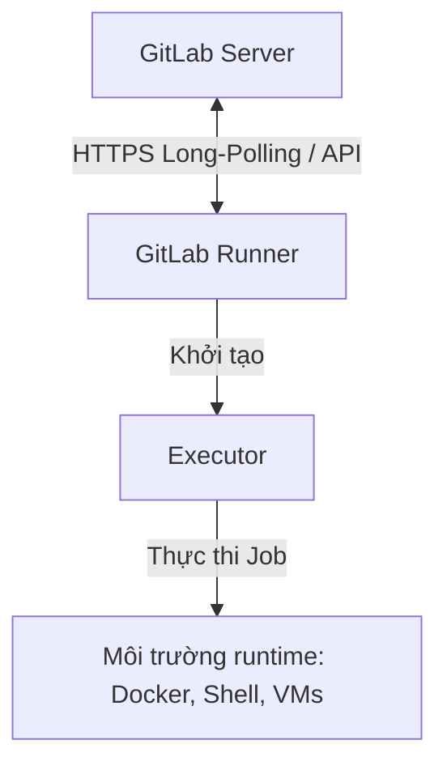

# KIỂM THỬ TỰ ĐỘNG VÀ TRIỂN KHAI CI/CD QUA GITLAB

## MỤC LỤC

* [1. Giới thiệu chi tiết về GitLab CI/CD và các cơ chế chính](#1-giới-thiệu-chi-tiết-về-gitlab-cicd-và-các-cơ-chế-cốt-lõi)
    * [1.1. Khái niệm và Vai trò của CI/CD trong phát triển phần mềm](#11-khái-niệm-và-vai-trò-của-cicd-trong-phát-triển-phần-mềm)
    * [1.2. Các thành phần cấu trúc chính của GitLab CI/CD](#12-các-thành-phần-cấu-trúc-cốt-lõi-của-gitlab-cicd)
    * [1.3. Kiến trúc và cơ chế hoạt động của GitLab Runner](#13-kiến-trúc-và-cơ-chế-hoạt-động-của-gitlab-runner)
    * [1.4. Cấu hình khai báo qua .gitlab-ci.yml](#14-cấu-hình-khai-báo-qua-gitlab-ciyml)
    * [1.5. Phân biệt cơ chế Cache và Artifacts](#15-phân-biệt-cơ-chế-cache-và-artifacts)
* [2. Hướng dẫn thiết lập hệ thống kiểm thử và triển khai tự động](#2-hướng-dẫn-thiết-lập-hệ-thống-kiểm-thử-và-triển-khai-tự-động)
    * [2.1. Cấu hình tệp tin .gitlab-ci.yml trong dự án](#21-cấu-hình-tệp-tin-gitlab-ciyml-trong-dự-án)
    * [2.2. Thiết lập cơ chế bảo vệ nhánh chính và ràng buộc gộp mã nguồn](#22-thiết-lập-cơ-chế-bảo-vệ-nhánh-chính-và-ràng-buộc-gộp-mã-nguồn)
    * [2.3. Cấu hình môi trường triển khai tự động trên Render qua Deploy Hooks](#23-cấu-hình-môi-trường-triển-khai-tự-động-trên-render-qua-deploy-hooks)
* [3. Thực hiện kịch bản kiểm thử luồng hủy đơn hàng (Order Cancel)](#3-thực-hiện-kịch-bản-kiểm-thử-luồng-hủy-đơn-hàng-order-cancel)
* [4. Thực hiện kịch bản kiểm thử chức năng Quản lý hồ sơ cá nhân (FR-04)](#4-thực-hiện-kịch-bản-kiểm-thử-chức-năng-quản-lý-hồ-sơ-cá-nhân-fr-04)
* [5. Thực hiện kịch bản kiểm thử chức năng Xác thực (Đăng ký/Đăng nhập)](#5-thực-hiện-kịch-bản-kiểm-thử-chức-năng-xác-thực-đăng-kýđăng-nhập)

---

## 1. Giới thiệu chi tiết về GitLab CI/CD và các cơ chế chính

### 1.1. Khái niệm và Vai trò của CI/CD trong phát triển phần mềm
Trong quy trình phát triển phần mềm hiện đại, **CI (Continuous Integration)** và **CD (Continuous Delivery/Deployment)** đóng vai trò là xương sống giúp tối ưu luồng bàn giao sản phẩm, giảm thiểu rủi ro tích hợp và kiểm soát chất lượng mã nguồn.

*   **Continuous Integration (CI)**: Yêu cầu các lập trình viên thường xuyên gộp các thay đổi mã nguồn (commits) vào một nhánh chung (nhánh chính như `main` hoặc `develop`). Mỗi lần push sẽ tự động kích hoạt quá trình build và chạy test suite để phát hiện lỗi tích hợp sớm nhất có thể theo phương pháp *Shift-Left Testing*.
*   **Continuous Delivery / Continuous Deployment (CD)**: Tiếp nối quy trình CI. 
    *   *Continuous Delivery*: Đảm bảo mã nguồn sau khi vượt qua các bài test luôn ở trạng thái sẵn sàng để deploy lên môi trường production bất kỳ lúc nào qua lệnh kích hoạt thủ công.
    *   *Continuous Deployment*: Tự động hóa hoàn toàn quy trình release. Mọi thay đổi hợp lệ vượt qua được toàn bộ các pipeline kiểm thử sẽ được deploy trực tiếp lên máy chủ production mà không cần phê duyệt thủ công.

### 1.2. Các thành phần cấu trúc chính của GitLab CI/CD
GitLab CI/CD là giải pháp built-in trong nền tảng GitLab, quản lý quy trình tự động hóa thông qua các khái niệm:

1.  **Pipeline**: Đơn vị thực thi cấp cao nhất của CI/CD. Một pipeline bao gồm tập hợp các stages và jobs định nghĩa cho dự án. Tiến trình chạy của pipeline tuân theo cấu trúc Đồ thị có hướng không chu trình (DAG - Directed Acyclic Graph), cho phép tối ưu hóa và chạy song song các job không phụ thuộc lẫn nhau.
2.  **Stage**: Phân chia pipeline thành các giai đoạn logic chạy tuần tự. Các stage mặc định bao gồm `.pre`, `build`, `test`, `deploy`, và `.post`. Các job thuộc cùng một stage được thực thi song song, các stage tiếp theo chỉ bắt đầu khi toàn bộ job ở stage trước đó đã hoàn thành thành công.
3.  **Job**: Đơn vị thực thi nhỏ nhất trong pipeline, xác định tác vụ cụ thể cần chạy (chạy lệnh shell, chạy test suite, build docker image, v.v.). Mỗi job được cô lập trong môi trường runtime riêng biệt do GitLab Runner khởi tạo.

### 1.3. Kiến trúc và cơ chế hoạt động của GitLab Runner
**GitLab Runner** là một agent mã nguồn mở chịu trách nhiệm xử lý các job được yêu cầu bởi pipeline.



*   **Cơ chế giao tiếp**: Runner kết nối với GitLab Server thông qua HTTPS bằng cơ chế **Long-Polling**. Runner chủ động gửi request để nhận job từ hàng đợi. Thiết kế này giúp bảo vệ hạ tầng Runner vì không yêu cầu mở inbound port trên tường lửa.
*   **Phân loại Runner**:
    *   *Shared Runners*: Do hệ thống cung cấp dùng chung cho toàn bộ các repository, thích hợp cho các tác vụ build và test cơ bản.
    *   *Specific Runners*: Được cấu hình riêng cho một hoặc một nhóm dự án nhất định. Thường được chạy trên hạ tầng riêng của team để phục vụ các yêu cầu về tài nguyên phần cứng, cấu hình mạng nội bộ hoặc tuân thủ chính sách bảo mật riêng.
*   **Executors**: Xác định môi trường chạy các câu lệnh được chỉ định trong job:
    *   `Shell`: Chạy lệnh trực tiếp trên hệ điều hành của máy chủ cài đặt Runner. Đơn giản nhưng thiếu tính cô lập và dễ gây xung đột môi trường.
    *   `Docker`: Khởi tạo một container mới từ Docker image được chỉ định cho mỗi job. Đây là executor phổ biến nhất nhờ tính cô lập hoàn toàn, dễ cấu hình dependencies và dọn dẹp sạch tài nguyên sau khi kết thúc.
    *   `Kubernetes`: Tự động deploy các pod trên cụm Kubernetes để thực thi job, cung cấp khả năng mở rộng (scaling) linh hoạt.

### 1.4. Cấu hình khai báo qua `.gitlab-ci.yml`
Luồng hoạt động của GitLab CI/CD được định nghĩa qua tệp `.gitlab-ci.yml` tại thư mục gốc. Hệ thống sẽ parse tệp này để dựng pipeline dựa trên các từ khóa:
*   `image`: Docker image chỉ định làm môi trường runtime cho job.
*   `stages`: Thứ tự và tên các stages trong pipeline.
*   `before_script` / `after_script`: Các script chạy trước hoặc sau phần xử lý chính.
*   `script`: Các dòng lệnh shell thực hiện tác vụ chính của job.
*   `rules`: Các điều kiện logic để quyết định việc đưa job vào pipeline (dựa trên git branch, pipeline source, file changes, v.v.).

### 1.5. Phân biệt cơ chế Cache và Artifacts
Hai cơ chế lưu trữ này đóng vai trò quan trọng trong việc tối ưu hóa hiệu năng pipeline và truyền nhận dữ liệu giữa các job:

| Tiêu chí | Cache | Artifacts |
| :--- | :--- | :--- |
| **Mục đích** | Tối ưu hóa thời gian build bằng cách tái sử dụng các dependencies đã tải về trước đó (tránh tải lại qua Internet). | Lưu trữ kết quả đầu ra của một stage để chuyển giao sang stage kế tiếp hoặc để download thủ công. |
| **Tính chất** | Không đảm bảo 100% tồn tại (có thể bị xóa/hết hạn mà không ảnh hưởng tới kết quả kiểm thử). | Bắt buộc phải tồn tại nếu stage tiếp theo khai báo phụ thuộc (dependencies/needs). |
| **Ví dụ thực tế** | Thư mục `node_modules/`, local repository của package manager (`.npm/`, `.m2/`). | File build (`dist/`, `build/`), test reports (HTML, XML). |
| **Cơ chế lưu** | Được lưu và chia sẻ qua các lần chạy pipeline khác nhau trên cùng nhánh/dự án. | Được nén zip, đẩy lên GitLab Server và chỉ đi kèm với pipeline định danh cụ thể đó. |

---

## 2. Hướng dẫn thiết lập hệ thống kiểm thử và triển khai tự động

### 2.1. Cấu hình tệp tin `.gitlab-ci.yml` trong dự án
Tệp `.gitlab-ci.yml` của dự án EShop được cấu hình để kiểm thử backend và deploy lên Render như sau:

```yaml
stages:
  - test
  - deploy

test_backend:
  stage: test
  image: node:18
  cache:
    key:
      files:
        - application_demo_2/backend/package-lock.json
    paths:
      - application_demo_2/backend/node_modules/
  script:
    - cd application_demo_2/backend
    - npm ci
    - npm test
  rules:
    - if: $CI_PIPELINE_SOURCE == 'merge_request_event'
    - if: $CI_COMMIT_BRANCH == 'main'
    - if: $CI_COMMIT_BRANCH == 'bugfix/order-cancel'
    - if: $CI_COMMIT_BRANCH == 'bugfix/profile'
    - if: $CI_COMMIT_BRANCH == 'bugfix/auth'

deploy_backend:
  stage: deploy
  image: curlimages/curl:latest
  script:
    - |
      if [ -z "$RENDER_DEPLOY_HOOK_URL" ]; then
        echo "RENDER_DEPLOY_HOOK_URL is not configured. Skipping deployment."
      else
        echo "Triggering Render deploy hook..."
        curl -f -s "$RENDER_DEPLOY_HOOK_URL"
      fi
  rules:
    - if: $CI_COMMIT_BRANCH == 'main'
```

#### Phân tích cơ chế hoạt động của cấu hình trên:
1.  **Stages**: Định nghĩa hai stage tuần tự là `test` và `deploy`. Quy định này đảm bảo job deploy chỉ được thực thi khi toàn bộ job test đã hoàn thành thành công.
2.  **Môi trường thực thi**: Job `test_backend` được cô lập bằng Docker image `node:18` (Node.js LTS), đảm bảo tính nhất quán môi trường chạy thử nghiệm giữa local và CI/CD server.
3.  **Tối ưu hóa với Caching**: 
    *   Sử dụng `key: files` gắn liền với hash của `package-lock.json`. 
    *   Nếu danh sách dependencies không đổi, Runner sẽ khôi phục thư mục `node_modules/` từ cache của lần chạy trước thay vì tải lại, giúp giảm thời gian chạy pipeline.
4.  **Cài đặt thư viện an toàn (`npm ci`)**: Sử dụng lệnh `npm ci` để cài đặt chính xác các phiên bản được khóa cứng trong `package-lock.json`, loại bỏ rủi ro tự động cập nhật thư viện lỗi ngoài ý muốn.
5.  **Kích hoạt linh hoạt (`rules`)**: 
    *   Job `test_backend` chạy khi phát hiện sự kiện Merge Request, push lên `main` hoặc các nhánh bugfix (`bugfix/order-cancel`, `bugfix/profile`, `bugfix/auth`).
    *   Job `deploy_backend` chỉ chạy duy nhất khi gộp code vào `main`.

#### Các bước thực hiện cấu hình tệp tin `.gitlab-ci.yml`:
1. **Tạo tệp cấu hình**: Tại thư mục gốc của dự án, tạo một tệp tin mới có tên là `.gitlab-ci.yml`.
2. **Khai báo các Stage**: Định nghĩa danh sách các giai đoạn chạy của pipeline (bao gồm `test` và `deploy`).
3. **Cấu hình Job kiểm thử (`test_backend`)**:
   - Chỉ định Docker image chạy job (`node:18`).
   - Cấu hình cơ chế lưu cache cho thư mục `node_modules` dựa trên tệp `package-lock.json`.
   - Viết tập lệnh thực thi (`script`) thực hiện di chuyển vào thư mục dự án, cài đặt dependencies sạch bằng `npm ci` và chạy test bằng `npm test`.
   - Thiết lập quy tắc kích hoạt (`rules`) khi có sự kiện Merge Request hoặc push lên các nhánh được chỉ định.
4. **Cấu hình Job triển khai (`deploy_backend`)**:
   - Chỉ định Docker image chạy job (`curlimages/curl:latest`).
   - Viết tập lệnh thực thi (`script`) kiểm tra và gọi webhook deploy Render bằng lệnh `curl`.
   - Thiết lập quy tắc chỉ chạy khi nhánh được push hoặc gộp vào là nhánh `main`.

### 2.2. Thiết lập cơ chế bảo vệ nhánh chính và ràng buộc gộp mã nguồn
Nhánh `main` chứa mã nguồn production ổn định nên được áp dụng các chính sách bảo vệ nghiêm ngặt. Dưới đây là các bước cấu hình trực tiếp trên GitLab:

#### Các bước thiết lập Bảo vệ nhánh chính (Protected Branch):
1. **Truy cập phần cài đặt nhánh**: Trên giao diện GitLab của dự án, truy cập vào menu **Settings** ở thanh điều hướng bên trái, chọn **Repository**.
2. **Cấu hình Protected Branches**: Tìm đến mục **Protected Branches** và nhấn nút **Expand**.
3. **Thêm quy tắc bảo vệ nhánh**:
   - Tại trường **Branch**, chọn nhánh `main`.
   - Tại trường **Allowed to merge**, chọn vai trò được phép gộp mã nguồn (ví dụ: `Developers + Maintainers`).
   - Tại trường **Allowed to push**, thiết lập thành `No one` để cấm hoàn toàn hành vi đẩy mã trực tiếp (Force Push hoặc push thông thường) lên nhánh `main`.
4. **Lưu cấu hình**: Nhấn nút **Protect** để kích hoạt quy tắc.

#### Các bước cấu hình ràng buộc điều kiện gộp mã (Merge Checks):
1. **Truy cập phần cài đặt Merge Requests**: Trên giao diện GitLab, truy cập menu **Settings** -> chọn **Merge requests**.
2. **Thiết lập điều kiện ràng buộc gộp mã**: Tìm đến phần **Merge checks**.
3. **Kích hoạt quy tắc kiểm thử**:
   - Tích chọn ô **Pipelines must succeed**: Ràng buộc này đảm bảo pipeline CI/CD chạy kiểm thử tự động phải hoàn thành thành công (Passed) trước khi cho phép gộp mã. Nếu pipeline báo lỗi (Failed), nút Merge sẽ bị vô hiệu hóa.
   - Tích chọn ô **All threads must be resolved**: Yêu cầu toàn bộ các thảo luận/bình luận của người review trên Merge Request phải được giải quyết xong mới được gộp.
4. **Lưu cấu hình**: Nhấn nút **Save changes** để áp dụng thay đổi.

### 2.3. Cấu hình môi trường triển khai tự động trên Render qua Deploy Hooks
Quy trình triển khai tự động lên Render được thực hiện thông qua Deploy Hooks để đảm bảo chỉ những mã nguồn đã vượt qua kiểm thử mới được phát hành trực tiếp.

#### Các bước thực hiện cấu hình trên Render:
1. **Truy cập trang quản lý Render**: Đăng nhập vào trang quản trị Render và lựa chọn Web Service của dự án backend.
2. **Vô hiệu hóa tự động deploy (Auto-Deploy)**:
   - Di chuyển đến mục **Settings** của Web Service.
   - Tìm kiếm cấu hình **Auto-Deploy** và chuyển trạng thái từ *Yes* sang *No* (hoặc **Off**). Thiết lập này giúp ngăn chặn Render tự động build ứng dụng mỗi khi có commit mới đẩy lên GitHub/GitLab mà chưa qua kiểm thử.
3. **Trích xuất Deploy Hook URL**:
   - Vẫn tại mục **Settings**, cuộn xuống phần **Deploy Hook**.
   - Sao chép (Copy) đường dẫn URL được Render cung cấp dưới dạng: `https://api.render.com/deploy/srv-...`.

#### Các bước cấu hình biến môi trường bảo mật trên GitLab:
1. **Truy cập mục thiết lập biến CI/CD**: Trên giao diện GitLab của dự án, truy cập **Settings** -> chọn **CI/CD**.
2. **Cấu hình biến môi trường**: Tìm đến mục **Variables** và nhấn nút **Expand**.
3. **Thêm biến mới**:
   - Nhấn vào **Add variable**.
   - Tại ô **Key**, nhập tên biến: `RENDER_DEPLOY_HOOK_URL`.
   - Tại ô **Value**, dán đường dẫn URL Deploy Hook đã sao chép từ Render.
   - Tích chọn tùy chọn **Protect variable** (chỉ cho phép các nhánh được bảo vệ truy cập) và **Mask variable** (ẩn giá trị biến trong log chạy pipeline để tránh lộ lọt thông tin nhạy cảm).
4. **Hoàn tất lưu**: Nhấn nút **Add variable** để lưu lại cấu hình.

---

## 3. Thực hiện kịch bản kiểm thử luồng hủy đơn hàng (Order Cancel)

Kịch bản kiểm thử được thiết kế nhằm phát hiện và ngăn chặn lỗi nghiệp vụ: cho phép khách hàng hủy đơn hàng khi đơn hàng đang ở trạng thái vận chuyển (shipping).

### Các bước thực hiện kịch bản:
1. **Viết tích hợp kiểm thử & Tạo Merge Request**: Viết các test case tích hợp (Jest + Supertest) và đẩy code lên nhánh bugfix, khởi tạo Merge Request để kích hoạt pipeline.
2. **Kích hoạt Pipeline tự động (Trạng thái Failed)**: Pipeline CI/CD chạy kiểm thử và phát hiện lỗi logic nghiệp vụ (vẫn cho phép hủy đơn ở trạng thái shipping). Nút Merge bị khóa.
3. **Khắc phục lỗi logic**: Lập trình viên cập nhật mã nguồn kiểm tra trạng thái đơn hàng trong `server.js` và push code mới lên.
4. **Xác thực lại và Gộp nhánh (Trạng thái Passed)**: Pipeline CI/CD chạy lại thành công, nút Merge được mở khóa và tiến hành gộp vào nhánh `main`.
5. **Tự động Deploy**: Sau khi gộp code vào `main`, pipeline kích hoạt job deploy gửi yêu cầu đến Render Deploy Hook để cập nhật môi trường chạy thực tế.

---

## 4. Thực hiện kịch bản kiểm thử chức năng Quản lý hồ sơ cá nhân (FR-04)

Kịch bản kiểm thử được thiết kế nhằm xác thực các quy định nghiệp vụ và bảo mật liên quan đến việc cập nhật hồ sơ thông tin cá nhân của người dùng, bao gồm:
* Ràng buộc định dạng Số điện thoại hợp lệ (phải bắt đầu bằng số `0`, từ 10–11 chữ số).
* Ngăn chặn lỗ hổng bảo mật tự nâng cấp quyền hạn, đảm bảo người dùng thông thường không thể tự sửa trường `role` thành `admin` thông qua API cập nhật thông tin cá nhân.

### Các bước thực hiện kịch bản:
1. **Thiết lập kịch bản kiểm thử**: Xây dựng tệp unit test `profile.test.js` và tệp kịch bản kiểm thử độc lập `test_profile_flow.js`. Khởi tạo Merge Request từ nhánh `bugfix/profile` sang nhánh `main`.
2. **Kích hoạt Pipeline tự động (Trạng thái Failed)**: Pipeline chạy kiểm thử tự động báo thất bại (Failed) do API cho phép lưu số điện thoại sai định dạng và cho phép người dùng tự nâng quyền. Nút Merge bị khóa.
3. **Khắc phục lỗi định dạng & Lỗ hổng bảo mật**: Sửa đổi logic trong `server.js` (thêm regex xác thực SĐT và loại bỏ logic sửa trường `role`).
4. **Xác thực lại và Gộp nhánh (Trạng thái Passed)**: Pipeline chạy lại thành công, nút Merge được mở khóa để tiến hành gộp vào nhánh chính.
5. **Tự động Deploy**: Hệ thống tự động triển khai phiên bản đã sửa lỗi an toàn lên máy chủ Render thông qua Deploy Hook.

---

## 5. Thực hiện kịch bản kiểm thử chức năng Xác thực (Đăng ký/Đăng nhập)

Kịch bản kiểm thử được thiết kế nhằm xác thực các tính năng đăng ký tài khoản, đăng nhập hệ thống, cơ chế khóa tài khoản (Account Lockout) khi nhập sai mật khẩu nhiều lần, và quy trình cấp lại mật khẩu (Forgot/Reset Password).

### Các bước thực hiện kịch bản:
1. **Thiết lập kịch bản kiểm thử**: Xây dựng tệp unit test `auth.test.js` trong thư mục `backend` sử dụng Jest và Supertest. Khởi tạo Merge Request từ nhánh `bugfix/auth` sang nhánh `main`.
2. **Kích hoạt Pipeline tự động (Trạng thái Passed)**: Pipeline CI/CD tự động kích hoạt để chạy toàn bộ các suite kiểm thử (`auth.test.js`, `profile.test.js`, `order.test.js`).
3. **Xác thực và Gộp nhánh (Trạng thái Passed)**: Khi pipeline hoàn thành thành công (Passed), tiến hành gộp code từ nhánh `bugfix/auth` vào nhánh chính `main`.
4. **Tự động Deploy**: Sau khi gộp vào `main`, pipeline kích hoạt job deploy tự động gọi Webhook để triển khai mã nguồn mới nhất lên máy chủ Render.


