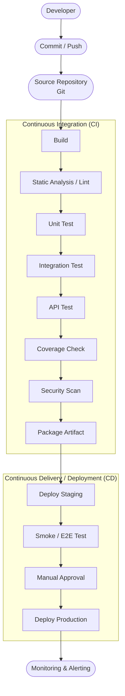
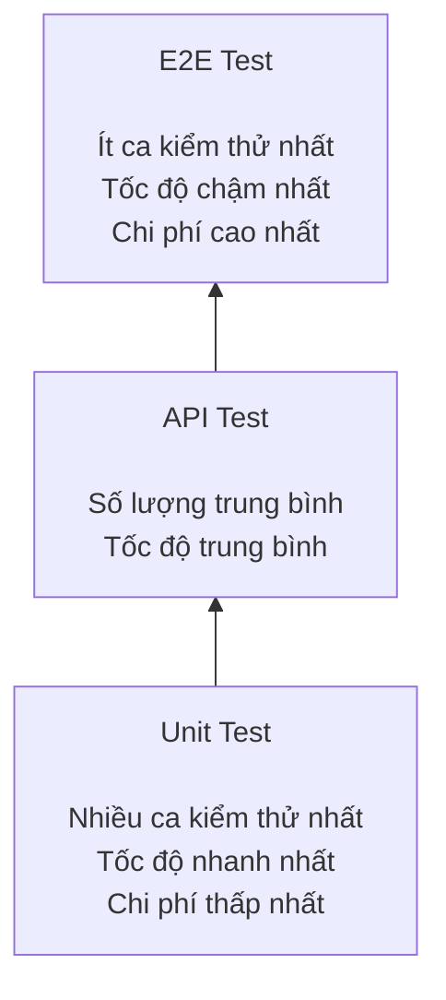

# Báo cáo về chủ đề CI/CD & Test-Harness Engineering

**Nhóm 06 - Môn Kiểm thử phần mềm**

## Mục lục

1. [Tổng quan về CI/CD](#1-tổng-quan-về-cicd)
2. [Cấu trúc một CI/CD Pipeline](#2-cấu-trúc-một-cicd-pipeline)
3. [Test-Harness Engineering](#3-test-harness-engineering)
4. [Các loại kiểm thử trong CI/CD (Test Pyramid)](#4-các-loại-kiểm-thử-trong-cicd-test-pyramid)
5. [Chiến lược tích hợp Test-Harness vào Pipeline](#5-chiến-lược-tích-hợp-test-harness-vào-pipeline)
6. [Khảo sát công cụ hỗ trợ](#6-khảo-sát-công-cụ-hỗ-trợ)
7. [Các vấn đề thực tế thường gặp](#7-các-vấn-đề-thực-tế-thường-gặp)
8. [Xu hướng tương lai](#8-xu-hướng-tương-lai)
9. [Best Practices](#9-best-practices)
10. [Kết luận](#10-kết-luận)
11. [Tài liệu tham khảo](#11-tài-liệu-tham-khảo)

---

## 1. Tổng quan về CI/CD

### 1.1 Vấn đề trước khi có CI/CD

Trước khi CI/CD phổ biến, các nhóm phát triển thường gặp khó khăn khi tích hợp hệ thống do lập trình viên làm việc độc lập trong thời gian dài, tích hợp code muộn, chỉ gộp sau nhiều tuần/tháng. 

Hệ quả:

- Việc kiểm thử thủ công mất nhiều thời gian, dễ bỏ sót các trường hợp cần kiểm tra, khó thực hiện lặp lại một cách nhất quán và khó phát hiện các lỗi phát sinh sau khi hệ thống được chỉnh sửa.
- Khi tích hợp muộn, xung đột code và lỗi giao tiếp giữa các module rất khó sửa, chi phí sửa chữa cao.
- Việc nhận phản hồi diễn ra chậm, thời gian phát hành sản phẩm kéo dài và sản phẩm vẫn có thể còn nhiều lỗi khi đến tay người dùng.

### 1.2 Khái niệm

| Khái niệm | Định nghĩa | Đặc điểm |
|---|---|---|
| **CI - Continuous Integration** (Tích hợp liên tục) | Lập trình viên thường xuyên tích hợp mã nguồn vào nhánh chung (nhiều lần mỗi ngày); sau mỗi lần tích hợp, hệ thống tự động biên dịch và kiểm thử mã nguồn. | Không tự động triển khai; mục tiêu là phát hiện sớm các xung đột và lỗi biên dịch. |
| **CD - Continuous Delivery** (Chuyển giao liên tục) | Nối tiếp CI: Mã nguồn luôn ở trạng thái sẵn sàng để triển khai lên bất kỳ môi trường nào. | Tự động triển khai lên môi trường tiền sản xuất, nhưng khi triển khai lên môi trường sản xuất vẫn cần được phê duyệt thủ công.|
| **CD - Continuous Deployment** (Triển khai liên tục) | Mọi thay đổi sau khi vượt qua toàn bộ quy trình kiểm thử tự động sẽ được tự động triển khai lên môi trường sản xuất. | Không cần phê duyệt thủ công; đòi hỏi bộ kiểm thử tự động có độ tin cậy rất cao. |

So sánh nhanh:

| Khía cạnh | CI | Continuous Delivery | Continuous Deployment |
|---|---|---|---|
| Deploy production | Không | Cần phê duyệt thủ công | Tự động |
| Tần suất release | Vài lần/ngày | Hàng ngày/tuần | Hàng giờ/ngày |
| Rủi ro | Thấp | Trung bình | Cao (đòi hỏi kiểm thử rất chặt) |
| Phù hợp | Mọi dự án | Dự án ổn định | các dự án khởi nghiệp (startup), các sản phẩm phần mềm cung cấp dưới dạng dịch vụ (SaaS) và ứng dụng web.|

### 1.3 Ưu điểm và nhược điểm

**Ưu điểm:**
- Phát hiện lỗi biên dịch hay lỗi môi trường từ sớm, tránh lỗi không đáng có.
- Đảm bảo tính năng mới không phá vỡ tính năng cũ nhờ kiểm thử tự động (phát hiện lỗi phát sinh sau khi thay đổi mã nguồn).
- Lập trình viên có thể tập trung vào việc phát triển mã nguồn thay vì phải biên dịch và triển khai thủ công; kết quả phản hồi được nhận chỉ sau vài phút thay vì phải chờ đến ngày hôm sau.
- Nâng cao chất lượng mã nguồn thông qua các quy định của quy trình phát triển (giới hạn số lượng thay đổi trong mỗi yêu cầu hợp nhất (PR), yêu cầu pipeline hoàn thành thành công trước khi hợp nhất mã nguồn).
- Cho phép phát hành phần mềm nhanh chóng, nhiều lần trong ngày mà vẫn bảo đảm chất lượng.

**Nhược điểm:**
- Nhiều yêu cầu hợp nhất mã nguồn (PR) được tạo cùng lúc có thể làm tăng thời gian chờ hợp nhất, phát sinh xung đột mã nguồn và phải thực hiện lại toàn bộ quy trình kiểm thử, từ đó làm chậm tiến độ phát triển.
- Phụ thuộc vào dịch vụ CI/CD của bên thứ ba; khi dịch vụ gặp sự cố hoặc ngừng hoạt động, toàn bộ quy trình phát triển phần mềm có thể bị ảnh hưởng.
- Cần đầu tư ban đầu về hạ tầng và năng lực vận hành; nếu đội ngũ chưa có đủ chuyên môn, các sự cố trong quy trình tự động (pipeline) có thể gây gián đoạn nhiều hơn những lợi ích mà CI/CD mang lại.

### 1.4 Khi nào nên/không nên áp dụng

- **Nên áp dụng càng sớm càng tốt**, kể cả đối với các dự án cá nhân, vì nhiều nền tảng cung cấp gói miễn phí đáp ứng đủ nhu cầu của các dự án nhỏ.
- **Nên cân nhắc chỉ áp dụng ở mức cơ bản hoặc tạm thời chưa áp dụng** khi tổ chức chưa có nhân sự đủ năng lực vận hành CI/CD, lập trình viên chưa thành thạo các công cụ hoặc nhóm chưa thể bảo đảm quy trình tự động hoạt động ổn định. Trong những trường hợp này, việc xử lý sự cố có thể tốn nhiều thời gian hơn những lợi ích mà CI/CD mang lại.
- **Nên triển khai thử nghiệm trên từng nhóm nhỏ** (theo ngôn ngữ lập trình hoặc nền tảng phát triển) trước khi áp dụng cho toàn bộ dự án hoặc tổ chức.

### 1.5 Yếu tố lựa chọn nền tảng CI/CD

Khi chọn công cụ CI/CD, cần cân nhắc:

1. **Cloud-based vs Self-hosted** - Cloud-based không cần tự quản lý và bảo trì hạ tầng; Self-hosted cho phép kiểm soát tốt hơn về bảo mật và tài nguyên.
2. **Tính dễ dùng** - giao diện thân thiện, tài liệu đầy đủ và giúp rút ngắn thời gian hòa nhập của thành viên mới.
3. **Khả năng tích hợp** - có thể tích hợp với ngôn ngữ lập trình, hệ thống quản lý mã nguồn (VCS), hệ thống theo dõi công việc và nền tảng điện toán đám mây đang sử dụng.
4. **Khả năng cấu hình** - hỗ trợ cấu hình điều kiện kích hoạt, xử lý khi quy trình thất bại, quản lý biến môi trường và thông tin bí mật, thông qua script, tệp YAML hoặc giao diện người dùng.
5. **Chi phí** Phù hợp với ngân sách, bao gồm thời lượng thực hiện build, số lượng người dùng và dung lượng lưu trữ các tệp đầu ra (artifact).
6. **Mức độ quen thuộc của đội ngũ** - công cụ được sử dụng phổ biến, dễ tìm tài liệu và nhận được sự hỗ trợ từ cộng đồng.
7. **Khả năng mở rộng/hiệu năng** - đáp ứng tốt khối lượng công việc lớn, đồng thời hỗ trợ tùy biến thông qua hệ sinh thái plugin.

---

## 2. Cấu trúc một CI/CD Pipeline

### 2.1 Sơ đồ tổng quát

- Ví dụ thực tế: 

Lập trình viên đẩy mã nguồn lên GitHub, sau đó GitHub Actions tự động biên dịch ứng dụng, thực hiện kiểm thử đơn vị và kiểm thử tích hợp. Nếu tất cả các bước đều thành công, hệ thống sẽ tự động triển khai lên môi trường tiền sản xuất. Sau khi một thành viên xem xét và phê duyệt, ứng dụng sẽ được triển khai lên môi trường sản xuất.

### 2.2 Các giai đoạn và vai trò

| Giai đoạn | Mục đích | Loại lỗi phát hiện | Ví dụ công cụ |
|---|---|---|---|
| **Kích hoạt quy trình** (Trigger) | Khởi động quy trình tự động khi có sự kiện như push, pull request, schedule (cron), manual hoặc tạo thẻ phiên bản (release tag). | - | GitHub Actions `on:`, GitLab `rules:` |
| **Cài đặt thư viện** | Cài đặt các thư viện cần thiết, cố định phiên bản và bảo đảm môi trường phát triển nhất quán. | Thiếu thư viện, không tương thích phiên bản. | npm/yarn, pip, Maven/Gradle, go mod |
| **Phân tích tĩnh/Kiểm tra quy tắc mã nguồn/Định dạng mã nguồn** (Static Analysis/Lint/Format) | Kiểm tra chất lượng mã nguồn và phát hiện các lỗi tiềm ẩn mà không cần chạy chương trình. | Vi phạm quy tắc viết mã, biến hoặc thư viện không được sử dụng, các lỗ hổng bảo mật cơ bản. | ESLint, Prettier, Pylint/Ruff, golangci-lint, Checkstyle/PMD, SonarQube |
| **Biên dịch và đóng gói** (Build) | Biên dịch và đóng gói mã nguồn thành sản phẩm hoặc tệp đầu ra có thể triển khai. | Lỗi biên dịch, xung đột giữa các thư viện. | Maven/Gradle, go build, webpack/esbuild, Docker build |
| **Kiểm thử đơn vị** (Unit Test) | Kiểm thử riêng từng hàm hoặc phương thức, tách biệt với các thành phần phụ thuộc. | Lỗi logic, các trường hợp biên, ngoại lệ chưa được xử lý. | Jest, Vitest, pytest, JUnit, Go testing, NUnit/xUnit |
| **Kiểm thử tích hợp** (Integration Test) | Kiểm tra sự tương tác giữa các mô-đun, dịch vụ hoặc cơ sở dữ liệu. | Không tương thích giao diện, lỗi truy vấn cơ sở dữ liệu, điều kiện tranh chấp. | Testcontainers, WireMock, Spring Test |
| **Kiểm thử API** | Kiểm tra toàn bộ quá trình xử lý của API từ yêu cầu đến phản hồi. | Sai mã trạng thái, sai cấu trúc dữ liệu phản hồi, lỗi nghiệp vụ. | Postman/Newman, REST Assured, Supertest |
| **Báo cáo độ bao phủ kiểm thử** (Coverage Report) | Đo tỷ lệ mã nguồn đã được kiểm thử và xác định các phần mã chưa được kiểm thử. | Mã nguồn chưa được kiểm thử, đoạn mã có độ phức tạp cao nhưng độ bao phủ thấp. | JaCoCo, Istanbul/nyc, coverage.py, Codecov |
| **Quét bảo mật** (Security Scan) | Kiểm tra các lỗ hổng bảo mật trong thư viện, mã nguồn và ảnh vùng chứa (container image). | Lỗ hổng bảo mật (CVE), thông tin bí mật được ghi trực tiếp trong mã nguồn, ảnh vùng chứa lỗi thời. | Snyk, OWASP Dependency-Check, Trivy, Semgrep, Dependabot |
| **Đóng gói sản phẩm đầu ra** (Package Artifact) | Đóng gói sản phẩm đầu ra thành tệp thực thi hoặc container image, sau đó lưu vào kho lưu trữ với phiên bản tương ứng. | Thiếu sản phẩm đầu ra hoặc gán sai phiên bản. | Docker Registry, JFrog Artifactory, GitHub Packages |
| **Triển khai lên môi trường tiền sản xuất** (Deploy Staging) | Triển khai ứng dụng lên môi trường có cấu hình tương tự môi trường sản xuất để tiếp tục kiểm thử. | Lỗi cấu hình triển khai, thiếu thư viện hoặc thành phần của môi trường. | Kubernetes/Helm, Docker Compose, Terraform |
| **Kiểm thử nhanh/Kiểm thử đầu cuối** (Smoke Test/E2E Test) | Kiểm tra nhanh hệ thống sau khi triển khai hoặc kiểm thử toàn bộ luồng sử dụng của người dùng. | Lỗi triển khai, lỗi giao diện, lỗi tích hợp giữa giao diện và hệ thống phía máy chủ. | Playwright, Cypress, Selenium |
| **Phê duyệt và triển khai lên môi trường sản xuất** (Manual Approval/Production Deploy) | Thành viên có trách nhiệm xem xét và phê duyệt trước khi triển khai lên môi trường sản xuất (đối với Continuous Delivery) hoặc triển khai tự động (đối với Continuous Deployment). | Rủi ro về nghiệp vụ, các thay đổi có thể làm ảnh hưởng đến chức năng hiện có. | Blue-green, Canary deployment |
| **Giám sát và cảnh báo** (Monitoring & Alerting) | Theo dõi tình trạng hoạt động của hệ thống sau khi triển khai và gửi cảnh báo khi có bất thường. | Các lỗi phát sinh trên môi trường sản xuất. | Prometheus/Grafana, healthcheck endpoint |

**Nguyên tắc phát hiện lỗi sớm**: Các bước thực hiện nhanh và ít tốn tài nguyên như kiểm tra quy tắc mã nguồn và kiểm thử đơn vị nên được thực hiện trước. Nếu phát hiện lỗi, quy trình sẽ dừng ngay để tránh lãng phí thời gian và tài nguyên cho các bước tốn kém hơn như kiểm thử đầu cuối hoặc quét bảo mật chuyên sâu.

---

## 3. Kỹ thuật xây dựng môi trường kiểm thử tự động (Test-Harness Engineering)

### 3.1 Định nghĩa

**Test Harness** là tập hợp các công cụ, thư viện, dữ liệu kiểm thử và cấu hình được xây dựng để **tự động hóa việc thực thi test, thu thập kết quả và báo cáo** một cách nhất quán, lặp lại được. Có thể hình dung Test Harness giống *giàn giáo* khi xây nhà: hỗ trợ việc kiểm thử diễn ra, nhưng bản thân nó không phải là sản phẩm chính.

Về mặt kỹ thuật, Test Harness gồm hai phần lõi:
- **Test execution engine**: bộ máy thực thi test.
- **Test script repository**: kho lưu trữ test case/script.

Nó cung cấp bản sao của tài nguyên/cấu hình chưa có sẵn (driver, stub) để có thể kiểm thử ngay cả khi một phần hệ thống chưa hoàn thiện - vì vậy phục vụ tốt cho cả **automation testing** lẫn **integration testing**.

### 3.2 Phân biệt các khái niệm dễ nhầm lẫn

| Thuật ngữ | Định nghĩa | Phạm vi | Ví dụ |
|---|---|---|---|
| **Bộ kiểm thử (Test Suite)** | Tập hợp các ca kiểm thử dùng để xác minh một chức năng hoặc một phần của hệ thống. | Nội dung kiểm thử | Bộ kiểm thử cho chức năng thanh toán |
| **Khung kiểm thử (Test Framework)** | Thư viện hoặc nền tảng hỗ trợ xây dựng và thực hiện các ca kiểm thử, cung cấp các chức năng như kiểm tra kết quả (assert), mô phỏng (mock) và chạy kiểm thử (test runner). | Công cụ (thư viện) | Jest, JUnit, pytest, Cypress |
| **Hạ tầng kiểm thử (Test Harness)** | Toàn bộ môi trường phục vụ việc thực hiện kiểm thử, bao gồm khung kiểm thử, dữ liệu kiểm thử, thành phần mô phỏng, môi trường thực thi và công cụ ghi nhận kết quả. | Hệ thống | Docker Compose + Jest + Fixtures + WireMock |
| **Đường ống CI/CD (CI/CD Pipeline)** | Quy trình tự động thực hiện các bước như build, kiểm thử và triển khai, được kích hoạt bởi các sự kiện từ hệ thống quản lý mã nguồn. | Quy trình điều phối | Quy trình GitHub Actions chạy lint → test → deploy |

Trong thực tế, CI/CD Pipeline là lớp điều phối cao nhất: nó sử dụng Test Harness để thực thi Test Suite, còn Test Framework là công cụ được sử dụng bên trong Test Harness.

### 3.3 Các thành phần cốt lõi

| Thành phần | Vai trò |
|---|---|
| **Test Runner** | Thực thi các tập lệnh kiểm thử, tổng hợp kết quả đạt/không đạt và tạo báo cáo kiểm thử. (Ví dụ: Jest, pytest, JUnit, Go testing) |
| **Test Script** | Mã nguồn chứa các ca kiểm thử, thường được xây dựng theo mô hình chuẩn bị - thực hiện - kiểm tra (Arrange - Act - Assert). |
| **Test Data** | Dữ liệu đầu vào và kết quả mong đợi, có thể được khai báo trực tiếp trong mã nguồn, lưu trong tệp fixture (JSON, YAML), hoặc được tạo bằng factory method hay builder pattern. |
| **Fixture** | Chuẩn bị môi trường trước khi kiểm thử và dọn dẹp sau khi kiểm thử, chẳng hạn như kết nối cơ sở dữ liệu, tạo dữ liệu mẫu hoặc xóa dữ liệu tạm. |
| **Mock** | Thành phần mô phỏng đối tượng hoặc dịch vụ, cho phép kiểm soát giá trị trả về và theo dõi các lần được gọi, đồng thời có thể kiểm tra xem đối tượng đã được gọi đúng cách hay chưa. |
| **Stub** | Thành phần mô phỏng tương tự mock, nhưng chỉ trả về các giá trị được định nghĩa trước và không theo dõi các lần được gọi. |
| **Driver** | Thành phần điều khiển hệ thống cần kiểm thử (System Under Test – SUT), giúp trừu tượng hóa các thao tác, chẳng hạn như điều khiển trình duyệt. |
| **Assertion** | Kiểm tra và so sánh kết quả thực tế với kết quả mong đợi. |
| **Test Environment** | Bao gồm cơ sở dữ liệu, các dịch vụ mô phỏng, container, biến môi trường và thông tin bí mật (secret) phục vụ quá trình kiểm thử. |
| **Reporter** | Xuất kết quả kiểm thử dưới các định dạng như console, JUnit XML, HTML hoặc JSON để con người và hệ thống CI/CD có thể sử dụng. |
| **Log/Artifact** | Lưu trữ nhật ký, ảnh chụp màn hình, video, bản ghi thực thi (trace) hoặc bản sao cơ sở dữ liệu (database dump) khi kiểm thử thất bại để hỗ trợ gỡ lỗi. |

### 3.4 Quy trình xây dựng Test Harness

1. Cài đặt và cấu hình Test Harness, bao gồm công cụ kiểm thử tự động, dữ liệu kiểm thử và môi trường kiểm thử.
2. Viết các tập lệnh kiểm thử (test script) cho từng chức năng hoặc từng tình huống, bắt đầu từ dữ liệu hợp lệ, dữ liệu biên và dữ liệu nhạy cảm.
3. Kích hoạt thực hiện toàn bộ bộ kiểm thử bằng một lệnh hoặc một thao tác tự động, đồng thời thu thập kết quả thực thi.
4. So sánh kết quả thực tế với kết quả mong đợi, ghi nhận các sai lệch hoặc lỗi phát hiện được.
5. Tạo báo cáo kiểm thử, chia sẻ với các bên liên quan và cập nhật các tập lệnh kiểm thử khi phần mềm hoặc yêu cầu kiểm thử thay đổi.

### 3.5 Ưu điểm và nhược điểm

**Ưu điểm:** 
- Nâng cao năng suất của người kiểm thử và lập trình viên.
- Hỗ trợ thực hiện kiểm thử tự động lặp lại, giảm sự phụ thuộc vào thao tác thủ công.
- Hỗ trợ gỡ lỗi thông qua nhật ký, ảnh chụp màn hình và các thông tin ghi nhận khác.
- Phát hiện lỗi sớm trong vòng đời phát triển phần mềm.
- Đo lường mức độ bao phủ của các ca kiểm thử đối với mã nguồn.
- Bao phủ được các chức năng và tình huống kiểm thử phức tạp, khó thực hiện hoặc khó tái hiện bằng phương pháp thủ công.

**Nhược điểm:** 
- Không hỗ trợ chức năng ghi và phát lại như một số công cụ kiểm thử giao diện người dùng chuyên dụng.
- Đòi hỏi kiến thức và kỹ năng kỹ thuật để thiết kế, xây dựng và bảo trì. 
- Tốn thời gian và chi phí đầu tư ban đầu, đặc biệt đối với các hệ thống có quy mô lớn hoặc kiến trúc phức tạp.

### 3.6 Vai trò của Test Harness trong CI/CD

Nếu không có Test Harness đủ tin cậy, quy trình CI/CD sẽ khó bảo đảm chất lượng của các bước kiểm thử tự động. Test Harness mang lại các lợi ích sau:

- **Tính nhất quán (Consistency)**: Mỗi lần kiểm thử đều được thực hiện trong cùng một môi trường và cùng một quy trình, giúp kết quả có thể tái lập (reproducible) và giảm các ca kiểm thử không ổn định (flaky test).
- **Tốc độ và khả năng mở rộng (Speed & Scalability)**: Cho phép thực hiện hàng nghìn ca kiểm thử tự động mà không cần thao tác thủ công.
- **Tính độc lập (Isolation)**: Sử dụng mock để mô phỏng các dịch vụ bên ngoài, giúp quá trình kiểm thử không phụ thuộc vào các hệ thống không ổn định.
- **Độ tin cậy và khả năng gỡ lỗi (Reliability & Debugging)**: Cung cấp nhật ký thực thi, ảnh chụp màn hình, dấu vết thực thi để hỗ trợ phân tích nguyên nhân khi kiểm thử thất bại.
- Bảo đảm các ca kiểm thử được thực hiện **nhất quán trên máy phát triển (local) và máy chạy CI (CI agent)**, tạo nền tảng để pipeline có thể phát hiện và ngăn chặn các thay đổi có lỗi trước khi triển khai lên môi trường sản xuất (production).

---

## 4. Các loại kiểm thử trong CI/CD (Test Pyramid)

| Loại test | Mục tiêu | Vị trí pipeline | Tốc độ | Công cụ tiêu biểu |
|---|---|---|---|---|
| **Unit Test** | Kiểm thử một hàm hoặc phương thức riêng lẻ, mô phỏng (mock) toàn bộ các thành phần phụ thuộc. | Sớm nhất, ngay sau bước build.| Rất nhanh (khoảng 10–100 ms mỗi ca kiểm thử). | Jest, Vitest, pytest, JUnit, Go testing |
| **Integration Test** | Kiểm tra sự tương tác giữa các mô-đun, cơ sở dữ liệu và dịch vụ. | Sau unit test | Trung bình (khoảng 100 ms–1s mỗi ca kiểm thử).| Testcontainers, WireMock, Spring Test |
| **API Test** | Kiểm tra toàn bộ quá trình xử lý của API từ yêu cầu đến phản hồi. | Sau integration test | Trung bình (khoảng 100–500 ms cho mỗi yêu cầu). | Postman/Newman, REST Assured, Supertest |
| **E2E Test** | Kiểm tra toàn bộ luồng thao tác của người dùng thông qua giao diện thực tế. | Trên môi trường staging, trước khi phát hành hoặc trong quy trình chạy định kỳ vào ban đêm. | Chậm (khoảng 1–5 giây mỗi ca kiểm thử). | Playwright, Cypress, Selenium, Appium |
| **Smoke Test** | Kiểm tra nhanh sau khi triển khai để xác nhận ứng dụng vẫn hoạt động. | Ngay sau deploy | Rất nhanh (khoảng 10–30 giây cho toàn bộ bài kiểm thử). | HTTP healthcheck, curl |
| **Regression Test** | Đảm bảo các thay đổi mới không làm hỏng các chức năng đã hoạt động trước đó. | Sau Unit Test, Integration Test và API Test. | Phụ thuộc vào các bộ kiểm thử được sử dụng lại. | Thực hiện bằng bộ kiểm thử hiện có, chạy định kỳ |
| **Performance/Load Test** | Đánh giá thời gian phản hồi và khả năng xử lý khi hệ thống chịu tải lớn. | Trong quy trình chạy định kỳ hoặc trước khi phát hành.| Chậm (khoảng 5–30 phút). | k6, JMeter, Gatling, Locust |
| **Security Test** | Phát hiện các lỗ hổng bảo mật như SQL Injection (SQLi), Cross-site Scripting (XSS) và các thư viện có lỗ hổng (CVE). | Quét thư viện từ sớm; quét mã nguồn ở mỗi PR. | Nhanh hoặc chậm tùy theo mức độ quét. | Snyk, OWASP DC, Trivy, Semgrep |

---

## 5. Chiến lược tích hợp Test-Harness vào Pipeline

### 5.1 Áp dụng Test Pyramid trong pipeline

- **PR pipeline** (feedback nhanh, <10 phút): lint + unit test + integration test cơ bản.
- **Nightly pipeline** (toàn diện, 30–60 phút): toàn bộ test + E2E test + performance test + quét bảo mật chuyên sâu.
- **Release pipeline** (nghiêm ngặt): hực hiện toàn bộ các loại kiểm thử, quét bảo mật toàn diện và yêu cầu phê duyệt thủ công trước khi triển khai lên môi trường sản xuất.

### 5.2 Chạy kiểm thử song song (Parallelization)

Khi số lượng ca kiểm thử tăng, chạy tuần tự làm nghẽn pipeline. Giải pháp là chia các tệp kiểm thử chạy song song trên nhiều worker/thread (VD: `--maxWorkers` của Jest) hoặc phân phối sang nhiều máy (**sharding**, VD `npx playwright test --shard=1/3`). Nhờ đó, thời gian thực hiện toàn bộ bộ kiểm thử được rút ngắn đáng kể.

### 5.3 Xử lý Flaky Test

Flaky test là là các ca kiểm thử có kết quả không ổn định, lúc thành công, lúc thất bại mặc dù mã nguồn không thay đổi. Nguyên nhân thường gặp gồm: 
- Vấn đề về thời gian thực thi (timing) hoặc điều kiện tranh chấp (race condition). 
- Dữ liệu ngẫu nhiên. 
- Phụ thuộc vào các dịch vụ bên ngoài không ổn định. 
- Các ca kiểm thử phụ thuộc vào thứ tự thực hiện. 

Chiến lược xử lý:

1. **Tự động chạy lại (Auto-retry)**: Thực hiện lại tối đa 2–3 lần trước khi xác định ca kiểm thử thất bại.
2. **Cách ly (Quarantine)**: Gắn nhãn @flaky hoặc @quarantine để tách các ca kiểm thử này khỏi quy trình chặn pipeline chính, giúp nhóm kiểm thử (QA) xử lý riêng.
3. **Sử dụng explicit wait** thay cho thời gian chờ cố định (fixed timeout), **dùng dữ liệu cố định** thay vì dữ liệu ngẫu nhiên, **mock các dịch vụ bên ngoài** và bảo đảm mỗi ca kiểm thử hoạt động độc lập bằng cách **chuẩn bị và dọn dẹp dữ liệu trước, sau mỗi lần kiểm thử**.

### 5.4 Shift-Left & Shift-Right Testing

- **Shift-Left**: Đưa hoạt động kiểm thử sang các giai đoạn sớm nhất của quá trình phát triển, chẳng hạn thực hiện lint và phân tích tĩnh ngay trên máy của lập trình viên thông qua Git Hooks (ví dụ: husky kết hợp lint-staged) trước khi push mã nguồn.
- **Shift-Right**: Thực hiện kiểm thử sau khi hệ thống đã được triển khai lên môi trường sản xuất bằng các kỹ thuật như:
  - Canary Deployment: Triển khai phiên bản mới cho một tỷ lệ nhỏ người dùng trước, theo dõi hoạt động rồi mới mở rộng phạm vi triển khai.
  - Synthetic Monitoring: Thực hiện các kịch bản kiểm thử tự động theo định kỳ trên môi trường sản xuất để giám sát khả năng hoạt động của hệ thống.

---

## 6. Khảo sát công cụ hỗ trợ

### 6.1 

### 6.2

### 6.3

### 6.4

### 6.5

### 6.6

### 6.7

### 6.8

### 6.9

### 6.10

---

## 7. Các vấn đề thực tế thường gặp

| Vấn đề | Nguyên nhân chính | Hướng khắc phục |
|---|---|---|
| **Flaky test** |Điều kiện tranh chấp (race condition), dữ liệu ngẫu nhiên, phụ thuộc vào dịch vụ bên ngoài, các ca kiểm thử phụ thuộc thứ tự thực hiện. | Sử dụng explicit wait, dữ liệu kiểm thử cố định, mock các dịch vụ bên ngoài, retry có giới hạn và bảo đảm các ca kiểm thử độc lập. |
| **Pipeline chạy chậm** | Quá nhiều ca kiểm thử, thực hiện tuần tự, quá trình build hoặc tạo artifact mất nhiều thời gian. | Chạy song song, lưu bộ nhớ đệm cho thư viện và kết quả build, tách pipeline của PR (nhanh) và nightly pipeline (đầy đủ). |
| **Môi trường kiểm thử khác môi trường sản xuất** | Khác hệ điều hành, phiên bản thư viện, cơ sở dữ liệu hoặc cấu hình. | Sử dụng container (Docker), quản lý và cấu hình hạ tầng bằng mã nguồn (Infrastructure as Code) và kiểm thử trên staging trước khi triển khai lên production. |
| **Dữ liệu kiểm thử không ổn định** | Tạo dữ liệu thủ công, không dọn dẹp dữ liệu hoặc nhiều ca kiểm thử cùng dùng chung cơ sở dữ liệu. | Sử dụng Factory Method, Builder Pattern, transaction rollback và cơ sở dữ liệu hoặc môi trường kiểm thử độc lập. |
| **Thông tin bí mật hoặc cấu hình bị lộ hoặc sai** | Ghi trực tiếp khóa bí mật trong mã nguồn hoặc đưa tệp .env vào kho mã nguồn. | Sử dụng biến môi trường, trình quản lý thông tin bí mật, tệp `.env.test` riêng và quét trước khi commit. |
| **Báo cáo khó đọc** | Thông báo kiểm tra không rõ ràng, không lưu log hoặc screenshot khi kiểm thử thất bại. | Viết thông báo kiểm tra rõ ràng, chụp ảnh màn hình khi lỗi, sử dụng log có cấu trúc và báo cáo HTML. |
| **Độ bao phủ kiểm thử cao nhưng chất lượng thấp** | Kiểm thử không xác minh đúng hành vi, sử dụng mock quá nhiều hoặc thiếu các trường hợp biên. | Đo cả branch coverage, viết kiểm thử theo hành vi và áp dụng mutation testing. |
| **Dịch vụ của bên thứ ba làm kiểm thử thất bại** | Gọi trực tiếp các dịch vụ thật như thanh toán hoặc gửi email. | Mock trong Unit Test và Integration Test, sử dụng môi trường thử nghiệm (sandbox, staging) cho E2E Test, kết hợp circuit breaker, retry và timeout.|

---

## 8. Xu hướng tương lai

- **Môi trường kiểm thử tạm thời (Ephemeral Environments)**: mỗi Pull Request tự động khởi tạo môi trường biệt lập riêng (Kubernetes Namespace/Docker Compose), tự xoá khi PR đóng - tránh xung đột dữ liệu test giữa các lập trình viên.
- **Kiểm thử sử dụng trí tuệ nhân tạo (AI-Driven Testing)**: Ứng dụng AI để tự động cập nhật các ca kiểm thử khi giao diện thay đổi (self-healing test) và tự động sinh các ca kiểm thử dựa trên việc phân tích mã nguồn hoặc lịch sử lỗi.
- **GitOps & Infrastructure as Code (IaC) cho hạ tầng kiểm thử**: toàn bộ cấu hình test harness (cơ sở dữ liệu mô phỏng, mạng, biến môi trường) được định nghĩa bằng Terraform/Ansible/Docker Compose giúp có thể tái tạo môi trường kiểm thử ở bất kỳ đâu.

---

## 9. Best Practices

1. **Phản hồi nhanh (Fast Feedback)** - Pipeline của PR nên hoàn thành trong vòng dưới 10 phút bằng cách chạy song song lint và Unit Test, đồng thời sử dụng cache cho các thư viện.
2. **Phát hiện lỗi sớm (Fail early)** - lint/static analysis trước, unit test trước integration, smoke test ngay sau deploy.
3. **Độc lập giữa các ca kiểm thử (Test Isolation)** - Mỗi ca kiểm thử tự chuẩn bị và dọn dẹp dữ liệu, không chia sẻ trạng thái và mock các dịch vụ bên ngoài.
4. **Khả năng lặp lại (Repeatability)** - Sử dụng dữ liệu kiểm thử cố định, mô phỏng thời gian khi cần và hạn chế Flaky Test.
5. **Môi trường dưới dạng mã (Environment as Code)** - Quản lý môi trường kiểm thử bằng Docker Compose hoặc Terraform, hạn chế thiết lập thủ công.
6. **Cổng kiểm soát chất lượng (Quality Gate)** - Chỉ cho phép merge khi các ca kiểm thử đều thành công, độ bao phủ kiểm thử đạt ngưỡng yêu cầu và lint không phát hiện lỗi.
7. **Chạy song song (Parallelization)** - Thực hiện đồng thời nhiều job hoặc ca kiểm thử để rút ngắn thời gian của pipeline.
8. **Sử dụng bộ nhớ đệm hợp lý (Cache)** - Lưu bộ nhớ đệm cho thư viện và kết quả build, nhưng không lưu bộ nhớ đệm cho dữ liệu kiểm thử.
9. **Không thực hiện mọi loại kiểm thử ở mọi thời điểm** - PR pipeline chỉ chạy các kiểm thử nhanh (Unit Test, lint), nightly pipeline chạy đầy đủ các kiểm thử, còn release pipeline thực hiện kiểm thử toàn diện và yêu cầu phê duyệt trước khi triển khai.
10. **Báo cáo dễ đọc** - Đặt tên ca kiểm thử rõ ràng, viết thông báo assertion chi tiết, lưu screenshot hoặc video khi kiểm thử thất bại và liên kết với mã nguồn, commit hoặc PR tương ứng.

---

## 10. Kết luận

CI/CD và Test-Harness Engineering **không thay thế vai trò người kiểm thử (tester)**, mà giúp tester:

- Tự động hóa các công việc lặp lại, để tester tập trung vào các hoạt động có giá trị cao hơn như kiểm thử khám phá (exploratory testing), đánh giá bảo mật (security audit) và đánh giá khả năng sử dụng (usability testing).
- Phát hiện lỗi ngay từ giai đoạn PR, giúp giảm đáng kể chi phí sửa lỗi so với khi phát hiện ở giai đoạn QA hoặc trên môi trường production.
- Cho phép phát hành phần mềm nhanh hơn nhưng vẫn bảo đảm chất lượng nhờ pipeline kiểm thử tự động.

**Test Harness là nền tảng** giúp CI/CD pipeline đáng tin cậy. Nếu không có một Test Harness được thiết kế tốt, pipeline chỉ đơn thuần tự động hóa việc thực hiện các bộ kiểm thử có chất lượng thấp. Mục tiêu cuối cùng là xây dựng một quy trình kiểm thử tự động nhất quán, đáng tin cậy và dễ tái sử dụng, góp phần nâng cao chất lượng phần mềm, rút ngắn thời gian phát hành và giảm rủi ro khi triển khai.

---

## 11. Tài liệu tham khảo

- TechWorld with Milan - *What is CI/CD Pipeline*: https://newsletter.techworld-with-milan.com/p/what-is-cicd-pipeline
- ITviec Blog - *CI/CD là gì?*: https://itviec.com/blog/ci-cd-la-gi/
- Tutorialspoint - *Software Testing: Test Harness*: https://www.tutorialspoint.com/software_testing_dictionary/harness.htm
- FMIT - *Test Harness là gì*: https://fmit.vn/tu-dien-quan-ly/test-harness-la-gi
- FIT NEU - *CI/CD với GitHub Actions*: https://fit.neu.edu.vn/post/ci-cd-voi-github-actions-tu-dong-hoa-kiem-thu-va-trien-khai-phan-mem
- Viblo - *Tìm hiểu về Jenkins và CI/CD*: https://viblo.asia/p/tim-hieu-ve-jenkins-va-cicd-eW65GbDxlDO
- Viblo - *Argo CD hiểu biết cơ bản*: https://viblo.asia/p/argo-cd-hieu-biet-co-ban-GAWVpOQaL05
- Viblo - *CI/CD Pipeline là gì?*: https://viblo.asia/p/cicd-pipeline-la-gi-mot-cicd-pipeline-hoan-thien-trong-nhu-the-nao-3RL1BKl7Vao
- Dev.to - *50 Best CI/CD Tools for 2025*: https://dev.to/dev_tips/50-best-cicd-tools-for-2025-the-ultimate-guide-to-automating-your-devops-pipeline-eh1
- Martin Fowler - *Continuous Integration*: https://martinfowler.com/articles/continuousIntegration.html
- Martin Fowler - *Test Pyramid*: https://martinfowler.com/bliki/TestPyramid.html
- Tài liệu chính thức: GitHub Actions, GitLab CI/CD, Jenkins, SonarQube, Docker, Testcontainers, Jest, pytest, JUnit, Playwright, Cypress.