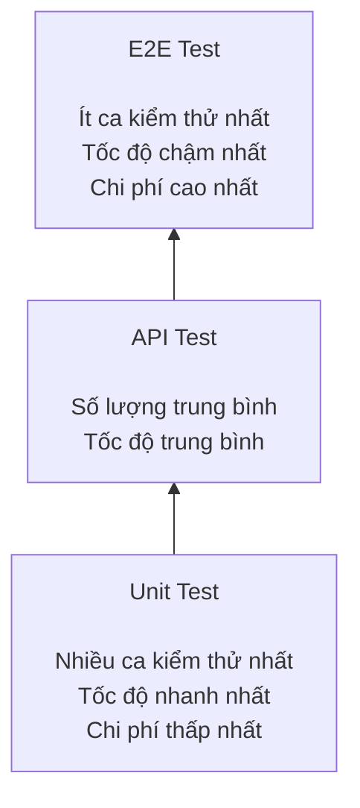

# Báo cáo về chủ đề CI/CD & Test-Harness Engineering

**Nhóm 06 - Môn Kiểm thử phần mềm**

## Mục lục

1. [Tổng quan về CI/CD](#1-tổng-quan-về-cicd)
2. [Cấu trúc một CI/CD Pipeline](#2-cấu-trúc-một-cicd-pipeline)
3. [Test-Harness Engineering](#3-test-harness-engineering)
4. [Các loại kiểm thử trong CI/CD (Test Pyramid)](#4-các-loại-kiểm-thử-trong-cicd-test-pyramid)
5. [Chiến lược tích hợp Test-Harness vào Pipeline](#5-chiến-lược-tích-hợp-test-harness-vào-pipeline)
6. [Khảo sát công cụ hỗ trợ](#6-khảo-sát-công-cụ-hỗ-trợ)
7. [Các vấn đề thực tế thường gặp](#7-các-vấn-đề-thực-tế-thường-gặp)
8. [Xu hướng tương lai](#8-xu-hướng-tương-lai)
9. [Best Practices](#9-best-practices)
10. [Kết luận](#10-kết-luận)
11. [Hướng dẫn công cụ](#11-hướng-dẫn-công-cụ)
12. [Tài liệu tham khảo](#12-tài-liệu-tham-khảo)

---

## 1. Tổng quan về CI/CD

### 1.1 Vấn đề trước khi có CI/CD

Trước khi CI/CD phổ biến, các nhóm phát triển thường gặp khó khăn khi tích hợp hệ thống do lập trình viên làm việc độc lập trong thời gian dài, tích hợp code muộn, chỉ gộp sau nhiều tuần/tháng. 

Hệ quả:

- Việc kiểm thử thủ công mất nhiều thời gian, dễ bỏ sót các trường hợp cần kiểm tra, khó thực hiện lặp lại một cách nhất quán và khó phát hiện các lỗi phát sinh sau khi hệ thống được chỉnh sửa.
- Khi tích hợp muộn, xung đột code và lỗi giao tiếp giữa các module rất khó sửa, chi phí sửa chữa cao.
- Việc nhận phản hồi diễn ra chậm, thời gian phát hành sản phẩm kéo dài và sản phẩm vẫn có thể còn nhiều lỗi khi đến tay người dùng.

### 1.2 Khái niệm

| Khái niệm | Định nghĩa | Đặc điểm |
|---|---|---|
| **CI - Continuous Integration** (Tích hợp liên tục) | Lập trình viên thường xuyên tích hợp mã nguồn vào nhánh chung (nhiều lần mỗi ngày); sau mỗi lần tích hợp, hệ thống tự động biên dịch và kiểm thử mã nguồn. | Không tự động triển khai; mục tiêu là phát hiện sớm các xung đột và lỗi biên dịch. |
| **CD - Continuous Delivery** (Chuyển giao liên tục) | Nối tiếp CI: Mã nguồn luôn ở trạng thái sẵn sàng để triển khai lên bất kỳ môi trường nào. | Tự động triển khai lên môi trường tiền sản xuất, nhưng khi triển khai lên môi trường sản xuất vẫn cần được phê duyệt thủ công.|
| **CD - Continuous Deployment** (Triển khai liên tục) | Mọi thay đổi sau khi vượt qua toàn bộ quy trình kiểm thử tự động sẽ được tự động triển khai lên môi trường sản xuất. | Không cần phê duyệt thủ công; đòi hỏi bộ kiểm thử tự động có độ tin cậy rất cao. |

So sánh nhanh:

| Khía cạnh | CI | Continuous Delivery | Continuous Deployment |
|---|---|---|---|
| Deploy production | Không | Cần phê duyệt thủ công | Tự động |
| Tần suất release | Vài lần/ngày | Hàng ngày/tuần | Hàng giờ/ngày |
| Rủi ro | Thấp | Trung bình | Cao (đòi hỏi kiểm thử rất chặt) |
| Phù hợp | Mọi dự án | Dự án ổn định | các dự án khởi nghiệp (startup), các sản phẩm phần mềm cung cấp dưới dạng dịch vụ (SaaS) và ứng dụng web.|

### 1.3 Ưu điểm và nhược điểm

**Ưu điểm:**
- Phát hiện lỗi biên dịch hay lỗi môi trường từ sớm, tránh lỗi không đáng có.
- Đảm bảo tính năng mới không phá vỡ tính năng cũ nhờ kiểm thử tự động (phát hiện lỗi phát sinh sau khi thay đổi mã nguồn).
- Lập trình viên có thể tập trung vào việc phát triển mã nguồn thay vì phải biên dịch và triển khai thủ công; kết quả phản hồi được nhận chỉ sau vài phút thay vì phải chờ đến ngày hôm sau.
- Nâng cao chất lượng mã nguồn thông qua các quy định của quy trình phát triển (giới hạn số lượng thay đổi trong mỗi yêu cầu hợp nhất (PR), yêu cầu pipeline hoàn thành thành công trước khi hợp nhất mã nguồn).
- Cho phép phát hành phần mềm nhanh chóng, nhiều lần trong ngày mà vẫn bảo đảm chất lượng.

**Nhược điểm:**
- Nhiều yêu cầu hợp nhất mã nguồn (PR) được tạo cùng lúc có thể làm tăng thời gian chờ hợp nhất, phát sinh xung đột mã nguồn và phải thực hiện lại toàn bộ quy trình kiểm thử, từ đó làm chậm tiến độ phát triển.
- Phụ thuộc vào dịch vụ CI/CD của bên thứ ba; khi dịch vụ gặp sự cố hoặc ngừng hoạt động, toàn bộ quy trình phát triển phần mềm có thể bị ảnh hưởng.
- Cần đầu tư ban đầu về hạ tầng và năng lực vận hành; nếu đội ngũ chưa có đủ chuyên môn, các sự cố trong quy trình tự động (pipeline) có thể gây gián đoạn nhiều hơn những lợi ích mà CI/CD mang lại.

### 1.4 Khi nào nên/không nên áp dụng

- **Nên áp dụng càng sớm càng tốt**, kể cả đối với các dự án cá nhân, vì nhiều nền tảng cung cấp gói miễn phí đáp ứng đủ nhu cầu của các dự án nhỏ.
- **Nên cân nhắc chỉ áp dụng ở mức cơ bản hoặc tạm thời chưa áp dụng** khi tổ chức chưa có nhân sự đủ năng lực vận hành CI/CD, lập trình viên chưa thành thạo các công cụ hoặc nhóm chưa thể bảo đảm quy trình tự động hoạt động ổn định. Trong những trường hợp này, việc xử lý sự cố có thể tốn nhiều thời gian hơn những lợi ích mà CI/CD mang lại.
- **Nên triển khai thử nghiệm trên từng nhóm nhỏ** (theo ngôn ngữ lập trình hoặc nền tảng phát triển) trước khi áp dụng cho toàn bộ dự án hoặc tổ chức.

### 1.5 Yếu tố lựa chọn nền tảng CI/CD

Khi chọn công cụ CI/CD, cần cân nhắc:

1. **Cloud-based vs Self-hosted** - Cloud-based không cần tự quản lý và bảo trì hạ tầng; Self-hosted cho phép kiểm soát tốt hơn về bảo mật và tài nguyên.
2. **Tính dễ dùng** - giao diện thân thiện, tài liệu đầy đủ và giúp rút ngắn thời gian hòa nhập của thành viên mới.
3. **Khả năng tích hợp** - có thể tích hợp với ngôn ngữ lập trình, hệ thống quản lý mã nguồn (VCS), hệ thống theo dõi công việc và nền tảng điện toán đám mây đang sử dụng.
4. **Khả năng cấu hình** - hỗ trợ cấu hình điều kiện kích hoạt, xử lý khi quy trình thất bại, quản lý biến môi trường và thông tin bí mật, thông qua script, tệp YAML hoặc giao diện người dùng.
5. **Chi phí** Phù hợp với ngân sách, bao gồm thời lượng thực hiện build, số lượng người dùng và dung lượng lưu trữ các tệp đầu ra (artifact).
6. **Mức độ quen thuộc của đội ngũ** - công cụ được sử dụng phổ biến, dễ tìm tài liệu và nhận được sự hỗ trợ từ cộng đồng.
7. **Khả năng mở rộng/hiệu năng** - đáp ứng tốt khối lượng công việc lớn, đồng thời hỗ trợ tùy biến thông qua hệ sinh thái plugin.

---

## 2. Cấu trúc một CI/CD Pipeline

### 2.1 Sơ đồ tổng quát


- Ví dụ thực tế: 

Lập trình viên đẩy mã nguồn lên GitHub, sau đó GitHub Actions tự động biên dịch ứng dụng, thực hiện kiểm thử đơn vị và kiểm thử tích hợp. Nếu tất cả các bước đều thành công, hệ thống sẽ tự động triển khai lên môi trường tiền sản xuất. Sau khi một thành viên xem xét và phê duyệt, ứng dụng sẽ được triển khai lên môi trường sản xuất.

### 2.2 Các giai đoạn và vai trò

| Giai đoạn | Mục đích | Loại lỗi phát hiện | Ví dụ công cụ |
|---|---|---|---|
| **Kích hoạt quy trình** (Trigger) | Khởi động quy trình tự động khi có sự kiện như push, pull request, schedule (cron), manual hoặc tạo thẻ phiên bản (release tag). | - | GitHub Actions `on:`, GitLab `rules:` |
| **Cài đặt thư viện** | Cài đặt các thư viện cần thiết, cố định phiên bản và bảo đảm môi trường phát triển nhất quán. | Thiếu thư viện, không tương thích phiên bản. | npm/yarn, pip, Maven/Gradle, go mod |
| **Phân tích tĩnh/Kiểm tra quy tắc mã nguồn/Định dạng mã nguồn** (Static Analysis/Lint/Format) | Kiểm tra chất lượng mã nguồn và phát hiện các lỗi tiềm ẩn mà không cần chạy chương trình. | Vi phạm quy tắc viết mã, biến hoặc thư viện không được sử dụng, các lỗ hổng bảo mật cơ bản. | ESLint, Prettier, Pylint/Ruff, golangci-lint, Checkstyle/PMD, SonarQube |
| **Biên dịch và đóng gói** (Build) | Biên dịch và đóng gói mã nguồn thành sản phẩm hoặc tệp đầu ra có thể triển khai. | Lỗi biên dịch, xung đột giữa các thư viện. | Maven/Gradle, go build, webpack/esbuild, Docker build |
| **Kiểm thử đơn vị** (Unit Test) | Kiểm thử riêng từng hàm hoặc phương thức, tách biệt với các thành phần phụ thuộc. | Lỗi logic, các trường hợp biên, ngoại lệ chưa được xử lý. | Jest, Vitest, pytest, JUnit, Go testing, NUnit/xUnit |
| **Kiểm thử tích hợp** (Integration Test) | Kiểm tra sự tương tác giữa các mô-đun, dịch vụ hoặc cơ sở dữ liệu. | Không tương thích giao diện, lỗi truy vấn cơ sở dữ liệu, điều kiện tranh chấp. | Testcontainers, WireMock, Spring Test |
| **Kiểm thử API** | Kiểm tra toàn bộ quá trình xử lý của API từ yêu cầu đến phản hồi. | Sai mã trạng thái, sai cấu trúc dữ liệu phản hồi, lỗi nghiệp vụ. | Postman/Newman, REST Assured, Supertest |
| **Báo cáo độ bao phủ kiểm thử** (Coverage Report) | Đo tỷ lệ mã nguồn đã được kiểm thử và xác định các phần mã chưa được kiểm thử. | Mã nguồn chưa được kiểm thử, đoạn mã có độ phức tạp cao nhưng độ bao phủ thấp. | JaCoCo, Istanbul/nyc, coverage.py, Codecov |
| **Quét bảo mật** (Security Scan) | Kiểm tra các lỗ hổng bảo mật trong thư viện, mã nguồn và ảnh vùng chứa (container image). | Lỗ hổng bảo mật (CVE), thông tin bí mật được ghi trực tiếp trong mã nguồn, ảnh vùng chứa lỗi thời. | Snyk, OWASP Dependency-Check, Trivy, Semgrep, Dependabot |
| **Đóng gói sản phẩm đầu ra** (Package Artifact) | Đóng gói sản phẩm đầu ra thành tệp thực thi hoặc container image, sau đó lưu vào kho lưu trữ với phiên bản tương ứng. | Thiếu sản phẩm đầu ra hoặc gán sai phiên bản. | Docker Registry, JFrog Artifactory, GitHub Packages |
| **Triển khai lên môi trường tiền sản xuất** (Deploy Staging) | Triển khai ứng dụng lên môi trường có cấu hình tương tự môi trường sản xuất để tiếp tục kiểm thử. | Lỗi cấu hình triển khai, thiếu thư viện hoặc thành phần của môi trường. | Kubernetes/Helm, Docker Compose, Terraform |
| **Kiểm thử nhanh/Kiểm thử đầu cuối** (Smoke Test/E2E Test) | Kiểm tra nhanh hệ thống sau khi triển khai hoặc kiểm thử toàn bộ luồng sử dụng của người dùng. | Lỗi triển khai, lỗi giao diện, lỗi tích hợp giữa giao diện và hệ thống phía máy chủ. | Playwright, Cypress, Selenium |
| **Phê duyệt và triển khai lên môi trường sản xuất** (Manual Approval/Production Deploy) | Thành viên có trách nhiệm xem xét và phê duyệt trước khi triển khai lên môi trường sản xuất (đối với Continuous Delivery) hoặc triển khai tự động (đối với Continuous Deployment). | Rủi ro về nghiệp vụ, các thay đổi có thể làm ảnh hưởng đến chức năng hiện có. | Blue-green, Canary deployment |
| **Giám sát và cảnh báo** (Monitoring & Alerting) | Theo dõi tình trạng hoạt động của hệ thống sau khi triển khai và gửi cảnh báo khi có bất thường. | Các lỗi phát sinh trên môi trường sản xuất. | Prometheus/Grafana, healthcheck endpoint |

**Nguyên tắc phát hiện lỗi sớm**: Các bước thực hiện nhanh và ít tốn tài nguyên như kiểm tra quy tắc mã nguồn và kiểm thử đơn vị nên được thực hiện trước. Nếu phát hiện lỗi, quy trình sẽ dừng ngay để tránh lãng phí thời gian và tài nguyên cho các bước tốn kém hơn như kiểm thử đầu cuối hoặc quét bảo mật chuyên sâu.

---

## 3. Kỹ thuật xây dựng môi trường kiểm thử tự động (Test-Harness Engineering)

### 3.1 Định nghĩa

**Test Harness** là tập hợp các công cụ, thư viện, dữ liệu kiểm thử và cấu hình được xây dựng để **tự động hóa việc thực thi test, thu thập kết quả và báo cáo** một cách nhất quán, lặp lại được. Có thể hình dung Test Harness giống *giàn giáo* khi xây nhà: hỗ trợ việc kiểm thử diễn ra, nhưng bản thân nó không phải là sản phẩm chính.

Về mặt kỹ thuật, Test Harness gồm hai phần lõi:
- **Test execution engine**: bộ máy thực thi test.
- **Test script repository**: kho lưu trữ test case/script.

Nó cung cấp bản sao của tài nguyên/cấu hình chưa có sẵn (driver, stub) để có thể kiểm thử ngay cả khi một phần hệ thống chưa hoàn thiện - vì vậy phục vụ tốt cho cả **automation testing** lẫn **integration testing**.

### 3.2 Phân biệt các khái niệm dễ nhầm lẫn

| Thuật ngữ | Định nghĩa | Phạm vi | Ví dụ |
|---|---|---|---|
| **Bộ kiểm thử (Test Suite)** | Tập hợp các ca kiểm thử dùng để xác minh một chức năng hoặc một phần của hệ thống. | Nội dung kiểm thử | Bộ kiểm thử cho chức năng thanh toán |
| **Khung kiểm thử (Test Framework)** | Thư viện hoặc nền tảng hỗ trợ xây dựng và thực hiện các ca kiểm thử, cung cấp các chức năng như kiểm tra kết quả (assert), mô phỏng (mock) và chạy kiểm thử (test runner). | Công cụ (thư viện) | Jest, JUnit, pytest, Cypress |
| **Hạ tầng kiểm thử (Test Harness)** | Toàn bộ môi trường phục vụ việc thực hiện kiểm thử, bao gồm khung kiểm thử, dữ liệu kiểm thử, thành phần mô phỏng, môi trường thực thi và công cụ ghi nhận kết quả. | Hệ thống | Docker Compose + Jest + Fixtures + WireMock |
| **Đường ống CI/CD (CI/CD Pipeline)** | Quy trình tự động thực hiện các bước như build, kiểm thử và triển khai, được kích hoạt bởi các sự kiện từ hệ thống quản lý mã nguồn. | Quy trình điều phối | Quy trình GitHub Actions chạy lint → test → deploy |

Trong thực tế, CI/CD Pipeline là lớp điều phối cao nhất: nó sử dụng Test Harness để thực thi Test Suite, còn Test Framework là công cụ được sử dụng bên trong Test Harness.

### 3.3 Các thành phần cốt lõi

| Thành phần | Vai trò |
|---|---|
| **Test Runner** | Thực thi các tập lệnh kiểm thử, tổng hợp kết quả đạt/không đạt và tạo báo cáo kiểm thử. (Ví dụ: Jest, pytest, JUnit, Go testing) |
| **Test Script** | Mã nguồn chứa các ca kiểm thử, thường được xây dựng theo mô hình chuẩn bị - thực hiện - kiểm tra (Arrange - Act - Assert). |
| **Test Data** | Dữ liệu đầu vào và kết quả mong đợi, có thể được khai báo trực tiếp trong mã nguồn, lưu trong tệp fixture (JSON, YAML), hoặc được tạo bằng factory method hay builder pattern. |
| **Fixture** | Chuẩn bị môi trường trước khi kiểm thử và dọn dẹp sau khi kiểm thử, chẳng hạn như kết nối cơ sở dữ liệu, tạo dữ liệu mẫu hoặc xóa dữ liệu tạm. |
| **Mock** | Thành phần mô phỏng đối tượng hoặc dịch vụ, cho phép kiểm soát giá trị trả về và theo dõi các lần được gọi, đồng thời có thể kiểm tra xem đối tượng đã được gọi đúng cách hay chưa. |
| **Stub** | Thành phần mô phỏng tương tự mock, nhưng chỉ trả về các giá trị được định nghĩa trước và không theo dõi các lần được gọi. |
| **Driver** | Thành phần điều khiển hệ thống cần kiểm thử (System Under Test – SUT), giúp trừu tượng hóa các thao tác, chẳng hạn như điều khiển trình duyệt. |
| **Assertion** | Kiểm tra và so sánh kết quả thực tế với kết quả mong đợi. |
| **Test Environment** | Bao gồm cơ sở dữ liệu, các dịch vụ mô phỏng, container, biến môi trường và thông tin bí mật (secret) phục vụ quá trình kiểm thử. |
| **Reporter** | Xuất kết quả kiểm thử dưới các định dạng như console, JUnit XML, HTML hoặc JSON để con người và hệ thống CI/CD có thể sử dụng. |
| **Log/Artifact** | Lưu trữ nhật ký, ảnh chụp màn hình, video, bản ghi thực thi (trace) hoặc bản sao cơ sở dữ liệu (database dump) khi kiểm thử thất bại để hỗ trợ gỡ lỗi. |

### 3.4 Quy trình xây dựng Test Harness

1. Cài đặt và cấu hình Test Harness, bao gồm công cụ kiểm thử tự động, dữ liệu kiểm thử và môi trường kiểm thử.
2. Viết các tập lệnh kiểm thử (test script) cho từng chức năng hoặc từng tình huống, bắt đầu từ dữ liệu hợp lệ, dữ liệu biên và dữ liệu nhạy cảm.
3. Kích hoạt thực hiện toàn bộ bộ kiểm thử bằng một lệnh hoặc một thao tác tự động, đồng thời thu thập kết quả thực thi.
4. So sánh kết quả thực tế với kết quả mong đợi, ghi nhận các sai lệch hoặc lỗi phát hiện được.
5. Tạo báo cáo kiểm thử, chia sẻ với các bên liên quan và cập nhật các tập lệnh kiểm thử khi phần mềm hoặc yêu cầu kiểm thử thay đổi.

### 3.5 Ưu điểm và nhược điểm

**Ưu điểm:** 
- Nâng cao năng suất của người kiểm thử và lập trình viên.
- Hỗ trợ thực hiện kiểm thử tự động lặp lại, giảm sự phụ thuộc vào thao tác thủ công.
- Hỗ trợ gỡ lỗi thông qua nhật ký, ảnh chụp màn hình và các thông tin ghi nhận khác.
- Phát hiện lỗi sớm trong vòng đời phát triển phần mềm.
- Đo lường mức độ bao phủ của các ca kiểm thử đối với mã nguồn.
- Bao phủ được các chức năng và tình huống kiểm thử phức tạp, khó thực hiện hoặc khó tái hiện bằng phương pháp thủ công.

**Nhược điểm:** 
- Không hỗ trợ chức năng ghi và phát lại như một số công cụ kiểm thử giao diện người dùng chuyên dụng.
- Đòi hỏi kiến thức và kỹ năng kỹ thuật để thiết kế, xây dựng và bảo trì. 
- Tốn thời gian và chi phí đầu tư ban đầu, đặc biệt đối với các hệ thống có quy mô lớn hoặc kiến trúc phức tạp.

### 3.6 Vai trò của Test Harness trong CI/CD

Nếu không có Test Harness đủ tin cậy, quy trình CI/CD sẽ khó bảo đảm chất lượng của các bước kiểm thử tự động. Test Harness mang lại các lợi ích sau:

- **Tính nhất quán (Consistency)**: Mỗi lần kiểm thử đều được thực hiện trong cùng một môi trường và cùng một quy trình, giúp kết quả có thể tái lập (reproducible) và giảm các ca kiểm thử không ổn định (flaky test).
- **Tốc độ và khả năng mở rộng (Speed & Scalability)**: Cho phép thực hiện hàng nghìn ca kiểm thử tự động mà không cần thao tác thủ công.
- **Tính độc lập (Isolation)**: Sử dụng mock để mô phỏng các dịch vụ bên ngoài, giúp quá trình kiểm thử không phụ thuộc vào các hệ thống không ổn định.
- **Độ tin cậy và khả năng gỡ lỗi (Reliability & Debugging)**: Cung cấp nhật ký thực thi, ảnh chụp màn hình, dấu vết thực thi để hỗ trợ phân tích nguyên nhân khi kiểm thử thất bại.
- Bảo đảm các ca kiểm thử được thực hiện **nhất quán trên máy phát triển (local) và máy chạy CI (CI agent)**, tạo nền tảng để pipeline có thể phát hiện và ngăn chặn các thay đổi có lỗi trước khi triển khai lên môi trường sản xuất (production).

---

## 4. Các loại kiểm thử trong CI/CD (Test Pyramid)



| Loại test | Mục tiêu | Vị trí pipeline | Tốc độ | Công cụ tiêu biểu |
|---|---|---|---|---|
| **Unit Test** | Kiểm thử một hàm hoặc phương thức riêng lẻ, mô phỏng (mock) toàn bộ các thành phần phụ thuộc. | Sớm nhất, ngay sau bước build.| Rất nhanh (khoảng 10–100 ms mỗi ca kiểm thử). | Jest, Vitest, pytest, JUnit, Go testing |
| **Integration Test** | Kiểm tra sự tương tác giữa các mô-đun, cơ sở dữ liệu và dịch vụ. | Sau unit test | Trung bình (khoảng 100 ms–1s mỗi ca kiểm thử).| Testcontainers, WireMock, Spring Test |
| **API Test** | Kiểm tra toàn bộ quá trình xử lý của API từ yêu cầu đến phản hồi. | Sau integration test | Trung bình (khoảng 100–500 ms cho mỗi yêu cầu). | Postman/Newman, REST Assured, Supertest |
| **E2E Test** | Kiểm tra toàn bộ luồng thao tác của người dùng thông qua giao diện thực tế. | Trên môi trường staging, trước khi phát hành hoặc trong quy trình chạy định kỳ vào ban đêm. | Chậm (khoảng 1–5 giây mỗi ca kiểm thử). | Playwright, Cypress, Selenium, Appium |
| **Smoke Test** | Kiểm tra nhanh sau khi triển khai để xác nhận ứng dụng vẫn hoạt động. | Ngay sau deploy | Rất nhanh (khoảng 10–30 giây cho toàn bộ bài kiểm thử). | HTTP healthcheck, curl |
| **Regression Test** | Đảm bảo các thay đổi mới không làm hỏng các chức năng đã hoạt động trước đó. | Sau Unit Test, Integration Test và API Test. | Phụ thuộc vào các bộ kiểm thử được sử dụng lại. | Thực hiện bằng bộ kiểm thử hiện có, chạy định kỳ |
| **Performance/Load Test** | Đánh giá thời gian phản hồi và khả năng xử lý khi hệ thống chịu tải lớn. | Trong quy trình chạy định kỳ hoặc trước khi phát hành.| Chậm (khoảng 5–30 phút). | k6, JMeter, Gatling, Locust |
| **Security Test** | Phát hiện các lỗ hổng bảo mật như SQL Injection (SQLi), Cross-site Scripting (XSS) và các thư viện có lỗ hổng (CVE). | Quét thư viện từ sớm; quét mã nguồn ở mỗi PR. | Nhanh hoặc chậm tùy theo mức độ quét. | Snyk, OWASP DC, Trivy, Semgrep |

---

## 5. Chiến lược tích hợp Test-Harness vào Pipeline

### 5.1 Áp dụng Test Pyramid trong pipeline

- **PR pipeline** (feedback nhanh, <10 phút): lint + unit test + integration test cơ bản.
- **Nightly pipeline** (toàn diện, 30–60 phút): toàn bộ test + E2E test + performance test + quét bảo mật chuyên sâu.
- **Release pipeline** (nghiêm ngặt): hực hiện toàn bộ các loại kiểm thử, quét bảo mật toàn diện và yêu cầu phê duyệt thủ công trước khi triển khai lên môi trường sản xuất.

### 5.2 Chạy kiểm thử song song (Parallelization)

Khi số lượng ca kiểm thử tăng, chạy tuần tự làm nghẽn pipeline. Giải pháp là chia các tệp kiểm thử chạy song song trên nhiều worker/thread (VD: `--maxWorkers` của Jest) hoặc phân phối sang nhiều máy (**sharding**, VD `npx playwright test --shard=1/3`). Nhờ đó, thời gian thực hiện toàn bộ bộ kiểm thử được rút ngắn đáng kể.

### 5.3 Xử lý Flaky Test

Flaky test là là các ca kiểm thử có kết quả không ổn định, lúc thành công, lúc thất bại mặc dù mã nguồn không thay đổi. Nguyên nhân thường gặp gồm: 
- Vấn đề về thời gian thực thi (timing) hoặc điều kiện tranh chấp (race condition). 
- Dữ liệu ngẫu nhiên. 
- Phụ thuộc vào các dịch vụ bên ngoài không ổn định. 
- Các ca kiểm thử phụ thuộc vào thứ tự thực hiện. 

Chiến lược xử lý:

1. **Tự động chạy lại (Auto-retry)**: Thực hiện lại tối đa 2–3 lần trước khi xác định ca kiểm thử thất bại.
2. **Cách ly (Quarantine)**: Gắn nhãn @flaky hoặc @quarantine để tách các ca kiểm thử này khỏi quy trình chặn pipeline chính, giúp nhóm kiểm thử (QA) xử lý riêng.
3. **Sử dụng explicit wait** thay cho thời gian chờ cố định (fixed timeout), **dùng dữ liệu cố định** thay vì dữ liệu ngẫu nhiên, **mock các dịch vụ bên ngoài** và bảo đảm mỗi ca kiểm thử hoạt động độc lập bằng cách **chuẩn bị và dọn dẹp dữ liệu trước, sau mỗi lần kiểm thử**.

### 5.4 Shift-Left & Shift-Right Testing

- **Shift-Left**: Đưa hoạt động kiểm thử sang các giai đoạn sớm nhất của quá trình phát triển, chẳng hạn thực hiện lint và phân tích tĩnh ngay trên máy của lập trình viên thông qua Git Hooks (ví dụ: husky kết hợp lint-staged) trước khi push mã nguồn.
- **Shift-Right**: Thực hiện kiểm thử sau khi hệ thống đã được triển khai lên môi trường sản xuất bằng các kỹ thuật như:
  - Canary Deployment: Triển khai phiên bản mới cho một tỷ lệ nhỏ người dùng trước, theo dõi hoạt động rồi mới mở rộng phạm vi triển khai.
  - Synthetic Monitoring: Thực hiện các kịch bản kiểm thử tự động theo định kỳ trên môi trường sản xuất để giám sát khả năng hoạt động của hệ thống.

---

## 6. Khảo sát công cụ hỗ trợ

### 6.1 Playwright

**Chức năng**: Playwright là framework automation testing mã nguồn mở do Microsoft phát triển (2020), dùng để thực hiện **kiểm thử end-to-end (E2E)** cho ứng dụng web hiện đại — mô phỏng hành vi người dùng thật trên nhiều trình duyệt. Các tính năng cốt lõi:
- Cross-browser testing: chạy cùng bộ test trên Chromium, Firefox, WebKit mà không cần viết code riêng cho từng trình duyệt.
- Auto-waiting: tự động chờ phần tử/animation/network request sẵn sàng trước khi thao tác, giảm mạnh flaky test.
- Mock/intercept network request (`page.route`) ngay trong test.
- Debug & Trace Viewer: ghi lại toàn bộ quá trình chạy test kèm screenshot, DOM snapshot, network log.
- Parallel testing & sharding, tích hợp sẵn với GitHub Actions, Jenkins, GitLab CI, CircleCI, Azure Pipelines qua Docker image chính thức.

**Giá**: Hoàn toàn miễn phí, mã nguồn mở (giấy phép Apache 2.0), không có bản trả phí cho công cụ lõi. Chi phí thực tế chỉ đến từ hạ tầng chạy test (CI runner).

**Điểm mạnh**:
- Nhanh và ổn định hơn Selenium nhờ giao tiếp trực tiếp với trình duyệt và cơ chế auto-waiting built-in, không cần tự cấu hình explicit/implicit wait.
- Đa trình duyệt và đa ngôn ngữ vượt trội hơn Cypress (chỉ Chromium, chỉ JS/TS) và Puppeteer (chỉ Chromium).
- Tích hợp sẵn trace viewer, screenshot, video recording mà không cần plugin thêm.
- Được Microsoft hậu thuẫn, phát triển bởi cựu tác giả Puppeteer, cộng đồng phát triển nhanh.
- Chạy song song (parallel) không cần công cụ ngoài như Selenium Grid.

**Điểm yếu**:
- Hệ sinh thái plugin/tài nguyên bên thứ ba còn trẻ hơn Selenium.
- Tốn tài nguyên máy (RAM/CPU) khi chạy nhiều browser instance song song trong CI.
- Cần thời gian làm quen nếu đội chưa quen JavaScript/TypeScript hoặc async/await.
- Không kiểm thử được ứng dụng native mobile thật (chỉ mô phỏng kích thước màn hình/thiết bị), khác với Appium.

**Hỗ trợ ngôn ngữ lập trình**: JavaScript, TypeScript, Python, Java, C#/.NET. Rất phù hợp với dự án Node.js/React (frontend) vì viết test ngay trong cùng hệ sinh thái Node.js; cũng phù hợp bổ sung kiểm thử API cho dự án backend nhờ module API testing riêng.

**Hỗ trợ AI**: Bản thân framework chưa tích hợp AI/ML gốc (chưa có self-healing test). Có tính năng Codegen (ghi thao tác để tự sinh code, không phải AI dự đoán). Có thể kết hợp thêm công cụ bên thứ ba như Healenium (self-healing), Applitools Eyes (visual AI testing), Testim, Mabl nếu cần khả năng AI sâu hơn.

### 6.2 GitLab CI/CD

**Chức năng**: GitLab CI/CD là công cụ tự động hóa build – test – deploy tích hợp sẵn trong nền tảng GitLab, không cần cài server CI riêng như Jenkins. Pipeline định nghĩa bằng file `.gitlab-ci.yml`, gồm các **stage** (build → test → deploy) và **job** thực thi bởi **runner**. Các tính năng cốt lõi:
- Pipeline-as-code với `.gitlab-ci.yml`, hỗ trợ chạy song song job qua từ khóa `parallel`/`parallel:matrix`.
- Runner tự đăng ký hoặc dùng sẵn trên GitLab.com (Linux/Windows/macOS).
- Tích hợp sâu với merge request, issue tracker, code review, container registry trên cùng nền tảng.
- CI/CD variables & expressions (biến custom/predefined, protected/masked variable, cú pháp `$[[ ]]`).
- CI/CD Components: đơn vị pipeline tái sử dụng qua `include:component`, có sẵn CI/CD Catalog.
- Container & Kubernetes native, Auto DevOps; có sẵn SAST/DAST cho bảo mật (DevSecOps).

**Giá**: Mô hình freemium — GitLab Community Edition (self-hosted) và gói Free trên GitLab.com dùng ngay, giới hạn số phút CI/CD/runner chia sẻ mỗi tháng. Gói Premium/Ultimate mở khóa bảo mật nâng cao, compliance, nhiều phút CI/CD hơn, hỗ trợ kỹ thuật chính thức. Nếu self-hosted, chi phí thực tế nằm ở hạ tầng máy chủ.

**Điểm mạnh**:
- Không cần cài đặt/thiết lập server CI riêng vì tích hợp sẵn trong GitLab — nhanh hơn Jenkins vốn phải tự cài từ đầu.
- Tích hợp toàn diện DevOps (source control, issue tracking, code review, registry, security scanning) trong một nền tảng, giảm số công cụ rời rạc so với Jenkins.
- Thực thi song song & runner tự mở rộng giúp rút ngắn thời gian pipeline.
- Bảo mật, phân quyền và audit trail chặt chẽ, phù hợp doanh nghiệp cần tuân thủ.
- Cộng đồng, tài liệu tốt; thuận lợi nếu đội đã dùng GitLab để quản lý mã nguồn.

**Điểm yếu**:
- Tài nguyên tự host nặng nếu chạy GitLab self-hosted, tốn chi phí hạ tầng và bảo trì.
- Nhiều tính năng nâng cao bị khóa ở gói Premium/Ultimate.
- Hệ sinh thái plugin/tích hợp bên thứ ba nhỏ hơn Jenkins (Jenkins có hơn 1.800 plugin).
- Tích hợp cồng kềnh nếu mã nguồn nằm ở GitHub/Bitbucket nhưng muốn dùng GitLab CI/CD (phải mirror repository).

**Hỗ trợ ngôn ngữ lập trình**: Không giới hạn ngôn ngữ cụ thể — pipeline chỉ gọi lệnh shell/script nên hỗ trợ mọi ngôn ngữ chạy được trong container/runner (Node.js, Python, Java, Go, .NET, Ruby, PHP...). Phù hợp tốt cho dự án Node.js/React (frontend, dùng Docker image Node.js để build/lint/test) và dự án backend đa ngôn ngữ (build → test → security scan → deploy Kubernetes).

**Hỗ trợ AI**: GitLab tích hợp trợ lý AI **GitLab Duo** (gợi ý code, tóm tắt/giải thích merge request, hỗ trợ code review AI, phân tích lỗ hổng bảo mật có AI hỗ trợ) — thường nằm trong gói trả phí. Bản thân pipeline chưa có self-healing test; nếu cần, có thể tích hợp thêm Testim, Mabl, Applitools hoặc SonarQube AI Code Assurance vào job của pipeline.

### 6.3 Postman

**Chức năng**: Postman là nền tảng all-in-one cho API, hỗ trợ **thiết kế, test, mock, document và giám sát API** xuyên suốt vòng đời phát triển — trong CI/CD chủ yếu đóng vai trò công cụ **API testing** cho tầng backend. Các tính năng cốt lõi:
- Gửi & kiểm thử HTTP request đa dạng: GET/POST/PUT/PATCH/DELETE, và cả GraphQL, gRPC, WebSocket, SOAP.
- Viết test script bằng JavaScript (`pm.test`/`pm.expect`) để assert status code, body, header.
- Collections & Environment Management: nhóm request, quản lý biến môi trường dev/staging/production.
- Mock Server: tạo API giả lập để test song song khi backend thật chưa hoàn thiện.
- Chạy test tự động & tích hợp CI/CD qua Postman CLI hoặc Newman (GitHub Actions, GitLab CI, Jenkins).
- API Documentation & Collaboration qua Workspace, đồng bộ real-time.

**Giá**: Mô hình freemium. Gói Free đủ cho test API cơ bản/nhóm nhỏ nhưng giới hạn số lượng collection run, thành viên, tính năng nâng cao. Gói Basic/Professional/Enterprise (trả phí theo user/tháng) mở khóa Mock Server không giới hạn, Monitor, API Governance, SSO... Chi phí để dùng đầy đủ tính năng khá cao khi mở rộng quy mô team.

**Điểm mạnh**:
- Giao diện trực quan, test API không cần viết code, phù hợp cả Dev lẫn Tester.
- Tự động hóa test và lên lịch chạy tốt hơn các REST client thuần UI đơn giản, nhờ Postman CLI/Newman tích hợp CI/CD.
- Cộng đồng người dùng lớn, tài liệu phong phú.
- Chia sẻ/cộng tác dễ dàng qua Workspace/Collection, đồng bộ real-time.
- Import/export linh hoạt (OpenAPI, Swagger, cURL, Insomnia, SoapUI...).

**Điểm yếu**:
- Chi phí cao khi cần đầy đủ tính năng cho team/doanh nghiệp lớn.
- Giao diện có thể gây quá tải cho người mới vì nhiều chức năng trên cùng màn hình.
- Cần thời gian làm quen với tính năng nâng cao (scripting, Flows, Vault, Governance...).
- Không phải API nào cũng chạy trực tiếp qua Postman (một số cần Desktop Agent/cấu hình proxy).
- Thiên về kiểm thử tầng API/backend, không thay thế kiểm thử UI như Playwright/Selenium.

**Hỗ trợ ngôn ngữ lập trình**: Không giới hạn theo ngôn ngữ backend — miễn hệ thống expose REST/GraphQL/gRPC/WebSocket/SOAP thì test được. Script test viết bằng JavaScript; hỗ trợ generate code mẫu sang nhiều ngôn ngữ (Node.js, Python, Java, C#, Go, PHP...). Phù hợp cao cho dự án backend (test trực tiếp endpoint REST/GraphQL); với dự án frontend (Node.js/React) hữu ích để mock/test API mà frontend gọi tới.

**Hỗ trợ AI**: Tích hợp **Postman AI/Agent Mode** hỗ trợ sinh test script, gợi ý cấu hình request, tương tác AI model/MCP server ngay trong ứng dụng. Có **AI Agent block trong Postman Flows** để dùng AI làm logic điều phối luồng test. Chưa có self-healing test tự động cho API ở mức chuyên sâu; có thể bổ sung Postman API Governance + Spectral rules hoặc nền tảng AI-testing bên thứ ba nếu cần.

### 6.4 CircleCI

**Chức năng**: CircleCI là nền tảng CI/CD dạng Cloud SaaS, giải quyết bài toán tự động hóa hoàn toàn quy trình tích hợp và chuyển giao liên tục, loại bỏ thao tác thủ công dễ sai sót. Các tính năng cốt lõi:
- Tự động hóa luồng tích hợp: build, kiểm thử, đóng gói artifact ngay khi phát hiện thay đổi trên repository.
- Cơ chế Caching mạnh mẽ: lưu bộ nhớ đệm cho file phụ thuộc (`node_modules`), giảm thời gian cài đặt ở các lần build sau.
- Parallelism & Sharding: chia tách file kiểm thử để chạy đồng thời trên nhiều container biệt lập.
- Hệ sinh thái **CircleCI Orbs**: gói cấu hình mã nguồn mở tái sử dụng nhanh (ví dụ Node orb thiết lập môi trường Node.js chỉ với một dòng lệnh).
- Cơ chế kích hoạt qua Webhook (Push/Pull Request), cấu hình tập trung trong `.circleci/config.yml`, cấp phát Executor (Docker container, Linux/Windows/macOS VM) khi workflow chạy.

**Giá**: Tính phí dựa trên mức độ tiêu thụ tài nguyên thực tế (số phút build, dung lượng RAM/CPU cấp phát) — mô hình pay-as-you-go/theo credit, có gói miễn phí giới hạn. Với dự án lớn có tần suất commit dày đặc, chi phí có thể tăng nhanh nếu không tối ưu file cấu hình.

**Điểm mạnh**:
- Tốc độ thực thi tối ưu nhờ kiến trúc cache và khả năng chạy song song hiệu năng cao.
- Khả năng debug trực quan: tính năng "Rerun job với quyền SSH", cho phép truy cập trực tiếp vào container lỗi để gỡ lỗi thực tế.
- Là nền tảng độc lập, chuyên biệt cao — khác với GitHub Actions vốn tích hợp mặc định sâu vào GitHub — mang lại khả năng quản lý tài nguyên và tùy biến pipeline phức tạp tốt hơn cho dự án quy mô doanh nghiệp.

**Điểm yếu**:
- Chi phí tài nguyên tăng nhanh theo mức tiêu thụ thực tế, khó kiểm soát nếu không tối ưu hóa cấu hình.
- Đường cong học tập dốc: hệ thống phân tách cấu hình thành nhiều khái niệm (Workflows, Jobs, Steps, Executors) khiến người mới dễ bối rối so với cấu hình tuyến tính đơn giản hơn của một số công cụ khác.

**Hỗ trợ ngôn ngữ lập trình**: Không giới hạn ngôn ngữ/nền tảng, miễn đóng gói được thành Docker image hoặc chạy trên hệ điều hành phổ biến. Rất phù hợp với cấu trúc mã nguồn full-stack của nhóm — có sẵn Orb tối ưu cho Node.js/React (`application/frontend-*`) và ExpressJS (`application/backend`), giúp đồng bộ phiên bản thư viện giữa local và máy chủ build.

**Hỗ trợ AI**: Tích hợp **CircleCI Insights** dùng dữ liệu lịch sử chạy pipeline để phân tích xu hướng, tự động phát hiện flaky test và cảnh báo nghẽn cổ chai. Đối với kiểm tra bảo mật/đánh giá mã nguồn bằng AI, có thể tích hợp linh hoạt plugin/action bên thứ ba như DeepCode AI hoặc SonarQube thông qua bước quét tĩnh trong pipeline.

### 6.5 SonarQube

**Chức năng**: SonarQube là công cụ phân tích mã tĩnh (Static Application Security Testing - SAST), đóng vai trò chốt chặn kiểm soát chất lượng mã nguồn toàn diện. Các tính năng cốt lõi:
- Phát hiện Bug và Code Smell: lỗi logic tiềm ẩn, mã dư thừa, đoạn code làm giảm khả năng bảo trì.
- Quét lỗ hổng bảo mật chuyên sâu theo chuẩn OWASP Top 10, CWE (XSS, SQL Injection, Hardcoded Secrets).
- Quality Gates: ràng buộc tiêu chí bắt buộc để mã nguồn được merge/deploy (VD: coverage > 80%, không có bug nghiêm trọng).
- Dashboard theo dõi xu hướng chất lượng mã nguồn và nợ kỹ thuật (Technical Debt) theo thời gian.
- Kiến trúc Client-Server: SonarScanner (client) quét mã nguồn cục bộ/trong CI runner rồi đẩy dữ liệu (push-based) lên SonarQube Server để tính điểm, đối chiếu rule set, lưu vào PostgreSQL và hiển thị Web UI.

**Giá**: Có bản **Community** miễn phí nhưng giới hạn nhiều tính năng nâng cao (không hỗ trợ Branch Analysis, không kiểm tra Pull Request riêng biệt). Các phiên bản thương mại (Developer/Enterprise/Data Center) có mức giá bản quyền khá cao, đặc biệt với nhóm nhỏ.

**Điểm mạnh**:
- Thúc đẩy chiến lược Shift-Left Security: phát hiện điểm yếu logic/bảo mật rất sớm trong SDLC, giảm chi phí khắc phục so với phát hiện ở giai đoạn kiểm thử thủ công hay trên production.
- Bộ quy tắc phong phú, chuẩn hóa, cập nhật liên tục theo tiêu chuẩn bảo mật hiện đại.
- Quản lý nợ kỹ thuật tối ưu qua dashboard trực quan, giúp theo dõi sức khỏe dự án dài hạn.

**Điểm yếu**:
- Gánh nặng hạ tầng/bảo trì nếu tự vận hành (self-hosted): đòi hỏi tài nguyên phần cứng lớn (khuyến nghị tối thiểu 2GB RAM cho Java Heap).
- Ràng buộc chi phí phiên bản: bản Community giới hạn tính năng nâng cao, bản thương mại giá cao với nhóm nhỏ.

**Hỗ trợ ngôn ngữ lập trình**: Hỗ trợ chính thức hơn 30 ngôn ngữ phổ biến (JavaScript, TypeScript, Python, Java, C#, C++, Go...). Phù hợp và cần thiết cho dự án nhóm — quét được cả giao diện React (`application/frontend-*`) lẫn kiến trúc định tuyến/xử lý dữ liệu ExpressJS ở backend (`application/backend`).

**Hỗ trợ AI**: Đã tích hợp tính năng **AI-Assisted** — khi phát hiện lỗi/lỗ hổng bảo mật phức tạp, hệ thống dùng LLM để giải thích chi tiết nguyên nhân và tự động đề xuất đoạn mã sửa lỗi (Fix Suggestions) ngay trên giao diện, giúp rút ngắn thời gian remediation.

### 6.6 GitHub Actions

**Chức năng**: GitHub Actions là nền tảng CI/CD tích hợp sẵn trong GitHub, tự động hóa toàn bộ Software Workflow. Trong Test-Harness Engineering, nó đóng vai trò hệ thống kích hoạt (Trigger System) và điều phối (Orchestrator), tự động chuẩn bị môi trường độc lập để chạy bộ công cụ kiểm thử, quét lỗi mã nguồn và triển khai ứng dụng. Tính năng cốt lõi:
- **CI/CD**: tự động build/test khi có thay đổi code, deploy sản phẩm lên môi trường lưu trữ/Cloud.
- **Tự động hóa quy trình**: tự động hóa bất kỳ sự kiện nào trên GitHub (VD: gắn tag khi tạo Issue, tự đóng PR bị bỏ quên).
- **Quét mã và bảo mật**: tích hợp quét mã nguồn phát hiện lỗ hổng bảo mật/lỗi logic trước khi merge.
- **Workflow Templates phong phú**: cấu hình mẫu tối ưu theo từng ngôn ngữ/framework.
- **Pages/Artifacts Management**: tự động đóng gói sản phẩm, lưu báo cáo kiểm thử (Artifacts), triển khai trang tĩnh qua GitHub Pages.

**Giá**: Public Repositories hoàn toàn miễn phí, không giới hạn phút chạy. Private Repositories tính phí theo Compute Minutes/Storage mỗi tháng: Free (cá nhân) 2.000 phút + 500MB; GitHub Pro 3.000 phút + 1GB; GitHub Enterprise tới 50.000 phút + 50GB. Lưu ý hệ số nhân OS: Linux 1x, Windows 2x, macOS 10x.

**Điểm mạnh**:
- Hệ sinh thái GitHub Marketplace khổng lồ với hàng ngàn Action viết sẵn (setup Node.js, Docker, AWS...), tiết kiệm thời gian viết cấu hình.
- Tích hợp sâu, không cần cài đặt: nằm ngay trong repo, phân quyền Secrets an toàn, mượt với Pull Request mà không cần Webhook ngoài.
- Hỗ trợ đa nền tảng (Linux/Windows/macOS) chạy cùng lúc qua tính năng `matrix`.

**Điểm yếu**:
- Giới hạn phút chạy miễn phí trên repo riêng tư, dễ phát sinh chi phí với dự án lớn.
- Khó debug offline: không hỗ trợ sẵn chạy thử workflow local, phải dùng công cụ bên thứ ba (`act`) hoặc push liên tục để test YAML.
- Cú pháp YAML dễ phình to khi dự án phức tạp, khó quản trị nếu không module hóa.

**Hỗ trợ ngôn ngữ lập trình**: Hỗ trợ mọi ngôn ngữ/nền tảng qua máy ảo cài sẵn công cụ hoặc Docker container. Cực kỳ tối ưu cho Node.js/React nhờ template `actions/setup-node` chính thức — tự cài Node.js, cache `node_modules`, tăng tốc `npm install` và chạy test nhanh.

**Hỗ trợ AI**: Tích hợp **Copilot in GitHub Actions** (hệ sinh thái GitHub Copilot) — tự động phân loại/giải thích lỗi khi pipeline Fail (phân tích log, gợi ý sửa code bằng ngôn ngữ tự nhiên ngay tab Actions), và auto-suggest hoàn thiện file YAML qua chat/gợi ý mã.

### 6.7 Jest

**Chức năng**: Jest là framework JavaScript Testing cho Unit Test và Integration Test, cung cấp toàn bộ môi trường từ Test Runner, Assertion Library đến Mocking Object để cô lập mã nguồn cần kiểm tra. Tính năng cốt lõi:
- **Zero Configuration**: tự nhận diện và chạy file test trong dự án JS/TS mà không cần cấu hình phức tạp.
- **Snapshot Testing**: chụp cấu trúc UI/dữ liệu tại một thời điểm để so sánh với thay đổi tương lai, mạnh khi test component React.
- **Built-in Mocking**: giả lập hàm, module, API bên ngoài để kiểm tra độc lập logic cốt lõi.

**Giá**: Hoàn toàn miễn phí, mã nguồn mở dưới giấy phép MIT License, dùng không giới hạn cho dự án cá nhân, thương mại hay giáo dục.

**Điểm mạnh**:
- Tốc độ thực thi nhanh và song song: chạy file test trong các worker process cô lập song song, tối ưu tài nguyên máy.
- Tích hợp sẵn Code Coverage (`--coverage`) mà không cần thư viện ngoài như Istanbul.
- Thông báo lỗi trực quan: chỉ rõ dòng code lỗi và diff giữa kết quả thực tế và mong đợi.

**Điểm yếu**:
- Tiêu tốn bộ nhớ (Memory Intensive) do cơ chế cô lập và chạy song song, đặc biệt với bộ test lớn.
- Dùng `jsdom` để giả lập trình duyệt trong Node.js — chạy nhanh nhưng một số tính năng trình duyệt thật (layout, hiệu ứng hình ảnh, tọa độ chuột) không kiểm tra chính xác 100%.

**Hỗ trợ ngôn ngữ lập trình**: JavaScript, TypeScript và các framework đi kèm (React, Vue, Angular, Node.js). Phù hợp tuyệt đối (100%) với dự án Node.js/React của nhóm — công cụ tiêu chuẩn để viết Unit Test cho logic giỏ hàng, áp dụng coupon, hay API xử lý đơn hàng ở backend.

**Hỗ trợ AI**: Kết hợp bên thứ ba như **GitHub Copilot, CodiumAI, Tabnine** — tự động đọc/phân tích hàm logic có sẵn rồi sinh toàn bộ file test Jest tương ứng (auto-generate test case, bao gồm boundary test và dữ liệu lỗi).

### 6.8 ArgoCD

**Chức năng**: ArgoCD là công cụ Continuous Deployment khai báo theo triết lý **GitOps**, dành riêng cho Kubernetes. Giải quyết bài toán đồng bộ hóa trạng thái: giữ ứng dụng chạy thực tế trên cụm K8s luôn khớp 100% với file cấu hình trong Git Repository. Tính năng cốt lõi:
- **Automated Sync**: tự phát hiện thay đổi cấu hình trong Git và deploy lên Kubernetes Cluster mà không cần lệnh thủ công.
- **Self-Healing**: nếu ai đó sửa trực tiếp trên hệ thống chạy thật (lệch cấu hình Git), ArgoCD tự phát hiện "Out of Sync" và ghi đè lại đúng cấu hình chuẩn.
- **Dashboard trực quan**: hiển thị sơ đồ cây các thành phần ứng dụng trên K8s (Pods, Services, Deployments).

**Giá**: Bản Open Source (CNCF quản lý) hoàn toàn miễn phí. Bản Managed Service thương mại (VD Akuity Platform) có giá khởi điểm khoảng $495/tháng, kèm AI và dashboard nâng cao.

**Điểm mạnh**:
- Bảo mật tối đa (Pull-based CD): khác Jenkins/GitLab CI cần giữ Key/Token để push deploy, ArgoCD cài trong Kubernetes và chủ động "kéo" code về — lộ Git repo không đồng nghĩa lộ thông tin đăng nhập Kubernetes Cluster.
- Quản lý phiên bản hạ tầng rõ ràng: thay đổi kiến trúc lưu qua lịch sử Git Commit, rollback dễ dàng.
- Hỗ trợ nhiều công cụ định nghĩa K8s: Kustomize, Helm, Ksonnet, YAML thuần.

**Điểm yếu**:
- Giới hạn nền tảng: chỉ chạy trên hệ sinh thái Kubernetes, không phù hợp VPS truyền thống hay Serverless đơn giản.
- Độ phức tạp cấu hình cao, đòi hỏi kiến thức vững về Docker, Kubernetes, GitOps và quản trị mạng.

**Hỗ trợ ngôn ngữ lập trình**: Không phụ thuộc ngôn ngữ lập trình (Language-agnostic) — chỉ quan tâm file cấu hình YAML (`deployment.yaml`, `service.yaml`, `Chart.yaml`). Phù hợp ở khâu đóng gói: nếu dự án nhóm đóng gói thành Docker Image (`eshop-frontend`, `eshop-backend`), ArgoCD quản lý và tự động cập nhật các image này lên cụm test/production.

**Hỗ trợ AI**: Các nền tảng thương mại như **Akuity Platform** tích hợp sẵn gói AI Tokens (~25 triệu tokens/tháng) — AI tự đọc manifest YAML K8s để phát hiện misconfiguration, cảnh báo rủi ro bảo mật hạ tầng, hoặc tự tóm tắt thay đổi kiến trúc khi đồng bộ.

### 6.9 k6

**Chức năng**: k6 (Grafana Labs phát triển) là công cụ kiểm thử hiệu năng (Performance & Load Testing) mã nguồn mở, giả lập hàng ngàn/vạn người dùng ảo (Virtual Users - VUs) truy cập cùng lúc để phát hiện điểm nghẽn, sập server hoặc chậm phản hồi. Tính năng cốt lõi:
- **Scripting in JavaScript**: viết kịch bản giả lập hành vi user (nhập hàng, thanh toán, áp coupon) bằng JavaScript.
- **Metrics First**: thu thập chi tiết Response Time, Error Rate, Data Received.
- **Thresholds**: thiết lập quy chuẩn (VD: response time trung bình > 200ms thì test tự Fail để chặn deploy code lỗi hiệu năng).

**Giá**: k6 OSS hoàn toàn miễn phí khi chạy local/tự dựng hạ tầng, không giới hạn VUs nếu máy đủ mạnh. Grafana Cloud k6 (bản Cloud thương mại) cho test quy mô lớn phân tán, tính phí theo Virtual User hours (VUh) từ khoảng $0.15/VUh, hoặc gói Pro từ $19/tháng.

**Điểm mạnh**:
- Tiết kiệm tài nguyên vượt trội: viết bằng Go, một máy đơn có thể tạo lượng VU gấp nhiều lần công cụ cũ chạy Java như Apache JMeter.
- Thân thiện Automation & CI/CD: dạng CLI, dễ tích hợp vào pipeline GitHub Actions/GitLab CI để tự chạy test tải mỗi khi cập nhật.
- Tích hợp hệ sinh thái Grafana: đẩy dữ liệu real-time lên Grafana Dashboard để vẽ biểu đồ hiệu năng.

**Điểm yếu**:
- Không có GUI Script Builder: khác JMeter (kéo thả), k6 bắt buộc code kịch bản hoàn toàn bằng tay, khó cho tester không mạnh lập trình.
- Không import trực tiếp thư viện NPM nặng dù script viết JavaScript, vì chạy trên môi trường JS nội bộ bằng Go (trừ khi chuyển đổi qua Webpack).

**Hỗ trợ ngôn ngữ lập trình**: Scripting bằng JavaScript (ES6). Rất phù hợp với nhóm vì cả team đã quen JavaScript (React/Node.js) — viết script test tải cho tính năng Checkout diễn ra nhanh chóng, không cần học ngôn ngữ mới.

**Hỗ trợ AI**: Sử dụng **Grafana AI Assistant** hoặc plugin AI trên VS Code — AI đọc cấu trúc API endpoint backend để tự viết script k6 hoàn chỉnh (VD sinh kịch bản giả lập 500 người dùng bắn API mua hàng áp coupon), đồng thời hỗ trợ đọc/phân tích biểu đồ metric lỗi để tìm nguyên nhân nghẽn cổ chai.

### 6.10 Jenkins

**Chức năng**: Jenkins là Automation Server mã nguồn mở lâu đời và phổ biến nhất, "trái tim" của hệ thống CI/CD truyền thống — kết nối các công cụ đơn lẻ (Git, Docker, SonarQube, Jest, Kubernetes) thành chuỗi pipeline tự động khép kín từ nhận code đến phân phối sản phẩm. Tính năng cốt lõi:
- **Jenkins Pipeline (Groovy)**: định nghĩa CI/CD bằng Pipeline as Code qua `Jenkinsfile` (Declarative hoặc Scripted Groovy).
- **Plugin Ecosystem**: hơn 1.800+ plugin kết nối hầu hết mọi công nghệ trong ngành CNTT.
- **Distributed Builds**: phân phối job từ Server chính (Controller) sang nhiều máy phụ (Agents/Nodes) chạy song song.

**Giá**: Hoàn toàn miễn phí về bản quyền (mã nguồn mở, MIT License). Chi phí thực tế ẩn: vận hành (TCO) lớn — thuê máy chủ (AWS/Azure) chạy 24/7, kỹ sư DevOps bảo trì/cập nhật plugin liên tục (hệ thống lớn có thể tốn vài trăm đến hàng ngàn USD/tháng cho hạ tầng).

**Điểm mạnh**:
- Khả năng tùy biến vô hạn nhờ hệ plugin đồ sộ và Groovy mạnh mẽ, giải quyết được pipeline phức tạp mà GitHub Actions/GitLab CI (Cloud hiện đại) khó làm được.
- Làm chủ hoàn toàn dữ liệu (self-hosted): server riêng doanh nghiệp, đáp ứng tiêu chí bảo mật khắt khe của ngân hàng/tập đoàn tài chính.
- Cộng đồng lâu đời, tài liệu/giải đáp lỗi trên StackOverflow cực nhiều.

**Điểm yếu**:
- Gánh nặng bảo trì ("Plugin Hell"): plugin thường xung đột khi cập nhật, tốn nhiều thời gian sửa chữa hệ thống.
- Giao diện lỗi thời, cấu hình phân quyền phức tạp, không tích hợp sẵn môi trường chạy mượt như nền tảng SaaS hiện nay.

**Hỗ trợ ngôn ngữ lập trình**: Không phụ thuộc ngôn ngữ (Language-agnostic) — cài công cụ tương ứng trên Agent hoặc dùng Docker Container Agent để build/test Java, C#, C++, Python, Node.js, Go... Phù hợp nếu tự dựng hạ tầng: cần cài NodeJS Plugin hoặc cấu hình Pipeline chạy `npm install` trong Docker image chứa Node.js để test dự án `eshop`.

**Hỗ trợ AI**: Sử dụng plugin kết nối AI như **Jenkins OpenAI Plugin** hoặc webhook gọi API ChatGPT/Claude — hỗ trợ đọc hiểu/chuyển đổi file cấu hình Scripted Groovy cũ sang Declarative trực quan hơn, và tự động quét log console dài/rối để chỉ thẳng dòng code khiến build thất bại.

---

## 7. Các vấn đề thực tế thường gặp

| Vấn đề | Nguyên nhân chính | Hướng khắc phục |
|---|---|---|
| **Flaky test** |Điều kiện tranh chấp (race condition), dữ liệu ngẫu nhiên, phụ thuộc vào dịch vụ bên ngoài, các ca kiểm thử phụ thuộc thứ tự thực hiện. | Sử dụng explicit wait, dữ liệu kiểm thử cố định, mock các dịch vụ bên ngoài, retry có giới hạn và bảo đảm các ca kiểm thử độc lập. |
| **Pipeline chạy chậm** | Quá nhiều ca kiểm thử, thực hiện tuần tự, quá trình build hoặc tạo artifact mất nhiều thời gian. | Chạy song song, lưu bộ nhớ đệm cho thư viện và kết quả build, tách pipeline của PR (nhanh) và nightly pipeline (đầy đủ). |
| **Môi trường kiểm thử khác môi trường sản xuất** | Khác hệ điều hành, phiên bản thư viện, cơ sở dữ liệu hoặc cấu hình. | Sử dụng container (Docker), quản lý và cấu hình hạ tầng bằng mã nguồn (Infrastructure as Code) và kiểm thử trên staging trước khi triển khai lên production. |
| **Dữ liệu kiểm thử không ổn định** | Tạo dữ liệu thủ công, không dọn dẹp dữ liệu hoặc nhiều ca kiểm thử cùng dùng chung cơ sở dữ liệu. | Sử dụng Factory Method, Builder Pattern, transaction rollback và cơ sở dữ liệu hoặc môi trường kiểm thử độc lập. |
| **Thông tin bí mật hoặc cấu hình bị lộ hoặc sai** | Ghi trực tiếp khóa bí mật trong mã nguồn hoặc đưa tệp .env vào kho mã nguồn. | Sử dụng biến môi trường, trình quản lý thông tin bí mật, tệp `.env.test` riêng và quét trước khi commit. |
| **Báo cáo khó đọc** | Thông báo kiểm tra không rõ ràng, không lưu log hoặc screenshot khi kiểm thử thất bại. | Viết thông báo kiểm tra rõ ràng, chụp ảnh màn hình khi lỗi, sử dụng log có cấu trúc và báo cáo HTML. |
| **Độ bao phủ kiểm thử cao nhưng chất lượng thấp** | Kiểm thử không xác minh đúng hành vi, sử dụng mock quá nhiều hoặc thiếu các trường hợp biên. | Đo cả branch coverage, viết kiểm thử theo hành vi và áp dụng mutation testing. |
| **Dịch vụ của bên thứ ba làm kiểm thử thất bại** | Gọi trực tiếp các dịch vụ thật như thanh toán hoặc gửi email. | Mock trong Unit Test và Integration Test, sử dụng môi trường thử nghiệm (sandbox, staging) cho E2E Test, kết hợp circuit breaker, retry và timeout.|

---

## 8. Xu hướng tương lai

- **Môi trường kiểm thử tạm thời (Ephemeral Environments)**: mỗi Pull Request tự động khởi tạo môi trường biệt lập riêng (Kubernetes Namespace/Docker Compose), tự xoá khi PR đóng - tránh xung đột dữ liệu test giữa các lập trình viên.
- **Kiểm thử sử dụng trí tuệ nhân tạo (AI-Driven Testing)**: Ứng dụng AI để tự động cập nhật các ca kiểm thử khi giao diện thay đổi (self-healing test) và tự động sinh các ca kiểm thử dựa trên việc phân tích mã nguồn hoặc lịch sử lỗi.
- **GitOps & Infrastructure as Code (IaC) cho hạ tầng kiểm thử**: toàn bộ cấu hình test harness (cơ sở dữ liệu mô phỏng, mạng, biến môi trường) được định nghĩa bằng Terraform/Ansible/Docker Compose giúp có thể tái tạo môi trường kiểm thử ở bất kỳ đâu.

---

## 9. Best Practices

1. **Phản hồi nhanh (Fast Feedback)** - Pipeline của PR nên hoàn thành trong vòng dưới 10 phút bằng cách chạy song song lint và Unit Test, đồng thời sử dụng cache cho các thư viện.
2. **Phát hiện lỗi sớm (Fail early)** - lint/static analysis trước, unit test trước integration, smoke test ngay sau deploy.
3. **Độc lập giữa các ca kiểm thử (Test Isolation)** - Mỗi ca kiểm thử tự chuẩn bị và dọn dẹp dữ liệu, không chia sẻ trạng thái và mock các dịch vụ bên ngoài.
4. **Khả năng lặp lại (Repeatability)** - Sử dụng dữ liệu kiểm thử cố định, mô phỏng thời gian khi cần và hạn chế Flaky Test.
5. **Môi trường dưới dạng mã (Environment as Code)** - Quản lý môi trường kiểm thử bằng Docker Compose hoặc Terraform, hạn chế thiết lập thủ công.
6. **Cổng kiểm soát chất lượng (Quality Gate)** - Chỉ cho phép merge khi các ca kiểm thử đều thành công, độ bao phủ kiểm thử đạt ngưỡng yêu cầu và lint không phát hiện lỗi.
7. **Chạy song song (Parallelization)** - Thực hiện đồng thời nhiều job hoặc ca kiểm thử để rút ngắn thời gian của pipeline.
8. **Sử dụng bộ nhớ đệm hợp lý (Cache)** - Lưu bộ nhớ đệm cho thư viện và kết quả build, nhưng không lưu bộ nhớ đệm cho dữ liệu kiểm thử.
9. **Không thực hiện mọi loại kiểm thử ở mọi thời điểm** - PR pipeline chỉ chạy các kiểm thử nhanh (Unit Test, lint), nightly pipeline chạy đầy đủ các kiểm thử, còn release pipeline thực hiện kiểm thử toàn diện và yêu cầu phê duyệt trước khi triển khai.
10. **Báo cáo dễ đọc** - Đặt tên ca kiểm thử rõ ràng, viết thông báo assertion chi tiết, lưu screenshot hoặc video khi kiểm thử thất bại và liên kết với mã nguồn, commit hoặc PR tương ứng.

---

## 10. Kết luận

CI/CD và Test-Harness Engineering **không thay thế vai trò người kiểm thử (tester)**, mà giúp tester:

- Tự động hóa các công việc lặp lại, để tester tập trung vào các hoạt động có giá trị cao hơn như kiểm thử khám phá (exploratory testing), đánh giá bảo mật (security audit) và đánh giá khả năng sử dụng (usability testing).
- Phát hiện lỗi ngay từ giai đoạn PR, giúp giảm đáng kể chi phí sửa lỗi so với khi phát hiện ở giai đoạn QA hoặc trên môi trường production.
- Cho phép phát hành phần mềm nhanh hơn nhưng vẫn bảo đảm chất lượng nhờ pipeline kiểm thử tự động.

**Test Harness là nền tảng** giúp CI/CD pipeline đáng tin cậy. Nếu không có một Test Harness được thiết kế tốt, pipeline chỉ đơn thuần tự động hóa việc thực hiện các bộ kiểm thử có chất lượng thấp. Mục tiêu cuối cùng là xây dựng một quy trình kiểm thử tự động nhất quán, đáng tin cậy và dễ tái sử dụng, góp phần nâng cao chất lượng phần mềm, rút ngắn thời gian phát hành và giảm rủi ro khi triển khai.

---

## 11. Hướng dẫn công cụ

### 11.1 GitHub Actions

#### Kịch bản test

Áp dụng thực nghiệm trên backend EShop (`application_demo_1/backend`), với 2 kịch bản test tương ứng 2 chức năng đã đặc tả trong `README.md` (System Requirements Specification):

**Chức năng 1 — Hủy đơn hàng theo trạng thái (FR-10: Order State Machine)**
- Đặc tả đúng: khi đơn hàng đã ở trạng thái `shipping` (đang giao), User không được phép tự hủy đơn — chỉ trạng thái `pending`/`confirmed` mới được hủy.
- Bug phát hiện: `PUT /api/orders/:id/cancel` chỉ chặn hủy khi trạng thái là `delivered` hoặc `canceled`, quên mất trường hợp `shipping` — đơn đang giao vẫn hủy được, sai đặc tả.
- Các bước test (Jest + Supertest): (1) đăng ký/đăng nhập user mới lấy JWT token; (2) đăng nhập admin có sẵn lấy token; (3) user checkout tạo đơn (`pending`); (4) admin cập nhật trạng thái `pending → confirmed → shipping`; (5) user gọi hủy đơn khi đang `shipping`.
- Kỳ vọng: API trả mã lỗi `400`. Thực tế trước khi fix: trả về `200` (hủy thành công) — test FAIL, đúng bug.

**Chức năng 2 — Thanh toán, tự tính lại tổng tiền (FR-08: Checkout)**
- Đặc tả đúng: backend phải tự tính lại tổng tiền, không chấp nhận `total_amount` do client gửi lên.
- Bug phát hiện: `POST /api/checkout` lấy thẳng `total_amount` từ `req.body` và lưu vào đơn hàng, không đối chiếu với giỏ hàng thực tế phía server.
- Các bước test: (1) đăng ký/đăng nhập user mới; (2) thêm sản phẩm giá 30.000.000đ vào giỏ hàng; (3) checkout nhưng cố tình gửi `total_amount: 1`; (4) lấy lại chi tiết đơn hàng vừa tạo.
- Kỳ vọng: `total_amount` lưu trong DB phải là `30000000` (tính lại từ giỏ hàng). Thực tế trước khi fix: `total_amount` là `1` (y hệt giá trị giả client gửi) — test FAIL, đúng bug.

#### Chức năng

GitHub Actions là nền tảng CI/CD tích hợp sẵn trong GitHub, dùng để **tự động hóa build, test và deploy** mỗi khi có sự kiện xảy ra trên repository (push, pull request, tạo tag...). Trong bài demo, GitHub Actions đảm nhiệm 3 vai trò:
- **CI (Continuous Integration)**: tự động chạy bộ test Jest mỗi khi có push hoặc Pull Request, báo cáo kết quả pass/fail ngay trên giao diện PR.
- **Quality Gate**: kết hợp với Branch Protection Rule của GitHub, biến kết quả test thành điều kiện bắt buộc — PR không thể merge vào `main` nếu test chưa pass.
- **CD (Continuous Deployment) trigger**: sau khi merge thành công vào `main`, tự động gọi Render Deploy Hook để kích hoạt deploy bản mới lên production.

Công cụ hỗ trợ đi kèm trong demo: **Jest** (test framework/test runner — phát hiện file test, thực thi, so sánh kết quả/assertion, xuất báo cáo) kết hợp **Supertest** (thư viện gửi HTTP request giả lập tới Express app mà không cần mở cổng mạng thật, dùng để viết test tầng API/integration).

#### Nguyên lý hoạt động

GitHub Actions vận hành dựa trên file cấu hình YAML đặt trong `.github/workflows/`. Mỗi file định nghĩa 1 **workflow**, gồm 3 tầng: **Trigger (on) → Job → Step**.

```yaml
name: CI Demo 1 - Backend Tests

on:
  push:
    branches: [main, demo_1]
    paths:
      - "application_demo_1/**"
  pull_request:
    branches: [main]
    paths:
      - "application_demo_1/**"

jobs:
  test:
    name: Run Jest tests (backend)
    runs-on: ubuntu-latest
    defaults:
      run:
        working-directory: application_demo_1/backend
    steps:
      - uses: actions/checkout@v4
      - uses: actions/setup-node@v4
        with:
          node-version: "20"
          cache: "npm"
          cache-dependency-path: application_demo_1/backend/package-lock.json
      - run: npm ci
      - run: npm test

  deploy:
    name: Trigger Render deploy
    needs: test
    if: github.ref == 'refs/heads/main' && github.event_name == 'push'
    runs-on: ubuntu-latest
    steps:
      - run: curl -X POST "${{ secrets.RENDER_DEPLOY_HOOK }}"
```

Giải thích cơ chế từng phần:
- **`on:`** — GitHub liên tục lắng nghe sự kiện trên repo; workflow chỉ kích hoạt khi có `push`/`pull_request` và thay đổi nằm trong đường dẫn `application_demo_1/**`.
- **`jobs.test.runs-on: ubuntu-latest`** — GitHub cấp phát 1 máy ảo Linux tạm thời (runner) để chạy job, cô lập hoàn toàn, hủy sau khi job xong.
- **`defaults.run.working-directory`** — vì backend không nằm ở root repo, mọi lệnh `run:` sẽ tự `cd` vào `application_demo_1/backend` trước khi chạy.
- **`actions/checkout@v4`** — clone code repo vào máy ảo runner (nếu thiếu bước này, runner sẽ trống, không có gì để test).
- **`actions/setup-node@v4`** — cài Node.js 20 vào runner, đồng thời cache `node_modules` dựa trên checksum của `package-lock.json` để lần chạy sau nhanh hơn.
- **`npm ci`** — cài dependency đúng y hệt phiên bản khóa trong `package-lock.json` (khác `npm install` ở chỗ không tự cập nhật lockfile, đảm bảo môi trường CI nhất quán).
- **`npm test`** — chạy `jest --runInBand`; **exit code** của lệnh này là thứ GitHub Actions dùng để quyết định job pass hay fail (0 = pass, khác 0 = fail) — không đọc hiểu nội dung test, chỉ dựa vào mã thoát tiến trình.
- **`needs: test`** ở job `deploy` — tạo phụ thuộc: job `deploy` chỉ chạy nếu job `test` thành công trước đó, đây là cơ chế "Quality Gate" ở tầng workflow.
- **`if: github.ref == 'refs/heads/main' && github.event_name == 'push'`** — đảm bảo việc gọi deploy hook chỉ xảy ra khi có push thật vào `main` (sau khi PR đã merge), không chạy khi PR đang mở.
- **`secrets.RENDER_DEPLOY_HOOK`** — GitHub inject giá trị bí mật đã lưu ở Settings → Secrets vào biến môi trường tại thời điểm chạy, không lộ ra trong log hay code.

Kết hợp với **Branch Protection Rule** (cấu hình ở GitHub, không nằm trong file YAML) yêu cầu check `"Run Jest tests (backend)"` phải pass, GitHub sẽ tự khóa nút Merge trên PR cho tới khi job `test` trả về exit code 0.

**Cơ chế Jest + Supertest bên trong job test:**
1. Jest tự động quét các file khớp pattern `*.test.js`, nạp từng file như 1 module Node.js riêng biệt; `describe()` nhóm test, `test()`/`it()` định nghĩa từng ca kiểm thử.
2. Supertest gọi `request(app)...` — với `app` là object Express được export từ `server.js` (đã chỉnh `if (require.main === module) { app.listen(...) }` để `app.listen()` chỉ chạy khi gọi trực tiếp `node server.js`, không chạy khi Jest `require()` để test). Khi gọi `request(app)`, Supertest tự tạo 1 HTTP server tạm trên cổng ngẫu nhiên (ephemeral port), gửi request qua network loopback, nhận response rồi tắt server ngay sau đó.
3. `expect()` cùng các matcher (`.toBe()`, `.toEqual()`...) so sánh kết quả; nếu không thỏa mãn, Jest đánh dấu test failed, in report nhưng vẫn tiếp tục chạy các test khác.
4. Chạy với cờ `--runInBand`: vì `database.js` (SQLite) tự `DROP TABLE` + tạo lại + seed dữ liệu mỗi khi được `require()`, nếu chạy nhiều file test song song sẽ gây xung đột trên cùng 1 file SQLite — `--runInBand` buộc Jest chạy tuần tự từng file test để tránh xung đột.

Tóm tắt luồng phối hợp: Developer push code → GitHub Actions trigger → Runner cài Node 20, `npm ci` → `npm test` (Jest nạp `server.js` làm app, Supertest gọi API giả lập, `expect()` so sánh kết quả) → Exit code quyết định job "test" pass/fail → Branch Protection dùng kết quả đó khóa/mở nút Merge → Sau khi merge vào main, job "deploy" (`needs: test`) gọi Render Deploy Hook → Render build & deploy bản mới.

### 11.2 GitLab CI/CD

#### Kịch bản test

Thực nghiệm trên backend EShop (`application_demo_2/backend`), gồm 2 kịch bản kiểm thử tích hợp vào pipeline GitLab:

**Kịch bản 1 — Luồng hủy đơn hàng (Order Cancel)**: nhằm phát hiện và ngăn chặn lỗi nghiệp vụ cho phép khách hàng hủy đơn khi đơn đang ở trạng thái vận chuyển (`shipping`).
1. Viết test tích hợp (Jest + Supertest) và đẩy code lên nhánh bugfix, khởi tạo Merge Request để kích hoạt pipeline.
2. Pipeline chạy kiểm thử và phát hiện lỗi logic nghiệp vụ (vẫn cho phép hủy đơn ở trạng thái `shipping`) → trạng thái **Failed**, nút Merge bị khóa.
3. Lập trình viên cập nhật mã nguồn kiểm tra trạng thái đơn hàng trong `server.js`, push code mới.
4. Pipeline chạy lại thành công (**Passed**), nút Merge được mở khóa, gộp vào `main`.
5. Sau khi gộp vào `main`, pipeline kích hoạt job deploy gửi yêu cầu tới Render Deploy Hook để cập nhật môi trường production.

**Kịch bản 2 — Quản lý hồ sơ cá nhân (FR-04)**: xác thực quy định nghiệp vụ và bảo mật khi cập nhật hồ sơ cá nhân, gồm ràng buộc định dạng số điện thoại hợp lệ (bắt đầu bằng số `0`, 10–11 chữ số) và ngăn chặn lỗ hổng tự nâng cấp quyền hạn (user thường không được tự sửa trường `role` thành `admin`).
1. Xây dựng file unit test `profile.test.js` và kịch bản kiểm thử độc lập `test_profile_flow.js`; khởi tạo Merge Request từ `bugfix/profile` sang `main`.
2. Pipeline chạy kiểm thử tự động báo **Failed** do API cho phép lưu số điện thoại sai định dạng và cho phép user tự nâng quyền → nút Merge bị khóa.
3. Khắc phục: sửa `server.js` (thêm regex xác thực SĐT, loại bỏ logic cho phép sửa trường `role`).
4. Pipeline chạy lại thành công (**Passed**), nút Merge mở khóa, gộp vào `main`.
5. Hệ thống tự động triển khai phiên bản đã sửa lỗi lên Render qua Deploy Hook.

#### Chức năng

GitLab CI/CD là giải pháp CI/CD built-in trong nền tảng GitLab, quản lý tự động hóa qua các khái niệm:
- **Pipeline**: đơn vị thực thi cấp cao nhất, gồm tập hợp các stage/job, cấu trúc theo đồ thị có hướng không chu trình (DAG) cho phép chạy song song các job không phụ thuộc lẫn nhau.
- **Stage**: chia pipeline thành giai đoạn logic chạy tuần tự (mặc định `.pre`, `build`, `test`, `deploy`, `.post`); job cùng stage chạy song song, stage sau chỉ bắt đầu khi toàn bộ job stage trước hoàn thành.
- **Job**: đơn vị thực thi nhỏ nhất, mỗi job cô lập trong môi trường runtime riêng do GitLab Runner khởi tạo.
- **Cache vs Artifacts**: Cache tối ưu thời gian build bằng cách tái sử dụng dependency đã tải (VD `node_modules/`), không đảm bảo tồn tại 100%; Artifacts lưu kết quả đầu ra của 1 stage để chuyển sang stage kế tiếp (VD `dist/`, test report), bắt buộc tồn tại nếu stage sau khai báo phụ thuộc.

Trong demo, GitLab CI/CD đảm nhiệm: chạy test backend (Jest) mỗi khi có Merge Request hoặc push lên các nhánh chỉ định; làm Quality Gate qua Merge checks (`Pipelines must succeed`) kết hợp Protected Branch; và tự động trigger deploy lên Render sau khi merge vào `main`.

#### Nguyên lý hoạt động

**Kiến trúc GitLab Runner**: Runner là agent mã nguồn mở xử lý job được pipeline yêu cầu, giao tiếp với GitLab Server qua HTTPS bằng cơ chế **Long-Polling** (Runner chủ động gửi request để nhận job, không cần mở inbound port). Runner có 2 loại: **Shared Runners** (dùng chung toàn hệ thống, phù hợp tác vụ build/test cơ bản) và **Specific Runners** (cấu hình riêng cho dự án/nhóm, chạy trên hạ tầng riêng). Executor xác định môi trường chạy lệnh: `Shell` (chạy trực tiếp trên OS của máy Runner, đơn giản nhưng thiếu cô lập), `Docker` (khởi tạo container mới từ image chỉ định cho mỗi job — phổ biến nhất nhờ cô lập hoàn toàn), `Kubernetes` (tự động deploy pod trên cluster, khả năng mở rộng linh hoạt).

**Cấu hình `.gitlab-ci.yml`** thực tế của dự án EShop:

```yaml
stages:
  - test
  - deploy

test_backend:
  stage: test
  image: node:18
  cache:
    key:
      files:
        - application_demo_2/backend/package-lock.json
    paths:
      - application_demo_2/backend/node_modules/
  script:
    - cd application_demo_2/backend
    - npm ci
    - npm test
  rules:
    - if: $CI_PIPELINE_SOURCE == 'merge_request_event'
    - if: $CI_COMMIT_BRANCH == 'main'
    - if: $CI_COMMIT_BRANCH == 'bugfix/order-cancel'
    - if: $CI_COMMIT_BRANCH == 'bugfix/profile'

deploy_backend:
  stage: deploy
  image: curlimages/curl:latest
  script:
    - |
      if [ -z "$RENDER_DEPLOY_HOOK_URL" ]; then
        echo "RENDER_DEPLOY_HOOK_URL is not configured. Skipping deployment."
      else
        echo "Triggering Render deploy hook..."
        curl -f -s "$RENDER_DEPLOY_HOOK_URL"
      fi
  rules:
    - if: $CI_COMMIT_BRANCH == 'main'
```

Phân tích cơ chế: (1) **Stages** `test` → `deploy` tuần tự, đảm bảo job deploy chỉ chạy khi toàn bộ job test đã pass. (2) **Môi trường thực thi**: job `test_backend` cô lập bằng Docker image `node:18`, đồng nhất giữa local và CI server. (3) **Caching**: `key: files` gắn với hash của `package-lock.json` — nếu dependency không đổi, Runner khôi phục `node_modules/` từ cache thay vì tải lại. (4) **`npm ci`**: cài đúng phiên bản khóa cứng trong lockfile, loại bỏ rủi ro tự cập nhật thư viện ngoài ý muốn. (5) **`rules`**: `test_backend` chạy khi có Merge Request hoặc push lên `main`/nhánh bugfix chỉ định; `deploy_backend` chỉ chạy khi push vào `main`.

Kết hợp với **Protected Branch** (Settings → Repository → Protected Branches: `Allowed to push = No one` trên `main`) và **Merge checks** (Settings → Merge requests: bật `Pipelines must succeed` và `All threads must be resolved`), GitLab khóa nút Merge cho tới khi pipeline test trả kết quả Passed. Biến bí mật `RENDER_DEPLOY_HOOK_URL` được khai báo tại Settings → CI/CD → Variables, bật `Protect variable` và `Mask variable` để tránh lộ giá trị trong log.

**Tài liệu tham khảo:**

- TechWorld with Milan - *What is CI/CD Pipeline*: https://newsletter.techworld-with-milan.com/p/what-is-cicd-pipeline
- ITviec Blog - *CI/CD là gì?*: https://itviec.com/blog/ci-cd-la-gi/
- Tutorialspoint - *Software Testing: Test Harness*: https://www.tutorialspoint.com/software_testing_dictionary/harness.htm
- FMIT - *Test Harness là gì*: https://fmit.vn/tu-dien-quan-ly/test-harness-la-gi
- FIT NEU - *CI/CD với GitHub Actions*: https://fit.neu.edu.vn/post/ci-cd-voi-github-actions-tu-dong-hoa-kiem-thu-va-trien-khai-phan-mem
- Viblo - *Tìm hiểu về Jenkins và CI/CD*: https://viblo.asia/p/tim-hieu-ve-jenkins-va-cicd-eW65GbDxlDO
- Viblo - *Argo CD hiểu biết cơ bản*: https://viblo.asia/p/argo-cd-hieu-biet-co-ban-GAWVpOQaL05
- Viblo - *CI/CD Pipeline là gì?*: https://viblo.asia/p/cicd-pipeline-la-gi-mot-cicd-pipeline-hoan-thien-trong-nhu-the-nao-3RL1BKl7Vao
- Dev.to - *50 Best CI/CD Tools for 2025*: https://dev.to/dev_tips/50-best-cicd-tools-for-2025-the-ultimate-guide-to-automating-your-devops-pipeline-eh1
- Martin Fowler - *Continuous Integration*: https://martinfowler.com/articles/continuousIntegration.html
- Martin Fowler - *Test Pyramid*: https://martinfowler.com/bliki/TestPyramid.html
- Tài liệu chính thức: GitHub Actions, GitLab CI/CD, Jenkins, SonarQube, Docker, Testcontainers, Jest, pytest, JUnit, Playwright, Cypress.

*Playwright:*
- Playwright Docs - *Documentation*: https://playwright.dev/docs/intro
- Playwright Docs - *Continuous Integration*: https://playwright.dev/docs/ci
- Playwright Docs - *Setting up CI*: https://playwright.dev/docs/ci-intro
- Playwright Docs - *API testing*: https://playwright.dev/docs/api-testing
- Playwright Docs - *Best Practices*: https://playwright.dev/docs/best-practices
- Nguyễn Đức Xinh - *Giới thiệu về Playwright: Công cụ Testing hiện đại cho ứng dụng Web*: https://www.ducxinh.com/techblog/gioi-thieu-ve-playwright:-cong-cu-testing-hien-dai-cho-ung-dung-web
- CareerLink (Trí Nhân) - *Playwright Là Gì? Tính Năng Nổi Bật Và Ứng Dụng Thực Tế*: https://www.careerlink.vn/cam-nang-viec-lam/tu-van-nghe-nghiep/playwright-la-gi
- Better Bytes Academy - *Vì sao Playwright đang trở thành lựa chọn số 1 của các công ty Tech?*, Viblo: https://viblo.asia/p/vi-sao-playwright-dang-tro-thanh-lua-chon-so-1-cua-cac-cong-ty-tech-BQyJKvGq4Me

*GitLab CI/CD:*
- GitLab Docs - *GitLab Documentation*: https://docs.gitlab.com/
- GitLab Docs - *Get started with GitLab CI/CD*: https://docs.gitlab.com/ci/
- GitLab Docs - *Pipelines*: https://docs.gitlab.com/ci/pipelines/
- GitLab Docs - *CI/CD YAML syntax reference*: https://docs.gitlab.com/ee/ci/yaml/
- GitLab - *What is CI/CD?*: https://about.gitlab.com/topics/ci-cd/
- Vishal Patil - *So sánh CI/CD Pipeline: GitHub Actions vs Jenkins vs GitLab CI/CD vs Bamboo*, LinkedIn Pulse: https://vn.linkedin.com/pulse/cicd-pipeline-comparison-github-actions-vs-jenkins-gitlab-patil-taczf
- ProHoster - *Trận chiến giữa Jenkins và GitLab CI/CD*: https://prohoster.info/vi/blog/administrirovanie/bitva-jenkins-i-gitlab-ci-cd
- Vishal - *CI/CD Pipeline Comparison: GitHub Actions vs Jenkins vs GitLab CI/CD vs Bamboo*, Medium: https://medium.com/@vishal2159/ci-cd-pipeline-comparison-github-actions-vs-jenkins-vs-gitlab-ci-cd-vs-bambo-322f16b70042
- SquareOps - *Jenkins vs GitHub Actions vs GitLab CI (2026): Features, Pricing & Verdict*: https://squareops.com/blog/jenkins-vs-github-actions-vs-gitlab-ci-2026/
- Northflank - *GitHub Actions vs Jenkins (2026): Which CI/CD tool is right for you?*: https://northflank.com/blog/github-actions-vs-jenkins
- DEV Community - *Jenkins vs. GitHub Actions vs. GitLab CI*: https://dev.to/574n13y/jenkins-vs-github-actions-vs-gitlab-ci-2k35
- TechnologyMatch - *Jenkins vs. GitLab CI vs. CircleCI vs. GitHub Actions: The CI/CD Decision Guide in 2026*: https://technologymatch.com/blog/jenkins-vs-gitlab-ci-vs-circleci-vs-github-actions-the-ci-cd-decision-guide-in-2026

*Postman:*
- Postman Docs - *Postman Learning Center*: https://learning.postman.com/
- Postman Docs - *Write tests*: https://learning.postman.com/docs/tests-and-scripts/write-scripts/test-scripts/
- Postman Docs - *Run API tests in your CI/CD pipeline using Postman*: https://learning.postman.com/docs/tests-and-scripts/run-tests/run-tests-with-ci-cd/
- Postman Docs - *GitLab CI Integration*: https://learning.postman.com/docs/integrations/available-integrations/ci-integrations/gitlab-ci/
- Postman Docs - *Explore Postman's command-line companion (Postman CLI)*: https://learning.postman.com/docs/postman-cli/postman-cli-overview/
- Quỳnh Mai - *[Postman #1] Tìm Hiểu Về Postman: Khả Năng Và Ứng Dụng*: https://maitrucquynh.com/2025/09/07/postman-1-tim-hieu-ve-postman-kha-nang-va-ung-dung/
- LANIT (Tú Anh) - *Postman là gì? Ưu nhược điểm, Cách cài đặt và sử dụng Postman*: https://lanit.com.vn/postman-la-gi-uu-nhuoc-diem-cach-cai-dat.html

*CircleCI & SonarQube:*
- Nội dung tổng hợp từ báo cáo khảo sát cá nhân của thành viên Trần Quang Đạo (MSSV 21127498, Nhóm 06), Tuần 5, dựa trên kịch bản test thực hiện trực tiếp trên CircleCI Dashboard và SonarQube Community (self-hosted qua Docker). Báo cáo gốc không kèm liên kết tài liệu bên ngoài; các chi tiết kỹ thuật nên được đối chiếu thêm với tài liệu chính thức: CircleCI Docs (https://circleci.com/docs/) và SonarQube Docs (https://docs.sonarsource.com/sonarqube/) khi hoàn thiện báo cáo.

*GitHub Actions:*
- GitHub Docs - *Quickstart for GitHub Actions*: https://docs.github.com/en/actions/get-started/quickstart
- GitHub Docs - *About billing for GitHub Actions*: https://docs.github.com/en/billing/managing-billing-for-your-github-account/about-billing-for-github-actions
- GitHub Docs - *Building and testing Node.js*: https://docs.github.com/en/actions/use-cases-and-examples/building-and-testing/building-and-testing-nodejs
- GitHub Docs - *Using GitHub Copilot in GitHub Actions*: https://docs.github.com/en/copilot/using-github-copilot/using-github-copilot-in-github-actions

*Jest:*
- Jest Official Documentation: https://jestjs.io/docs/getting-started
- Jest Repository on GitHub: https://github.com/jestjs/jest

*ArgoCD:*
- ArgoCD Core Documentation: https://argo-cd.readthedocs.io/en/stable/
- Akuity Pricing and AI Features: https://akuity.io/pricing

*k6:*
- k6 Documentation by Grafana Labs: https://grafana.com/docs/k6/latest/
- Grafana Cloud k6 Pricing: https://grafana.com/pricing/

*Jenkins:*
- Jenkins User Documentation: https://www.jenkins.io/doc/
- Aqua Cloud - *Understanding the True Jenkins Cost*: https://aqua-cloud.io/jenkins-review/
- Siit.io - *Jenkins Overview & Pricing Model*: https://www.siit.io/tools/trending/jenkins-overview